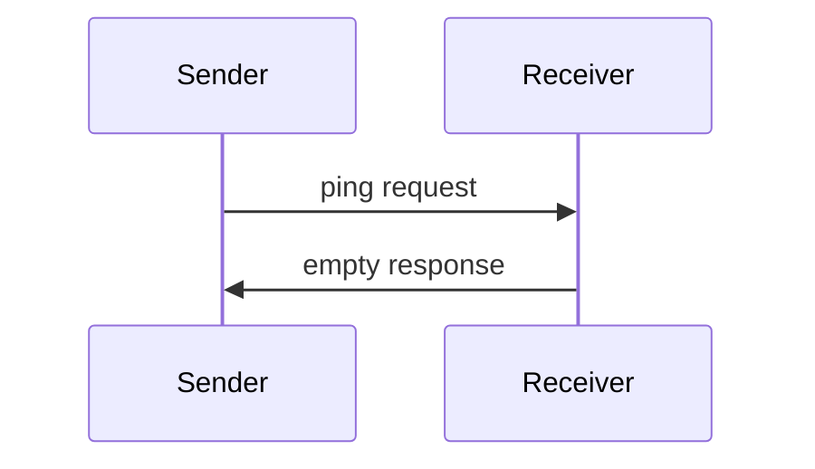

<div id="enable-section-numbers" />

<Info>**Protocol Revision**: 2025-11-25</Info>

The Model Context Protocol includes an optional ping mechanism that allows either party
to verify that their counterpart is still responsive and the connection is alive.

## Overview

The ping functionality is implemented through a simple request/response pattern. Either
the client or server can initiate a ping by sending a `ping` request.

## Message Format

A ping request is a standard JSON-RPC request with no parameters:

```json
{
  "jsonrpc": "2.0",
  "id": "123",
  "method": "ping"
}
```

## Behavior Requirements

1. The receiver **MUST** respond promptly with an empty response:

```json
{
  "jsonrpc": "2.0",
  "id": "123",
  "result": {}
}
```

2. If no response is received within a reasonable timeout period, the sender **MAY**:
   - Consider the connection stale
   - Terminate the connection
   - Attempt reconnection procedures

## Usage Patterns



## Implementation Considerations

- Implementations **SHOULD** periodically issue pings to detect connection health
- The frequency of pings **SHOULD** be configurable
- Timeouts **SHOULD** be appropriate for the network environment
- Excessive pinging **SHOULD** be avoided to reduce network overhead

## Error Handling

- Timeouts **SHOULD** be treated as connection failures
- Multiple failed pings **MAY** trigger connection reset
- Implementations **SHOULD** log ping failures for diagnostics
