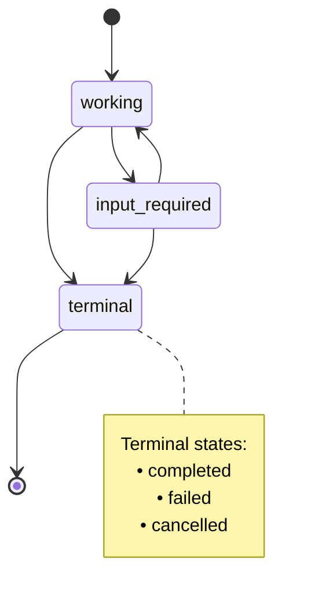
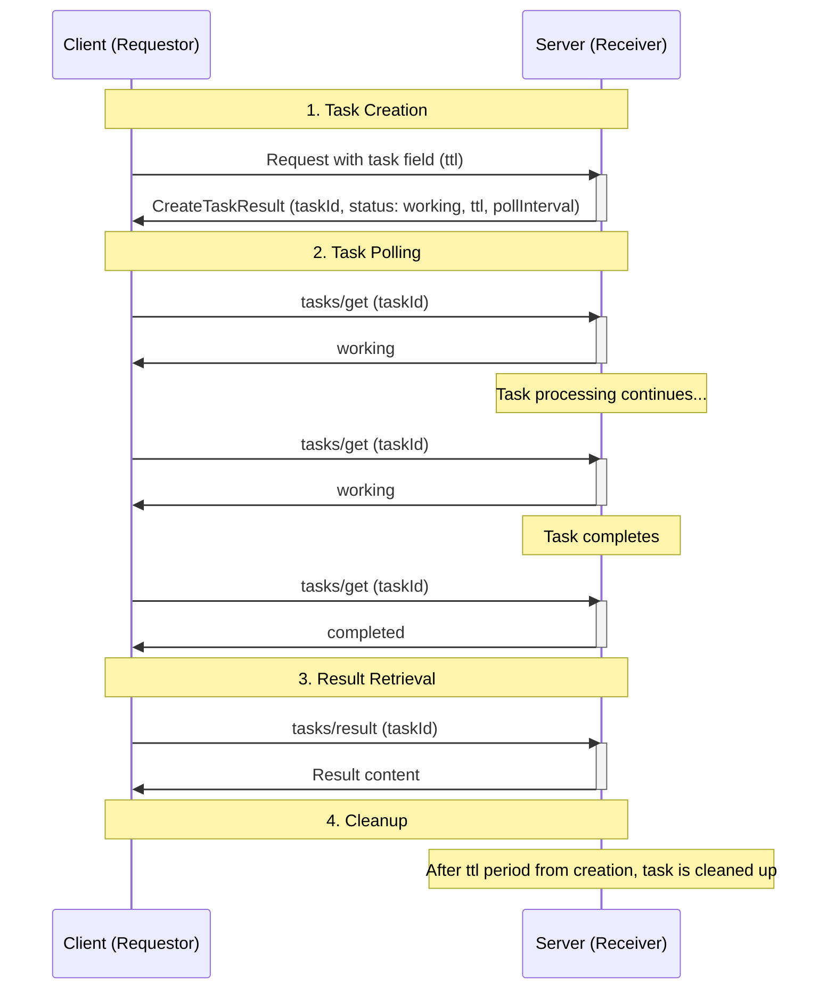
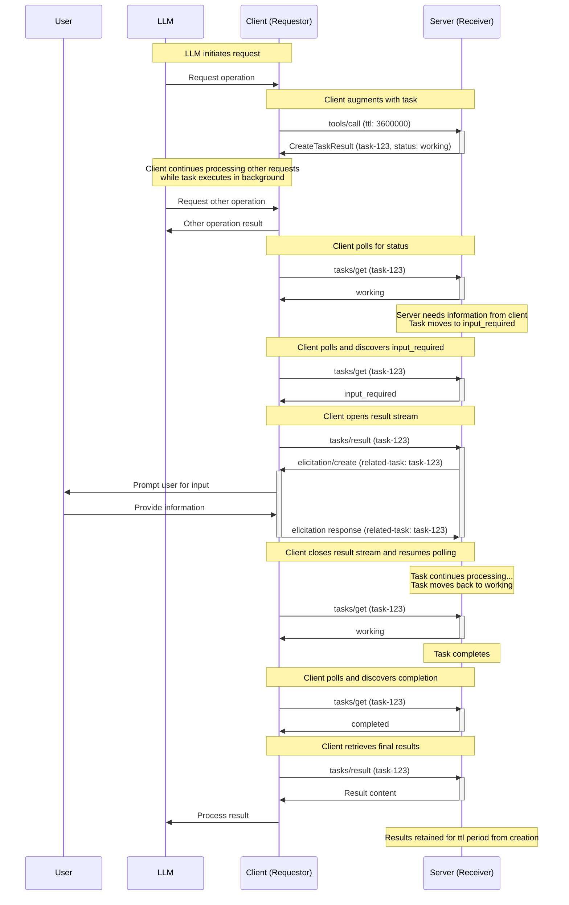
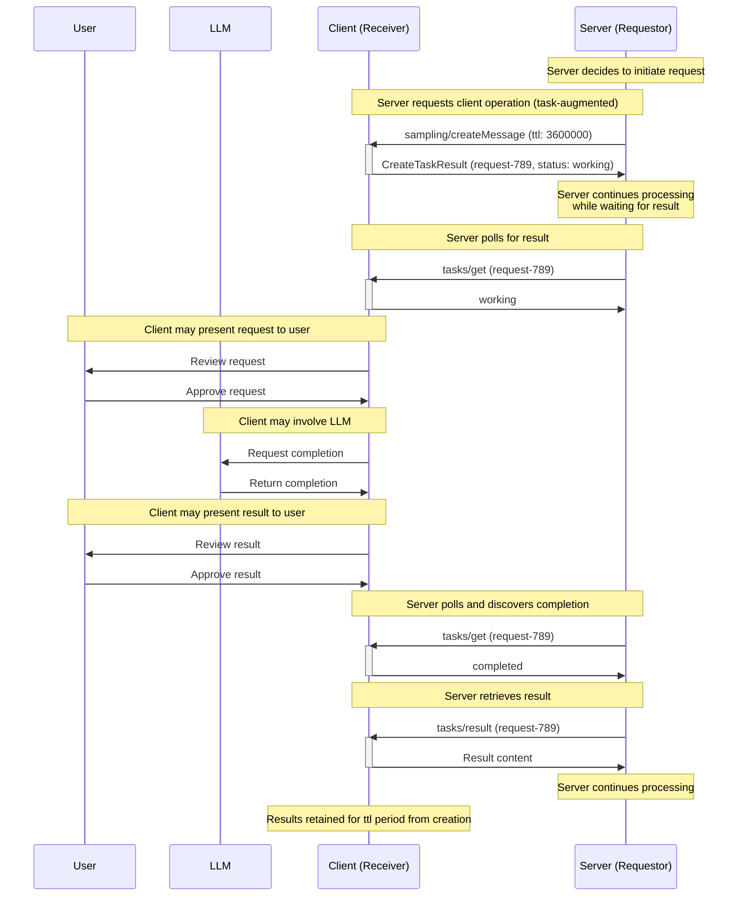
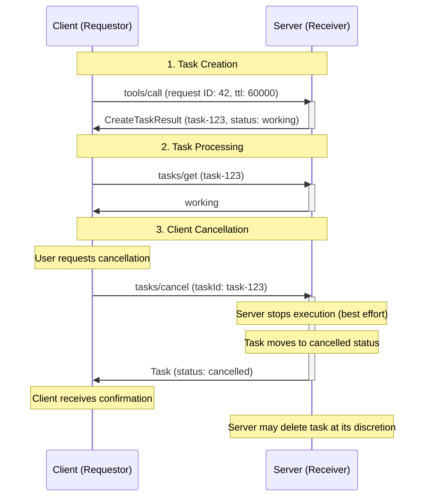

<div id="enable-section-numbers" />

<Info>**Protocol Revision**: 2025-11-25</Info>

<Note>

Tasks were introduced in version 2025-11-25 of the MCP specification and are currently considered **experimental**.
The design and behavior of tasks may evolve in future protocol versions.

</Note>

The Model Context Protocol (MCP) allows requestors — which can be either clients or servers, depending on the direction of communication — to augment their requests with **tasks**. Tasks are durable state machines that carry information about the underlying execution state of the request they wrap, and are intended for requestor polling and deferred result retrieval. Each task is uniquely identifiable by a receiver-generated **task ID**.

Tasks are useful for representing expensive computations and batch processing requests, and integrate seamlessly with external job APIs.

## Definitions

Tasks represent parties as either "requestors" or "receivers," defined as follows:

- **Requestor:** The sender of a task-augmented request. This can be the client or the server — either can create tasks.
- **Receiver:** The receiver of a task-augmented request, and the entity executing the task. This can be the client or the server — either can receive and execute tasks.

## User Interaction Model

Tasks are designed to be **requestor-driven** - requestors are responsible for augmenting requests with tasks and for polling for the results of those tasks; meanwhile, receivers tightly control which requests (if any) support task-based execution and manages the lifecycles of those tasks.

This requestor-driven approach ensures deterministic response handling and enables sophisticated patterns such as dispatching concurrent requests, which only the requestor has sufficient context to orchestrate.

Implementations are free to expose tasks through any interface pattern that suits their needs — the protocol itself does not mandate any specific user interaction model.

## Capabilities

Servers and clients that support task-augmented requests **MUST** declare a `tasks` capability during initialization. The `tasks` capability is structured by request category, with boolean properties indicating which specific request types support task augmentation.

### Server Capabilities

Servers declare if they support tasks, and if so, which server-side requests can be augmented with tasks.

| Capability                  | Description                                          |
| --------------------------- | ---------------------------------------------------- |
| `tasks.list`                | Server supports the `tasks/list` operation           |
| `tasks.cancel`              | Server supports the `tasks/cancel` operation         |
| `tasks.requests.tools.call` | Server supports task-augmented `tools/call` requests |

```json
{
  "capabilities": {
    "tasks": {
      "list": {},
      "cancel": {},
      "requests": {
        "tools": {
          "call": {}
        }
      }
    }
  }
}
```

### Client Capabilities

Clients declare if they support tasks, and if so, which client-side requests can be augmented with tasks.

| Capability                              | Description                                                      |
| --------------------------------------- | ---------------------------------------------------------------- |
| `tasks.list`                            | Client supports the `tasks/list` operation                       |
| `tasks.cancel`                          | Client supports the `tasks/cancel` operation                     |
| `tasks.requests.sampling.createMessage` | Client supports task-augmented `sampling/createMessage` requests |
| `tasks.requests.elicitation.create`     | Client supports task-augmented `elicitation/create` requests     |

```json
{
  "capabilities": {
    "tasks": {
      "list": {},
      "cancel": {},
      "requests": {
        "sampling": {
          "createMessage": {}
        },
        "elicitation": {
          "create": {}
        }
      }
    }
  }
}
```

### Capability Negotiation

During the initialization phase, both parties exchange their `tasks` capabilities to establish which operations support task-based execution. Requestors **SHOULD** only augment requests with a task if the corresponding capability has been declared by the receiver.

For example, if a server's capabilities include `tasks.requests.tools.call: {}`, then clients may augment `tools/call` requests with a task. If a client's capabilities include `tasks.requests.sampling.createMessage: {}`, then servers may augment `sampling/createMessage` requests with a task.

If `capabilities.tasks` is not defined, the peer **SHOULD NOT** attempt to create tasks during requests.

The set of capabilities in `capabilities.tasks.requests` is exhaustive. If a request type is not present, it does not support task-augmentation.

`capabilities.tasks.list` controls if the `tasks/list` operation is supported by the party.

`capabilities.tasks.cancel` controls if the `tasks/cancel` operation is supported by the party.

### Tool-Level Negotiation

Tool calls are given special consideration for the purpose of task augmentation. In the result of `tools/list`, tools declare support for tasks via `execution.taskSupport`, which if present can have a value of `"required"`, `"optional"`, or `"forbidden"`.

This is to be interpreted as a fine-grained layer in addition to capabilities, following these rules:

1. If a server's capabilities do not include `tasks.requests.tools.call`, then clients **MUST NOT** attempt to use task augmentation on that server's tools, regardless of the `execution.taskSupport` value.
1. If a server's capabilities include `tasks.requests.tools.call`, then clients consider the value of `execution.taskSupport`, and handle it accordingly:
   1. If `execution.taskSupport` is not present or `"forbidden"`, clients **MUST NOT** attempt to invoke the tool as a task. Servers **SHOULD** return a `-32601` (Method not found) error if a client attempts to do so. This is the default behavior.
   1. If `execution.taskSupport` is `"optional"`, clients **MAY** invoke the tool as a task or as a normal request.
   1. If `execution.taskSupport` is `"required"`, clients **MUST** invoke the tool as a task. Servers **MUST** return a `-32601` (Method not found) error if a client does not attempt to do so.

## Protocol Messages

### Creating Tasks

Task-augmented requests follow a two-phase response pattern that differs from normal requests:

- **Normal requests**: The server processes the request and returns the actual operation result directly.
- **Task-augmented requests**: The server accepts the request and immediately returns a `CreateTaskResult` containing task data. The actual operation result becomes available later through `tasks/result` after the task completes.

To create a task, requestors send a request with the `task` field included in the request params. Requestors **MAY** include a `ttl` value indicating the desired task lifetime duration (in milliseconds) since its creation.

**Request:**

```json
{
  "jsonrpc": "2.0",
  "id": 1,
  "method": "tools/call",
  "params": {
    "name": "get_weather",
    "arguments": {
      "city": "New York"
    },
    "task": {
      "ttl": 60000
    }
  }
}
```

**Response:**

```json
{
  "jsonrpc": "2.0",
  "id": 1,
  "result": {
    "task": {
      "taskId": "786512e2-9e0d-44bd-8f29-789f320fe840",
      "status": "working",
      "statusMessage": "The operation is now in progress.",
      "createdAt": "2025-11-25T10:30:00Z",
      "lastUpdatedAt": "2025-11-25T10:40:00Z",
      "ttl": 60000,
      "pollInterval": 5000
    }
  }
}
```

When a receiver accepts a task-augmented request, it returns a [`CreateTaskResult`](/specification/2025-11-25/schema#createtaskresult) containing task data. The response does not include the actual operation result. The actual result (e.g., tool result for `tools/call`) becomes available only through `tasks/result` after the task completes.

<Note>

When a task is created in response to a `tools/call` request, host applications may wish to return control to the model while the task is executing. This allows the model to continue processing other requests or perform additional work while waiting for the task to complete.

To support this pattern, servers can provide an optional `io.modelcontextprotocol/model-immediate-response` key in the `_meta` field of the `CreateTaskResult`. The value of this key should be a string intended to be passed as an immediate tool result to the model.
If a server does not provide this field, the host application can fall back to its own predefined message.

This guidance is non-binding and is provisional logic intended to account for the specific use case. This behavior may be formalized or modified as part of `CreateTaskResult` in future protocol versions.

</Note>

### Getting Tasks

<Note>

In the Streamable HTTP (SSE) transport, clients **MAY** disconnect from an SSE stream opened by the server in response to a `tasks/get` request at any time.

While this note is not prescriptive regarding the specific usage of SSE streams, all implementations **MUST** continue to comply with the existing [Streamable HTTP transport specification](../transports#sending-messages-to-the-server).

</Note>

Requestors poll for task completion by sending [`tasks/get`](/specification/2025-11-25/schema#tasks%2Fget) requests.
Requestors **SHOULD** respect the `pollInterval` provided in responses when determining polling frequency.

Requestors **SHOULD** continue polling until the task reaches a terminal status (`completed`, `failed`, or `cancelled`), or until encountering the [`input_required`](#input-required-status) status. Note that invoking `tasks/result` does not imply that the requestor needs to stop polling - requestors **SHOULD** continue polling the task status via `tasks/get` if they are not actively waiting for `tasks/result` to complete.

**Request:**

```json
{
  "jsonrpc": "2.0",
  "id": 3,
  "method": "tasks/get",
  "params": {
    "taskId": "786512e2-9e0d-44bd-8f29-789f320fe840"
  }
}
```

**Response:**

```json
{
  "jsonrpc": "2.0",
  "id": 3,
  "result": {
    "taskId": "786512e2-9e0d-44bd-8f29-789f320fe840",
    "status": "working",
    "statusMessage": "The operation is now in progress.",
    "createdAt": "2025-11-25T10:30:00Z",
    "lastUpdatedAt": "2025-11-25T10:40:00Z",
    "ttl": 30000,
    "pollInterval": 5000
  }
}
```

### Retrieving Task Results

<Note>

In the Streamable HTTP (SSE) transport, clients **MAY** disconnect from an SSE stream opened by the server in response to a `tasks/result` request at any time.

While this note is not prescriptive regarding the specific usage of SSE streams, all implementations **MUST** continue to comply with the existing [Streamable HTTP transport specification](../transports#sending-messages-to-the-server).

</Note>

After a task completes the operation result is retrieved via [`tasks/result`](/specification/2025-11-25/schema#tasks%2Fresult). This is distinct from the initial `CreateTaskResult` response, which contains only task data. The result structure matches the original request type (e.g., `CallToolResult` for `tools/call`).

To retrieve the result of a completed task, requestors can send a `tasks/result` request:

While `tasks/result` blocks until the task reaches a terminal status, requestors can continue polling via `tasks/get` in parallel if they are not actively blocked waiting for the result, such as if their previous `tasks/result` request failed or was cancelled. This allows requestors to monitor status changes or display progress updates while the task executes, even after invoking `tasks/result`.

**Request:**

```json
{
  "jsonrpc": "2.0",
  "id": 4,
  "method": "tasks/result",
  "params": {
    "taskId": "786512e2-9e0d-44bd-8f29-789f320fe840"
  }
}
```

**Response:**

```json
{
  "jsonrpc": "2.0",
  "id": 4,
  "result": {
    "content": [
      {
        "type": "text",
        "text": "Current weather in New York:\nTemperature: 72°F\nConditions: Partly cloudy"
      }
    ],
    "isError": false,
    "_meta": {
      "io.modelcontextprotocol/related-task": {
        "taskId": "786512e2-9e0d-44bd-8f29-789f320fe840"
      }
    }
  }
}
```

### Task Status Notification

When a task status changes, receivers **MAY** send a [`notifications/tasks/status`](/specification/2025-11-25/schema#notifications%2Ftasks%2Fstatus) notification to inform the requestor of the change. This notification includes the full task state.

**Notification:**

```json
{
  "jsonrpc": "2.0",
  "method": "notifications/tasks/status",
  "params": {
    "taskId": "786512e2-9e0d-44bd-8f29-789f320fe840",
    "status": "completed",
    "createdAt": "2025-11-25T10:30:00Z",
    "lastUpdatedAt": "2025-11-25T10:50:00Z",
    "ttl": 60000,
    "pollInterval": 5000
  }
}
```

The notification includes the full [`Task`](/specification/2025-11-25/schema#task) object, including the updated `status` and `statusMessage` (if present). This allows requestors to access the complete task state without making an additional `tasks/get` request.

Requestors **MUST NOT** rely on receiving this notifications, as it is optional. Receivers are not required to send status notifications and may choose to only send them for certain status transitions. Requestors **SHOULD** continue to poll via `tasks/get` to ensure they receive status updates.

### Listing Tasks

To retrieve a list of tasks, requestors can send a [`tasks/list`](/specification/2025-11-25/schema#tasks%2Flist) request. This operation supports pagination.

**Request:**

```json
{
  "jsonrpc": "2.0",
  "id": 5,
  "method": "tasks/list",
  "params": {
    "cursor": "optional-cursor-value"
  }
}
```

**Response:**

```json
{
  "jsonrpc": "2.0",
  "id": 5,
  "result": {
    "tasks": [
      {
        "taskId": "786512e2-9e0d-44bd-8f29-789f320fe840",
        "status": "working",
        "createdAt": "2025-11-25T10:30:00Z",
        "lastUpdatedAt": "2025-11-25T10:40:00Z",
        "ttl": 30000,
        "pollInterval": 5000
      },
      {
        "taskId": "abc123-def456-ghi789",
        "status": "completed",
        "createdAt": "2025-11-25T09:15:00Z",
        "lastUpdatedAt": "2025-11-25T10:40:00Z",
        "ttl": 60000
      }
    ],
    "nextCursor": "next-page-cursor"
  }
}
```

### Cancelling Tasks

To explicitly cancel a task, requestors can send a [`tasks/cancel`](/specification/2025-11-25/schema#tasks%2Fcancel) request.

**Request:**

```json
{
  "jsonrpc": "2.0",
  "id": 6,
  "method": "tasks/cancel",
  "params": {
    "taskId": "786512e2-9e0d-44bd-8f29-789f320fe840"
  }
}
```

**Response:**

```json
{
  "jsonrpc": "2.0",
  "id": 6,
  "result": {
    "taskId": "786512e2-9e0d-44bd-8f29-789f320fe840",
    "status": "cancelled",
    "statusMessage": "The task was cancelled by request.",
    "createdAt": "2025-11-25T10:30:00Z",
    "lastUpdatedAt": "2025-11-25T10:40:00Z",
    "ttl": 30000,
    "pollInterval": 5000
  }
}
```

## Behavior Requirements

These requirements apply to all parties that support receiving task-augmented requests.

### Task Support and Handling

1. Receivers that do not declare the task capability for a request type **MUST** process requests of that type normally, ignoring any task-augmentation metadata if present.
1. Receivers that declare the task capability for a request type **MAY** return an error for non-task-augmented requests, requiring requestors to use task augmentation.

### Task ID Requirements

1. Task IDs **MUST** be a string value.
1. Task IDs **MUST** be generated by the receiver when creating a task.
1. Task IDs **MUST** be unique among all tasks controlled by the receiver.

### Task Status Lifecycle

1. Tasks **MUST** begin in the `working` status when created.
1. Receivers **MUST** only transition tasks through the following valid paths:
   1. From `working`: may move to `input_required`, `completed`, `failed`, or `cancelled`
   1. From `input_required`: may move to `working`, `completed`, `failed`, or `cancelled`
   1. Tasks with a `completed`, `failed`, or `cancelled` status are in a terminal state and **MUST NOT** transition to any other status

**Task Status State Diagram:**



### Input Required Status

<Note>

With the Streamable HTTP (SSE) transport, servers often close SSE streams after delivering a response message, which can lead to ambiguity regarding the stream used for subsequent task messages.

Servers can handle this by enqueueing messages to the client to side-channel task-related messages alongside other responses.

Servers have flexibility in how they manage SSE streams during task polling and result retrieval, and clients **SHOULD** expect messages to be delivered on any SSE stream, including the HTTP GET stream.
One possible approach is maintaining an SSE stream on `tasks/result` (see notes on the `input_required` status).
Where possible, servers **SHOULD NOT** upgrade to an SSE stream in response to a `tasks/get` request, as the client has indicated it wishes to poll for a result.

While this note is not prescriptive regarding the specific usage of SSE streams, all implementations **MUST** continue to comply with the existing [Streamable HTTP transport specification](../transports#sending-messages-to-the-server).

</Note>

1. When the task receiver has messages for the requestor that are necessary to complete the task, the receiver **SHOULD** move the task to the `input_required` status.
1. The receiver **MUST** include the `io.modelcontextprotocol/related-task` metadata in the request to associate it with the task.
1. When the requestor encounters the `input_required` status, it **SHOULD** preemptively call `tasks/result`.
1. When the receiver receives all required input, the task **SHOULD** transition out of `input_required` status (typically back to `working`).

### TTL and Resource Management

1. Receivers **MUST** include a `createdAt` [ISO 8601](https://datatracker.ietf.org/doc/html/rfc3339#section-5)-formatted timestamp in all task responses to indicate when the task was created.
1. Receivers **MUST** include a `lastUpdatedAt` [ISO 8601](https://datatracker.ietf.org/doc/html/rfc3339#section-5)-formatted timestamp in all task responses to indicate when the task was last updated.
1. Receivers **MAY** override the requested `ttl` duration.
1. Receivers **MUST** include the actual `ttl` duration (or `null` for unlimited) in `tasks/get` responses.
1. After a task's `ttl` lifetime has elapsed, receivers **MAY** delete the task and its results, regardless of the task status.
1. Receivers **MAY** include a `pollInterval` value (in milliseconds) in `tasks/get` responses to suggest polling intervals. Requestors **SHOULD** respect this value when provided.

### Result Retrieval

1. Receivers that accept a task-augmented request **MUST** return a `CreateTaskResult` as the response. This result **SHOULD** be returned as soon as possible after accepting the task.
1. When a receiver receives a `tasks/result` request for a task in a terminal status (`completed`, `failed`, or `cancelled`), it **MUST** return the final result of the underlying request, whether that is a successful result or a JSON-RPC error.
1. When a receiver receives a `tasks/result` request for a task in any other non-terminal status (`working` or `input_required`), it **MUST** block the response until the task reaches a terminal status.
1. For tasks in a terminal status, receivers **MUST** return from `tasks/result` exactly what the underlying request would have returned, whether that is a successful result or a JSON-RPC error.

### Associating Task-Related Messages

1. All requests, notifications, and responses related to a task **MUST** include the `io.modelcontextprotocol/related-task` key in their `_meta` field, with the value set to an object with a `taskId` matching the associated task ID.
   1. For example, an elicitation that a task-augmented tool call depends on **MUST** share the same related task ID with that tool call's task.
1. For the `tasks/get`, `tasks/result`, and `tasks/cancel` operations, the `taskId` parameter in the request **MUST** be used as the source of truth for identifying the target task. Requestors **SHOULD NOT** include `io.modelcontextprotocol/related-task` metadata in these requests, and receivers **MUST** ignore such metadata if present in favor of the RPC method parameter.
   Similarly, for the `tasks/get`, `tasks/list`, and `tasks/cancel` operations, receivers **SHOULD NOT** include `io.modelcontextprotocol/related-task` metadata in the result messages, as the `taskId` is already present in the response structure.

### Task Notifications

1. Receivers **MAY** send `notifications/tasks/status` notifications when a task's status changes.
1. Requestors **MUST NOT** rely on receiving the `notifications/tasks/status` notification, as it is optional.
1. When sent, the `notifications/tasks/status` notification **SHOULD NOT** include the `io.modelcontextprotocol/related-task` metadata, as the task ID is already present in the notification parameters.

### Task Progress Notifications

Task-augmented requests support progress notifications as defined in the [progress](./progress) specification. The `progressToken` provided in the initial request remains valid throughout the task lifetime.

### Task Listing

1. Receivers **SHOULD** use cursor-based pagination to limit the number of tasks returned in a single response.
1. Receivers **MUST** include a `nextCursor` in the response if more tasks are available.
1. Requestors **MUST** treat cursors as opaque tokens and not attempt to parse or modify them.
1. If a task is retrievable via `tasks/get` for a requestor, it **MUST** be retrievable via `tasks/list` for that requestor.

### Task Cancellation

1. Receivers **MUST** reject cancellation requests for tasks already in a terminal status (`completed`, `failed`, or `cancelled`) with error code `-32602` (Invalid params).
1. Upon receiving a valid cancellation request, receivers **SHOULD** attempt to stop the task execution and **MUST** transition the task to `cancelled` status before sending the response.
1. Once a task is cancelled, it **MUST** remain in `cancelled` status even if execution continues to completion or fails.
1. The `tasks/cancel` operation does not define deletion behavior. However, receivers **MAY** delete cancelled tasks at their discretion at any time, including immediately after cancellation or after the task `ttl` expires.
1. Requestors **SHOULD NOT** rely on cancelled tasks being retained for any specific duration and should retrieve any needed information before cancelling.

## Message Flow

### Basic Task Lifecycle



### Task-Augmented Tool Call With Elicitation



### Task-Augmented Sampling Request



### Task Cancellation Flow



## Data Types

### Task

A task represents the execution state of a request. The task state includes:

- `taskId`: Unique identifier for the task
- `status`: Current state of the task execution
- `statusMessage`: Optional human-readable message describing the current state (can be present for any status, including error details for failed tasks)
- `createdAt`: ISO 8601 timestamp when the task was created
- `ttl`: Time in milliseconds from creation before task may be deleted
- `pollInterval`: Suggested time in milliseconds between status checks
- `lastUpdatedAt`: ISO 8601 timestamp when the task status was last updated

### Task Status

Tasks can be in one of the following states:

- `working`: The request is currently being processed.
- `input_required`: The receiver needs input from the requestor. The requestor should call `tasks/result` to receive input requests, even though the task has not reached a terminal state.
- `completed`: The request completed successfully and results are available.
- `failed`: The associated request did not complete successfully. For tool calls specifically, this includes cases where the tool call result has `isError` set to true.
- `cancelled`: The request was cancelled before completion.

### Task Parameters

When augmenting a request with task execution, the `task` field is included in the request parameters:

```json
{
  "task": {
    "ttl": 60000
  }
}
```

Fields:

- `ttl` (number, optional): Requested duration in milliseconds to retain task from creation

### Related Task Metadata

All requests, responses, and notifications associated with a task **MUST** include the `io.modelcontextprotocol/related-task` key in `_meta`:

```json
{
  "io.modelcontextprotocol/related-task": {
    "taskId": "786512e2-9e0d-44bd-8f29-789f320fe840"
  }
}
```

This associates messages with their originating task across the entire request lifecycle.

For the `tasks/get`, `tasks/list`, and `tasks/cancel` operations, requestors and receivers **SHOULD NOT** include this metadata in their messages, as the `taskId` is already present in the message structure.
The `tasks/result` operation **MUST** include this metadata in its response, as the result structure itself does not contain the task ID.

## Error Handling

Tasks use two error reporting mechanisms:

1. **Protocol Errors**: Standard JSON-RPC errors for protocol-level issues
1. **Task Execution Errors**: Errors in the underlying request execution, reported through task status

### Protocol Errors

Receivers **MUST** return standard JSON-RPC errors for the following protocol error cases:

- Invalid or nonexistent `taskId` in `tasks/get`, `tasks/result`, or `tasks/cancel`: `-32602` (Invalid params)
- Invalid or nonexistent cursor in `tasks/list`: `-32602` (Invalid params)
- Attempt to cancel a task already in a terminal status: `-32602` (Invalid params)
- Internal errors: `-32603` (Internal error)

Additionally, receivers **MAY** return the following errors:

- Non-task-augmented request when receiver requires task augmentation for that request type: `-32600` (Invalid request)

Receivers **SHOULD** provide informative error messages to describe the cause of errors.

**Example: Task augmentation required**

```json
{
  "jsonrpc": "2.0",
  "id": 1,
  "error": {
    "code": -32600,
    "message": "Task augmentation required for tools/call requests"
  }
}
```

**Example: Task not found**

```json
{
  "jsonrpc": "2.0",
  "id": 70,
  "error": {
    "code": -32602,
    "message": "Failed to retrieve task: Task not found"
  }
}
```

**Example: Task expired**

```json
{
  "jsonrpc": "2.0",
  "id": 71,
  "error": {
    "code": -32602,
    "message": "Failed to retrieve task: Task has expired"
  }
}
```

<Note>

Receivers are not required to retain tasks indefinitely. It is compliant behavior for a receiver to return an error stating the task cannot be found if it has purged an expired task.

</Note>

**Example: Task cancellation rejected (already terminal)**

```json
{
  "jsonrpc": "2.0",
  "id": 74,
  "error": {
    "code": -32602,
    "message": "Cannot cancel task: already in terminal status 'completed'"
  }
}
```

### Task Execution Errors

When the underlying request does not complete successfully, the task moves to the `failed` status. This includes JSON-RPC protocol errors during request execution, or for tool calls specifically, when the tool result has `isError` set to true. The `tasks/get` response **SHOULD** include a `statusMessage` field with diagnostic information about the failure.

**Example: Task with execution error**

```json
{
  "jsonrpc": "2.0",
  "id": 4,
  "result": {
    "taskId": "786512e2-9e0d-44bd-8f29-789f820fe840",
    "status": "failed",
    "createdAt": "2025-11-25T10:30:00Z",
    "lastUpdatedAt": "2025-11-25T10:40:00Z",
    "ttl": 30000,
    "statusMessage": "Tool execution failed: API rate limit exceeded"
  }
}
```

For tasks that wrap tool call requests, when the tool result has `isError` set to `true`, the task should reach `failed` status.

The `tasks/result` endpoint returns exactly what the underlying request would have returned:

- If the underlying request resulted in a JSON-RPC error, `tasks/result` **MUST** return that same JSON-RPC error.
- If the request completed with a JSON-RPC response, `tasks/result` **MUST** return a successful JSON-RPC response containing that result.

## Security Considerations

### Task Isolation and Access Control

Task IDs are the primary mechanism for accessing task state and results. Without proper access controls, any party that can guess or obtain a task ID could potentially access sensitive information or manipulate tasks they did not create.

When an authorization context is provided, receivers **MUST** bind tasks to said context.

Context-binding is not practical for all applications. Some MCP servers operate in environments without authorization, such as single-user tools, or use transports that don't support authorization.
In these scenarios, receivers **SHOULD** document this limitation clearly, as task results may be accessible to any requestor that can guess the task ID.
If context-binding is unavailable, receivers **MUST** generate cryptographically secure task IDs with enough entropy to prevent guessing and should consider using shorter TTL durations to reduce the exposure window.

If context-binding is available, receivers **MUST** reject `tasks/get`, `tasks/result`, and `tasks/cancel` requests for tasks that do not belong to the same authorization context as the requestor. For `tasks/list` requests, receivers **MUST** ensure the returned task list includes only tasks associated with the requestor's authorization context.

Additionally, receivers **SHOULD** implement rate limiting on task operations to prevent denial-of-service and enumeration attacks.

### Resource Management

1. Receivers **SHOULD**:
   1. Enforce limits on concurrent tasks per requestor
   1. Enforce maximum `ttl` durations to prevent indefinite resource retention
   1. Clean up expired tasks promptly to free resources
   1. Document maximum supported `ttl` duration
   1. Document maximum concurrent tasks per requestor
   1. Implement monitoring and alerting for resource usage

### Audit and Logging

1. Receivers **SHOULD**:
   1. Log task creation, completion, and retrieval events for audit purposes
   1. Include auth context in logs when available
   1. Monitor for suspicious patterns (e.g., many failed task lookups, excessive polling)
1. Requestors **SHOULD**:
   1. Log task lifecycle events for debugging and audit purposes
   1. Track task IDs and their associated operations
