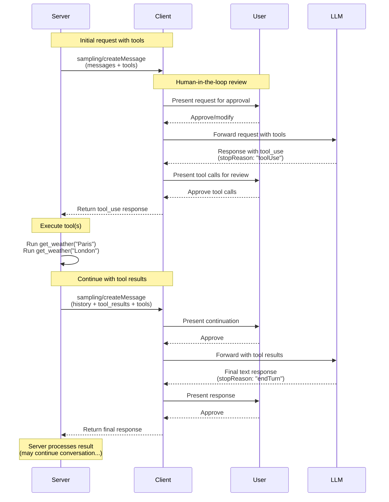
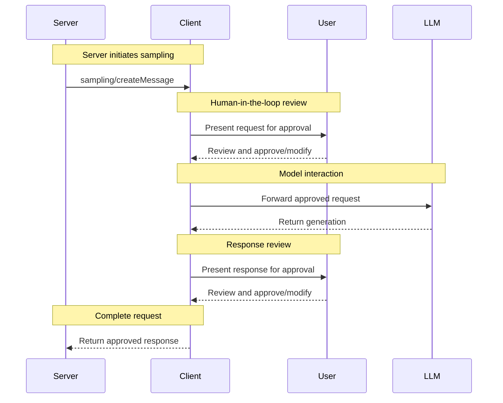

<div id="enable-section-numbers" />

<Info>**Protocol Revision**: 2025-11-25</Info>

The Model Context Protocol (MCP) provides a standardized way for servers to request LLM
sampling ("completions" or "generations") from language models via clients. This flow
allows clients to maintain control over model access, selection, and permissions while
enabling servers to leverage AI capabilities&mdash;with no server API keys necessary.
Servers can request text, audio, or image-based interactions and optionally include
context from MCP servers in their prompts.

## User Interaction Model

Sampling in MCP allows servers to implement agentic behaviors, by enabling LLM calls to
occur _nested_ inside other MCP server features.

Implementations are free to expose sampling through any interface pattern that suits
their needs&mdash;the protocol itself does not mandate any specific user interaction
model.

<Warning>

For trust & safety and security, there **SHOULD** always
be a human in the loop with the ability to deny sampling requests.

Applications **SHOULD**:

- Provide UI that makes it easy and intuitive to review sampling requests
- Allow users to view and edit prompts before sending
- Present generated responses for review before delivery

</Warning>

## Tools in Sampling

Servers can request that the client's LLM use tools during sampling by providing a `tools` array and optional `toolChoice` configuration in their sampling requests. This enables servers to implement agentic behaviors where the LLM can call tools, receive results, and continue the conversation - all within a single sampling request flow.

Clients **MUST** declare support for tool use via the `sampling.tools` capability to receive tool-enabled sampling requests. Servers **MUST NOT** send tool-enabled sampling requests to Clients that have not declared support for tool use via the `sampling.tools` capability.

## Capabilities

Clients that support sampling **MUST** declare the `sampling` capability during
[initialization](/specification/2025-11-25/basic/lifecycle#initialization):

**Basic sampling:**

```json
{
  "capabilities": {
    "sampling": {}
  }
}
```

**With tool use support:**

```json
{
  "capabilities": {
    "sampling": {
      "tools": {}
    }
  }
}
```

**With context inclusion support (soft-deprecated):**

```json
{
  "capabilities": {
    "sampling": {
      "context": {}
    }
  }
}
```

<Note>
  The `includeContext` parameter values `"thisServer"` and `"allServers"` are
  soft-deprecated. Servers **SHOULD** avoid using these values (e.g. can just
  omit `includeContext` since it defaults to `"none"`), and **SHOULD NOT** use
  them unless the client declares `sampling.context` capability. These values
  may be removed in future spec releases.
</Note>

## Protocol Messages

### Creating Messages

To request a language model generation, servers send a `sampling/createMessage` request:

**Request:**

```json
{
  "jsonrpc": "2.0",
  "id": 1,
  "method": "sampling/createMessage",
  "params": {
    "messages": [
      {
        "role": "user",
        "content": {
          "type": "text",
          "text": "What is the capital of France?"
        }
      }
    ],
    "modelPreferences": {
      "hints": [
        {
          "name": "claude-3-sonnet"
        }
      ],
      "intelligencePriority": 0.8,
      "speedPriority": 0.5
    },
    "systemPrompt": "You are a helpful assistant.",
    "maxTokens": 100
  }
}
```

**Response:**

```json
{
  "jsonrpc": "2.0",
  "id": 1,
  "result": {
    "role": "assistant",
    "content": {
      "type": "text",
      "text": "The capital of France is Paris."
    },
    "model": "claude-3-sonnet-20240307",
    "stopReason": "endTurn"
  }
}
```

### Sampling with Tools

The following diagram illustrates the complete flow of sampling with tools, including the multi-turn tool loop:



To request LLM generation with tool use capabilities, servers include `tools` and optionally `toolChoice` in the request:

**Request (Server -> Client):**

```json
{
  "jsonrpc": "2.0",
  "id": 1,
  "method": "sampling/createMessage",
  "params": {
    "messages": [
      {
        "role": "user",
        "content": {
          "type": "text",
          "text": "What's the weather like in Paris and London?"
        }
      }
    ],
    "tools": [
      {
        "name": "get_weather",
        "description": "Get current weather for a city",
        "inputSchema": {
          "type": "object",
          "properties": {
            "city": {
              "type": "string",
              "description": "City name"
            }
          },
          "required": ["city"]
        }
      }
    ],
    "toolChoice": {
      "mode": "auto"
    },
    "maxTokens": 1000
  }
}
```

**Response (Client -> Server):**

```json
{
  "jsonrpc": "2.0",
  "id": 1,
  "result": {
    "role": "assistant",
    "content": [
      {
        "type": "tool_use",
        "id": "call_abc123",
        "name": "get_weather",
        "input": {
          "city": "Paris"
        }
      },
      {
        "type": "tool_use",
        "id": "call_def456",
        "name": "get_weather",
        "input": {
          "city": "London"
        }
      }
    ],
    "model": "claude-3-sonnet-20240307",
    "stopReason": "toolUse"
  }
}
```

### Multi-turn Tool Loop

After receiving tool use requests from the LLM, the server typically:

1. Executes the requested tool uses.
2. Sends a new sampling request with the tool results appended
3. Receives the LLM's response (which might contain new tool uses)
4. Repeats as many times as needed (server might cap the maximum number of iterations, and e.g. pass `toolChoice: {mode: "none"}` on the last iteration to force a final result)

**Follow-up request (Server -> Client) with tool results:**

```json
{
  "jsonrpc": "2.0",
  "id": 2,
  "method": "sampling/createMessage",
  "params": {
    "messages": [
      {
        "role": "user",
        "content": {
          "type": "text",
          "text": "What's the weather like in Paris and London?"
        }
      },
      {
        "role": "assistant",
        "content": [
          {
            "type": "tool_use",
            "id": "call_abc123",
            "name": "get_weather",
            "input": { "city": "Paris" }
          },
          {
            "type": "tool_use",
            "id": "call_def456",
            "name": "get_weather",
            "input": { "city": "London" }
          }
        ]
      },
      {
        "role": "user",
        "content": [
          {
            "type": "tool_result",
            "toolUseId": "call_abc123",
            "content": [
              {
                "type": "text",
                "text": "Weather in Paris: 18°C, partly cloudy"
              }
            ]
          },
          {
            "type": "tool_result",
            "toolUseId": "call_def456",
            "content": [
              {
                "type": "text",
                "text": "Weather in London: 15°C, rainy"
              }
            ]
          }
        ]
      }
    ],
    "tools": [
      {
        "name": "get_weather",
        "description": "Get current weather for a city",
        "inputSchema": {
          "type": "object",
          "properties": {
            "city": { "type": "string" }
          },
          "required": ["city"]
        }
      }
    ],
    "maxTokens": 1000
  }
}
```

**Final response (Client -> Server):**

```json
{
  "jsonrpc": "2.0",
  "id": 2,
  "result": {
    "role": "assistant",
    "content": {
      "type": "text",
      "text": "Based on the current weather data:\n\n- **Paris**: 18°C and partly cloudy - quite pleasant!\n- **London**: 15°C and rainy - you'll want an umbrella.\n\nParis has slightly warmer and drier conditions today."
    },
    "model": "claude-3-sonnet-20240307",
    "stopReason": "endTurn"
  }
}
```

## Message Content Constraints

### Tool Result Messages

When a user message contains tool results (type: "tool_result"), it **MUST** contain ONLY tool results. Mixing tool results with other content types (text, image, audio) in the same message is not allowed.

This constraint ensures compatibility with provider APIs that use dedicated roles for tool results (e.g., OpenAI's "tool" role, Gemini's "function" role).

**Valid - single tool result:**

```json
{
  "role": "user",
  "content": {
    "type": "tool_result",
    "toolUseId": "call_123",
    "content": [{ "type": "text", "text": "Result data" }]
  }
}
```

**Valid - multiple tool results:**

```json
{
  "role": "user",
  "content": [
    {
      "type": "tool_result",
      "toolUseId": "call_123",
      "content": [{ "type": "text", "text": "Result 1" }]
    },
    {
      "type": "tool_result",
      "toolUseId": "call_456",
      "content": [{ "type": "text", "text": "Result 2" }]
    }
  ]
}
```

**Invalid - mixed content:**

```json
{
  "role": "user",
  "content": [
    {
      "type": "text",
      "text": "Here are the results:"
    },
    {
      "type": "tool_result",
      "toolUseId": "call_123",
      "content": [{ "type": "text", "text": "Result data" }]
    }
  ]
}
```

### Tool Use and Result Balance

When using tool use in sampling, every assistant message containing `ToolUseContent` blocks **MUST** be followed by a user message that consists entirely of `ToolResultContent` blocks, with each tool use (e.g. with `id: $id`) matched by a corresponding tool result (with `toolUseId: $id`), before any other message.

This requirement ensures:

- Tool uses are always resolved before the conversation continues
- Provider APIs can concurrently process multiple tool uses and fetch their results in parallel
- The conversation maintains a consistent request-response pattern

**Example valid sequence:**

1. User message: "What's the weather like in Paris and London?"
2. Assistant message: `ToolUseContent` (`id: "call_abc123", name: "get_weather", input: {city: "Paris"}`) + `ToolUseContent` (`id: "call_def456", name: "get_weather", input: {city: "London"}`)
3. User message: `ToolResultContent` (`toolUseId: "call_abc123", content: "18°C, partly cloudy"`) + `ToolResultContent` (`toolUseId: "call_def456", content: "15°C, rainy"`)
4. Assistant message: Text response comparing the weather in both cities

**Invalid sequence - missing tool result:**

1. User message: "What's the weather like in Paris and London?"
2. Assistant message: `ToolUseContent` (`id: "call_abc123", name: "get_weather", input: {city: "Paris"}`) + `ToolUseContent` (`id: "call_def456", name: "get_weather", input: {city: "London"}`)
3. User message: `ToolResultContent` (`toolUseId: "call_abc123", content: "18°C, partly cloudy"`) ← Missing result for call_def456
4. Assistant message: Text response (invalid - not all tool uses were resolved)

## Cross-API Compatibility

The sampling specification is designed to work across multiple LLM provider APIs (Claude, OpenAI, Gemini, etc.). Key design decisions for compatibility:

### Message Roles

MCP uses two roles: "user" and "assistant".

Tool use requests are sent in CreateMessageResult with the "assistant" role.
Tool results are sent back in messages with the "user" role.
Messages with tool results cannot contain other kinds of content.

### Tool Choice Modes

`CreateMessageRequest.params.toolChoice` controls the tool use ability of the model:

- `{mode: "auto"}`: Model decides whether to use tools (default)
- `{mode: "required"}`: Model MUST use at least one tool before completing
- `{mode: "none"}`: Model MUST NOT use any tools

### Parallel Tool Use

MCP allows models to make multiple tool use requests in parallel (returning an array of `ToolUseContent`). All major provider APIs support this:

- **Claude**: Supports parallel tool use natively
- **OpenAI**: Supports parallel tool calls (can be disabled with `parallel_tool_calls: false`)
- **Gemini**: Supports parallel function calls natively

Implementations wrapping providers that support disabling parallel tool use MAY expose this as an extension, but it is not part of the core MCP specification.

## Message Flow



## Data Types

### Messages

Sampling messages can contain:

#### Text Content

```json
{
  "type": "text",
  "text": "The message content"
}
```

#### Image Content

```json
{
  "type": "image",
  "data": "base64-encoded-image-data",
  "mimeType": "image/jpeg"
}
```

#### Audio Content

```json
{
  "type": "audio",
  "data": "base64-encoded-audio-data",
  "mimeType": "audio/wav"
}
```

### Model Preferences

Model selection in MCP requires careful abstraction since servers and clients may use
different AI providers with distinct model offerings. A server cannot simply request a
specific model by name since the client may not have access to that exact model or may
prefer to use a different provider's equivalent model.

To solve this, MCP implements a preference system that combines abstract capability
priorities with optional model hints:

#### Capability Priorities

Servers express their needs through three normalized priority values (0-1):

- `costPriority`: How important is minimizing costs? Higher values prefer cheaper models.
- `speedPriority`: How important is low latency? Higher values prefer faster models.
- `intelligencePriority`: How important are advanced capabilities? Higher values prefer
  more capable models.

#### Model Hints

While priorities help select models based on characteristics, `hints` allow servers to
suggest specific models or model families:

- Hints are treated as substrings that can match model names flexibly
- Multiple hints are evaluated in order of preference
- Clients **MAY** map hints to equivalent models from different providers
- Hints are advisory&mdash;clients make final model selection

For example:

```json
{
  "hints": [
    { "name": "claude-3-sonnet" }, // Prefer Sonnet-class models
    { "name": "claude" } // Fall back to any Claude model
  ],
  "costPriority": 0.3, // Cost is less important
  "speedPriority": 0.8, // Speed is very important
  "intelligencePriority": 0.5 // Moderate capability needs
}
```

The client processes these preferences to select an appropriate model from its available
options. For instance, if the client doesn't have access to Claude models but has Gemini,
it might map the sonnet hint to `gemini-1.5-pro` based on similar capabilities.

## Error Handling

Clients **SHOULD** return errors for common failure cases:

- User rejected sampling request: `-1`
- Tool result missing in request: `-32602` (Invalid params)
- Tool results mixed with other content: `-32602` (Invalid params)

Example errors:

```json
{
  "jsonrpc": "2.0",
  "id": 3,
  "error": {
    "code": -1,
    "message": "User rejected sampling request"
  }
}
```

```json
{
  "jsonrpc": "2.0",
  "id": 4,
  "error": {
    "code": -32602,
    "message": "Tool result missing in request"
  }
}
```

## Security Considerations

1. Clients **SHOULD** implement user approval controls
2. Both parties **SHOULD** validate message content
3. Clients **SHOULD** respect model preference hints
4. Clients **SHOULD** implement rate limiting
5. Both parties **MUST** handle sensitive data appropriately

When tools are used in sampling, additional security considerations apply:

6. Servers **MUST** ensure that when replying to a `stopReason: "toolUse"`, each `ToolUseContent` item is responded to with a `ToolResultContent` item with a matching `toolUseId`, and that the user message contains only tool results (no other content types)
7. Both parties **SHOULD** implement iteration limits for tool loops
