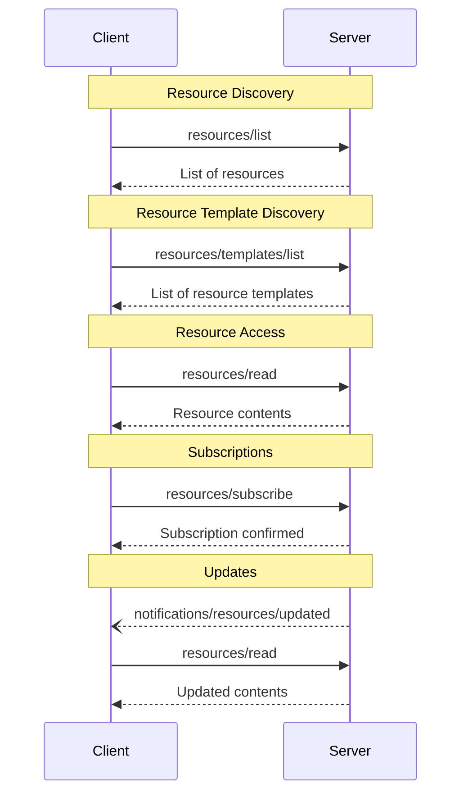

<div id="enable-section-numbers" />

<Info>**Protocol Revision**: 2025-11-25</Info>

The Model Context Protocol (MCP) provides a standardized way for servers to expose
resources to clients. Resources allow servers to share data that provides context to
language models, such as files, database schemas, or application-specific information.
Each resource is uniquely identified by a
[URI](https://datatracker.ietf.org/doc/html/rfc3986).

## User Interaction Model

Resources in MCP are designed to be **application-driven**, with host applications
determining how to incorporate context based on their needs.

For example, applications could:

- Expose resources through UI elements for explicit selection, in a tree or list view
- Allow the user to search through and filter available resources
- Implement automatic context inclusion, based on heuristics or the AI model's selection


However, implementations are free to expose resources through any interface pattern that
suits their needs&mdash;the protocol itself does not mandate any specific user
interaction model.

## Capabilities

Servers that support resources **MUST** declare the `resources` capability:

```json
{
  "capabilities": {
    "resources": {
      "subscribe": true,
      "listChanged": true
    }
  }
}
```

The capability supports two optional features:

- `subscribe`: whether the client can subscribe to be notified of changes to individual
  resources.
- `listChanged`: whether the server will emit notifications when the list of available
  resources changes.

Both `subscribe` and `listChanged` are optional&mdash;servers can support neither,
either, or both:

```json
{
  "capabilities": {
    "resources": {} // Neither feature supported
  }
}
```

```json
{
  "capabilities": {
    "resources": {
      "subscribe": true // Only subscriptions supported
    }
  }
}
```

```json
{
  "capabilities": {
    "resources": {
      "listChanged": true // Only list change notifications supported
    }
  }
}
```

## Protocol Messages

### Listing Resources

To discover available resources, clients send a `resources/list` request. This operation
supports [pagination](/specification/2025-11-25/server/utilities/pagination).

**Request:**

```json
{
  "jsonrpc": "2.0",
  "id": 1,
  "method": "resources/list",
  "params": {
    "cursor": "optional-cursor-value"
  }
}
```

**Response:**

```json
{
  "jsonrpc": "2.0",
  "id": 1,
  "result": {
    "resources": [
      {
        "uri": "file:///project/src/main.rs",
        "name": "main.rs",
        "title": "Rust Software Application Main File",
        "description": "Primary application entry point",
        "mimeType": "text/x-rust",
        "icons": [
          {
            "src": "https://example.com/rust-file-icon.png",
            "mimeType": "image/png",
            "sizes": ["48x48"]
          }
        ]
      }
    ],
    "nextCursor": "next-page-cursor"
  }
}
```

### Reading Resources

To retrieve resource contents, clients send a `resources/read` request:

**Request:**

```json
{
  "jsonrpc": "2.0",
  "id": 2,
  "method": "resources/read",
  "params": {
    "uri": "file:///project/src/main.rs"
  }
}
```

**Response:**

```json
{
  "jsonrpc": "2.0",
  "id": 2,
  "result": {
    "contents": [
      {
        "uri": "file:///project/src/main.rs",
        "mimeType": "text/x-rust",
        "text": "fn main() {\n    println!(\"Hello world!\");\n}"
      }
    ]
  }
}
```

### Resource Templates

Resource templates allow servers to expose parameterized resources using
[URI templates](https://datatracker.ietf.org/doc/html/rfc6570). Arguments may be
auto-completed through [the completion API](/specification/2025-11-25/server/utilities/completion).

**Request:**

```json
{
  "jsonrpc": "2.0",
  "id": 3,
  "method": "resources/templates/list"
}
```

**Response:**

```json
{
  "jsonrpc": "2.0",
  "id": 3,
  "result": {
    "resourceTemplates": [
      {
        "uriTemplate": "file:///{path}",
        "name": "Project Files",
        "title": "📁 Project Files",
        "description": "Access files in the project directory",
        "mimeType": "application/octet-stream",
        "icons": [
          {
            "src": "https://example.com/folder-icon.png",
            "mimeType": "image/png",
            "sizes": ["48x48"]
          }
        ]
      }
    ]
  }
}
```

### List Changed Notification

When the list of available resources changes, servers that declared the `listChanged`
capability **SHOULD** send a notification:

```json
{
  "jsonrpc": "2.0",
  "method": "notifications/resources/list_changed"
}
```

### Subscriptions

The protocol supports optional subscriptions to resource changes. Clients can subscribe
to specific resources and receive notifications when they change:

**Subscribe Request:**

```json
{
  "jsonrpc": "2.0",
  "id": 4,
  "method": "resources/subscribe",
  "params": {
    "uri": "file:///project/src/main.rs"
  }
}
```

**Update Notification:**

```json
{
  "jsonrpc": "2.0",
  "method": "notifications/resources/updated",
  "params": {
    "uri": "file:///project/src/main.rs"
  }
}
```

## Message Flow



## Data Types

### Resource

A resource definition includes:

- `uri`: Unique identifier for the resource
- `name`: The name of the resource.
- `title`: Optional human-readable name of the resource for display purposes.
- `description`: Optional description
- `icons`: Optional array of icons for display in user interfaces
- `mimeType`: Optional MIME type
- `size`: Optional size in bytes

### Resource Contents

Resources can contain either text or binary data:

#### Text Content

```json
{
  "uri": "file:///example.txt",
  "mimeType": "text/plain",
  "text": "Resource content"
}
```

#### Binary Content

```json
{
  "uri": "file:///example.png",
  "mimeType": "image/png",
  "blob": "base64-encoded-data"
}
```

### Annotations

Resources, resource templates and content blocks support optional annotations that provide hints to clients about how to use or display the resource:

- **`audience`**: An array indicating the intended audience(s) for this resource. Valid values are `"user"` and `"assistant"`. For example, `["user", "assistant"]` indicates content useful for both.
- **`priority`**: A number from 0.0 to 1.0 indicating the importance of this resource. A value of 1 means "most important" (effectively required), while 0 means "least important" (entirely optional).
- **`lastModified`**: An ISO 8601 formatted timestamp indicating when the resource was last modified (e.g., `"2025-01-12T15:00:58Z"`).

Example resource with annotations:

```json
{
  "uri": "file:///project/README.md",
  "name": "README.md",
  "title": "Project Documentation",
  "mimeType": "text/markdown",
  "annotations": {
    "audience": ["user"],
    "priority": 0.8,
    "lastModified": "2025-01-12T15:00:58Z"
  }
}
```

Clients can use these annotations to:

- Filter resources based on their intended audience
- Prioritize which resources to include in context
- Display modification times or sort by recency

## Common URI Schemes

The protocol defines several standard URI schemes. This list not
exhaustive&mdash;implementations are always free to use additional, custom URI schemes.

### https://

Used to represent a resource available on the web.

Servers **SHOULD** use this scheme only when the client is able to fetch and load the
resource directly from the web on its own—that is, it doesn’t need to read the resource
via the MCP server.

For other use cases, servers **SHOULD** prefer to use another URI scheme, or define a
custom one, even if the server will itself be downloading resource contents over the
internet.

### file://

Used to identify resources that behave like a filesystem. However, the resources do not
need to map to an actual physical filesystem.

MCP servers **MAY** identify file:// resources with an
[XDG MIME type](https://specifications.freedesktop.org/shared-mime-info-spec/0.14/ar01s02.html#id-1.3.14),
like `inode/directory`, to represent non-regular files (such as directories) that don’t
otherwise have a standard MIME type.

### git://

Git version control integration.

### Custom URI Schemes

Custom URI schemes **MUST** be in accordance with [RFC3986](https://datatracker.ietf.org/doc/html/rfc3986),
taking the above guidance in to account.

## Error Handling

Servers **SHOULD** return standard JSON-RPC errors for common failure cases:

- Resource not found: `-32002`
- Internal errors: `-32603`

Example error:

```json
{
  "jsonrpc": "2.0",
  "id": 5,
  "error": {
    "code": -32002,
    "message": "Resource not found",
    "data": {
      "uri": "file:///nonexistent.txt"
    }
  }
}
```

## Security Considerations

1. Servers **MUST** validate all resource URIs
2. Access controls **SHOULD** be implemented for sensitive resources
3. Binary data **MUST** be properly encoded
4. Resource permissions **SHOULD** be checked before operations
