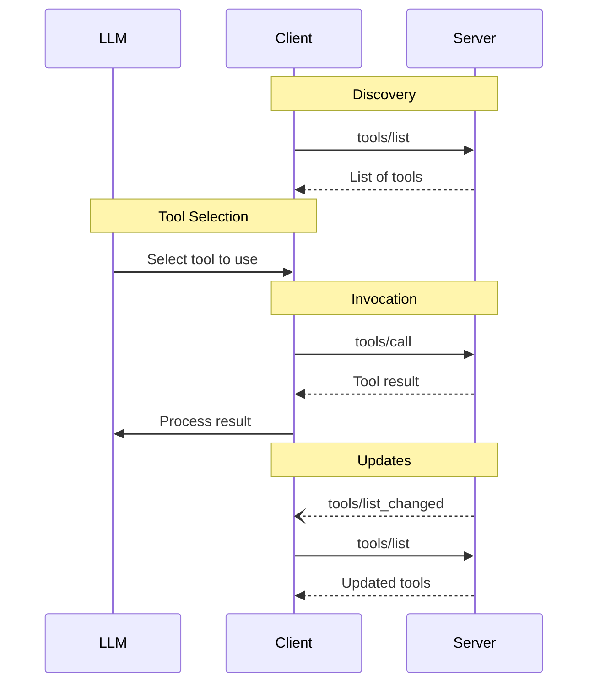

<div id="enable-section-numbers" />

<Info>**Protocol Revision**: 2025-11-25</Info>

The Model Context Protocol (MCP) allows servers to expose tools that can be invoked by
language models. Tools enable models to interact with external systems, such as querying
databases, calling APIs, or performing computations. Each tool is uniquely identified by
a name and includes metadata describing its schema.

## User Interaction Model

Tools in MCP are designed to be **model-controlled**, meaning that the language model can
discover and invoke tools automatically based on its contextual understanding and the
user's prompts.

However, implementations are free to expose tools through any interface pattern that
suits their needs&mdash;the protocol itself does not mandate any specific user
interaction model.

<Warning>

For trust & safety and security, there **SHOULD** always
be a human in the loop with the ability to deny tool invocations.

Applications **SHOULD**:

- Provide UI that makes clear which tools are being exposed to the AI model
- Insert clear visual indicators when tools are invoked
- Present confirmation prompts to the user for operations, to ensure a human is in the
  loop

</Warning>

## Capabilities

Servers that support tools **MUST** declare the `tools` capability:

```json
{
  "capabilities": {
    "tools": {
      "listChanged": true
    }
  }
}
```

`listChanged` indicates whether the server will emit notifications when the list of
available tools changes.

## Protocol Messages

### Listing Tools

To discover available tools, clients send a `tools/list` request. This operation supports
[pagination](/specification/2025-11-25/server/utilities/pagination).

**Request:**

```json
{
  "jsonrpc": "2.0",
  "id": 1,
  "method": "tools/list",
  "params": {
    "cursor": "optional-cursor-value"
  }
}
```

**Response:**

```json
{
  "jsonrpc": "2.0",
  "id": 1,
  "result": {
    "tools": [
      {
        "name": "get_weather",
        "title": "Weather Information Provider",
        "description": "Get current weather information for a location",
        "inputSchema": {
          "type": "object",
          "properties": {
            "location": {
              "type": "string",
              "description": "City name or zip code"
            }
          },
          "required": ["location"]
        },
        "icons": [
          {
            "src": "https://example.com/weather-icon.png",
            "mimeType": "image/png",
            "sizes": ["48x48"]
          }
        ]
      }
    ],
    "nextCursor": "next-page-cursor"
  }
}
```

### Calling Tools

To invoke a tool, clients send a `tools/call` request:

**Request:**

```json
{
  "jsonrpc": "2.0",
  "id": 2,
  "method": "tools/call",
  "params": {
    "name": "get_weather",
    "arguments": {
      "location": "New York"
    }
  }
}
```

**Response:**

```json
{
  "jsonrpc": "2.0",
  "id": 2,
  "result": {
    "content": [
      {
        "type": "text",
        "text": "Current weather in New York:\nTemperature: 72°F\nConditions: Partly cloudy"
      }
    ],
    "isError": false
  }
}
```

### List Changed Notification

When the list of available tools changes, servers that declared the `listChanged`
capability **SHOULD** send a notification:

```json
{
  "jsonrpc": "2.0",
  "method": "notifications/tools/list_changed"
}
```

## Message Flow



## Data Types

### Tool

A tool definition includes:

- `name`: Unique identifier for the tool
- `title`: Optional human-readable name of the tool for display purposes.
- `description`: Human-readable description of functionality
- `icons`: Optional array of icons for display in user interfaces
- `inputSchema`: JSON Schema defining expected parameters
  - Follows the [JSON Schema usage guidelines](/specification/2025-11-25/basic#json-schema-usage)
  - Defaults to 2020-12 if no `$schema` field is present
  - **MUST** be a valid JSON Schema object (not `null`)
  - For tools with no parameters, use one of these valid approaches:
    - `{ "type": "object", "additionalProperties": false }` - **Recommended**: explicitly accepts only empty objects
    - `{ "type": "object" }` - accepts any object (including with properties)
- `outputSchema`: Optional JSON Schema defining expected output structure
  - Follows the [JSON Schema usage guidelines](/specification/2025-11-25/basic#json-schema-usage)
  - Defaults to 2020-12 if no `$schema` field is present
- `annotations`: Optional properties describing tool behavior

<Warning>
  For trust & safety and security, clients **MUST** consider tool annotations to
  be untrusted unless they come from trusted servers.
</Warning>

#### Tool Names

- Tool names **SHOULD** be between 1 and 128 characters in length (inclusive).
- Tool names **SHOULD** be considered case-sensitive.
- The following **SHOULD** be the only allowed characters: uppercase and lowercase ASCII letters (A-Z, a-z), digits
  (0-9), underscore (\_), hyphen (-), and dot (.)
- Tool names **SHOULD NOT** contain spaces, commas, or other special characters.
- Tool names **SHOULD** be unique within a server.
- Example valid tool names:
  - getUser
  - DATA_EXPORT_v2
  - admin.tools.list

### Tool Result

Tool results may contain [**structured**](#structured-content) or **unstructured** content.

**Unstructured** content is returned in the `content` field of a result, and can contain multiple content items of different types:

<Note>
  All content types (text, image, audio, resource links, and embedded resources)
  support optional
  [annotations](/specification/2025-11-25/server/resources#annotations) that
  provide metadata about audience, priority, and modification times. This is the
  same annotation format used by resources and prompts.
</Note>

#### Text Content

```json
{
  "type": "text",
  "text": "Tool result text"
}
```

#### Image Content

```json
{
  "type": "image",
  "data": "base64-encoded-data",
  "mimeType": "image/png",
  "annotations": {
    "audience": ["user"],
    "priority": 0.9
  }
}
```

#### Audio Content

```json
{
  "type": "audio",
  "data": "base64-encoded-audio-data",
  "mimeType": "audio/wav"
}
```

#### Resource Links

A tool **MAY** return links to [Resources](/specification/2025-11-25/server/resources), to provide additional context
or data. In this case, the tool will return a URI that can be subscribed to or fetched by the client:

```json
{
  "type": "resource_link",
  "uri": "file:///project/src/main.rs",
  "name": "main.rs",
  "description": "Primary application entry point",
  "mimeType": "text/x-rust"
}
```

Resource links support the same [Resource annotations](/specification/2025-11-25/server/resources#annotations) as regular resources to help clients understand how to use them.

<Info>
  Resource links returned by tools are not guaranteed to appear in the results
  of a `resources/list` request.
</Info>

#### Embedded Resources

[Resources](/specification/2025-11-25/server/resources) **MAY** be embedded to provide additional context
or data using a suitable [URI scheme](./resources#common-uri-schemes). Servers that use embedded resources **SHOULD** implement the `resources` capability:

```json
{
  "type": "resource",
  "resource": {
    "uri": "file:///project/src/main.rs",
    "mimeType": "text/x-rust",
    "text": "fn main() {\n    println!(\"Hello world!\");\n}",
    "annotations": {
      "audience": ["user", "assistant"],
      "priority": 0.7,
      "lastModified": "2025-05-03T14:30:00Z"
    }
  }
}
```

Embedded resources support the same [Resource annotations](/specification/2025-11-25/server/resources#annotations) as regular resources to help clients understand how to use them.

#### Structured Content

**Structured** content is returned as a JSON object in the `structuredContent` field of a result.

For backwards compatibility, a tool that returns structured content SHOULD also return the serialized JSON in a TextContent block.

#### Output Schema

Tools may also provide an output schema for validation of structured results.
If an output schema is provided:

- Servers **MUST** provide structured results that conform to this schema.
- Clients **SHOULD** validate structured results against this schema.

Example tool with output schema:

```json
{
  "name": "get_weather_data",
  "title": "Weather Data Retriever",
  "description": "Get current weather data for a location",
  "inputSchema": {
    "type": "object",
    "properties": {
      "location": {
        "type": "string",
        "description": "City name or zip code"
      }
    },
    "required": ["location"]
  },
  "outputSchema": {
    "type": "object",
    "properties": {
      "temperature": {
        "type": "number",
        "description": "Temperature in celsius"
      },
      "conditions": {
        "type": "string",
        "description": "Weather conditions description"
      },
      "humidity": {
        "type": "number",
        "description": "Humidity percentage"
      }
    },
    "required": ["temperature", "conditions", "humidity"]
  }
}
```

Example valid response for this tool:

```json
{
  "jsonrpc": "2.0",
  "id": 5,
  "result": {
    "content": [
      {
        "type": "text",
        "text": "{\"temperature\": 22.5, \"conditions\": \"Partly cloudy\", \"humidity\": 65}"
      }
    ],
    "structuredContent": {
      "temperature": 22.5,
      "conditions": "Partly cloudy",
      "humidity": 65
    }
  }
}
```

Providing an output schema helps clients and LLMs understand and properly handle structured tool outputs by:

- Enabling strict schema validation of responses
- Providing type information for better integration with programming languages
- Guiding clients and LLMs to properly parse and utilize the returned data
- Supporting better documentation and developer experience

### Schema Examples

#### Tool with default 2020-12 schema:

```json
{
  "name": "calculate_sum",
  "description": "Add two numbers",
  "inputSchema": {
    "type": "object",
    "properties": {
      "a": { "type": "number" },
      "b": { "type": "number" }
    },
    "required": ["a", "b"]
  }
}
```

#### Tool with explicit draft-07 schema:

```json
{
  "name": "calculate_sum",
  "description": "Add two numbers",
  "inputSchema": {
    "$schema": "http://json-schema.org/draft-07/schema#",
    "type": "object",
    "properties": {
      "a": { "type": "number" },
      "b": { "type": "number" }
    },
    "required": ["a", "b"]
  }
}
```

#### Tool with no parameters:

```json
{
  "name": "get_current_time",
  "description": "Returns the current server time",
  "inputSchema": {
    "type": "object",
    "additionalProperties": false
  }
}
```

## Error Handling

Tools use two error reporting mechanisms:

1. **Protocol Errors**: Standard JSON-RPC errors for issues like:
   - Unknown tools
   - Malformed requests (requests that fail to satisfy [CallToolRequest schema](specification/2025-11-25/schema#calltoolrequest))
   - Server errors

2. **Tool Execution Errors**: Reported in tool results with `isError: true`:
   - API failures
   - Input validation errors (e.g., date in wrong format, value out of range)
   - Business logic errors

**Tool Execution Errors** contain actionable feedback that language models can use to self-correct and retry with adjusted parameters.
**Protocol Errors** indicate issues with the request structure itself that models are less likely to be able to fix.
Clients **SHOULD** provide tool execution errors to language models to enable self-correction.
Clients **MAY** provide protocol errors to language models, though these are less likely to result in successful recovery.

Example protocol error:

```json
{
  "jsonrpc": "2.0",
  "id": 3,
  "error": {
    "code": -32602,
    "message": "Unknown tool: invalid_tool_name"
  }
}
```

Example tool execution error (input validation):

```json
{
  "jsonrpc": "2.0",
  "id": 4,
  "result": {
    "content": [
      {
        "type": "text",
        "text": "Invalid departure date: must be in the future. Current date is 08/08/2025."
      }
    ],
    "isError": true
  }
}
```

## Security Considerations

1. Servers **MUST**:
   - Validate all tool inputs
   - Implement proper access controls
   - Rate limit tool invocations
   - Sanitize tool outputs

2. Clients **SHOULD**:
   - Prompt for user confirmation on sensitive operations
   - Show tool inputs to the user before calling the server, to avoid malicious or
     accidental data exfiltration
   - Validate tool results before passing to LLM
   - Implement timeouts for tool calls
   - Log tool usage for audit purposes
