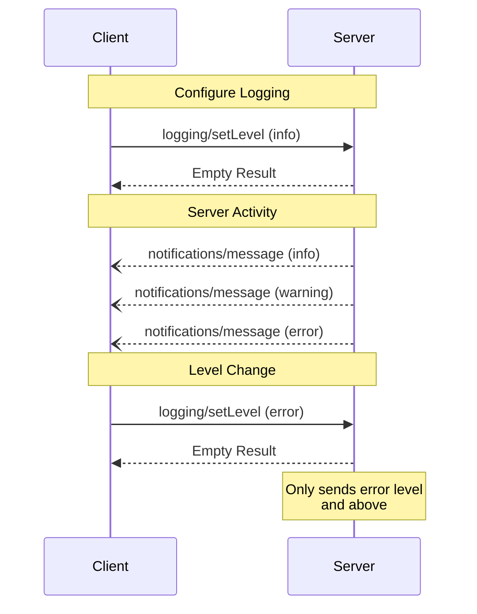

<div id="enable-section-numbers" />

<Info>**Protocol Revision**: 2025-11-25</Info>

The Model Context Protocol (MCP) provides a standardized way for servers to send
structured log messages to clients. Clients can control logging verbosity by setting
minimum log levels, with servers sending notifications containing severity levels,
optional logger names, and arbitrary JSON-serializable data.

## User Interaction Model

Implementations are free to expose logging through any interface pattern that suits their
needs&mdash;the protocol itself does not mandate any specific user interaction model.

## Capabilities

Servers that emit log message notifications **MUST** declare the `logging` capability:

```json
{
  "capabilities": {
    "logging": {}
  }
}
```

## Log Levels

The protocol follows the standard syslog severity levels specified in
[RFC 5424](https://datatracker.ietf.org/doc/html/rfc5424#section-6.2.1):

| Level     | Description                      | Example Use Case           |
| --------- | -------------------------------- | -------------------------- |
| debug     | Detailed debugging information   | Function entry/exit points |
| info      | General informational messages   | Operation progress updates |
| notice    | Normal but significant events    | Configuration changes      |
| warning   | Warning conditions               | Deprecated feature usage   |
| error     | Error conditions                 | Operation failures         |
| critical  | Critical conditions              | System component failures  |
| alert     | Action must be taken immediately | Data corruption detected   |
| emergency | System is unusable               | Complete system failure    |

## Protocol Messages

### Setting Log Level

To configure the minimum log level, clients **MAY** send a `logging/setLevel` request:

**Request:**

```json
{
  "jsonrpc": "2.0",
  "id": 1,
  "method": "logging/setLevel",
  "params": {
    "level": "info"
  }
}
```

### Log Message Notifications

Servers send log messages using `notifications/message` notifications:

```json
{
  "jsonrpc": "2.0",
  "method": "notifications/message",
  "params": {
    "level": "error",
    "logger": "database",
    "data": {
      "error": "Connection failed",
      "details": {
        "host": "localhost",
        "port": 5432
      }
    }
  }
}
```

## Message Flow



## Error Handling

Servers **SHOULD** return standard JSON-RPC errors for common failure cases:

- Invalid log level: `-32602` (Invalid params)
- Configuration errors: `-32603` (Internal error)

## Implementation Considerations

1. Servers **SHOULD**:
   - Rate limit log messages
   - Include relevant context in data field
   - Use consistent logger names
   - Remove sensitive information

2. Clients **MAY**:
   - Present log messages in the UI
   - Implement log filtering/search
   - Display severity visually
   - Persist log messages

## Security

1. Log messages **MUST NOT** contain:
   - Credentials or secrets
   - Personal identifying information
   - Internal system details that could aid attacks

2. Implementations **SHOULD**:
   - Rate limit messages
   - Validate all data fields
   - Control log access
   - Monitor for sensitive content
