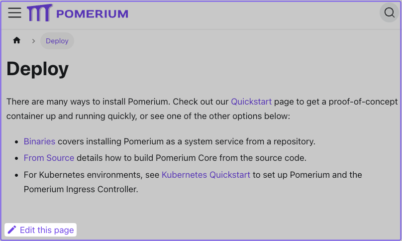
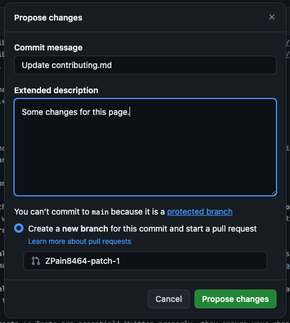

---
# cSpell:ignore zerolog jsonnet
title: Contributing
lang: en-US
keywords: [pomerium, community, contributing, pr, code]
description: This document describes how you can find issues to work on, fix/add documentation, and how setup Pomerium for local development.
---

First of all, thank you for considering contributing to Pomerium! You can have a direct impact on Pomerium by helping with its code or documentation.

- To contribute to Pomerium, open a [pull request](https://github.com/pomerium/pomerium/pulls) (PR) to the Pomerium repository
- To contribute to the documentation, open a PR to the documentation repository

If you're new to our community, that's okay: **we gladly welcome pull requests from anyone, regardless of your native language or coding experience.**

## General

We try to hold contributions to a high standard for quality, so don't be surprised if we ask for revisions--even if it seems small or insignificant. Please don't take it personally. If your change is on the right track, we can guide you to make it mergeable.

Here are some of the expectations we have of contributors:

- If your change is more than just a minor alteration, **open an issue to propose your change first.** This way we can avoid confusion, coordinate what everyone is working on, and ensure that changes are in-line with the project's goals and the best interests of its users. If there's already an issue about it, comment on the existing issue to claim it.

- **Keep pull requests small.** Smaller PRs are more likely to be merged because they are easier to review! We might ask you to break up large PRs into smaller ones. [An example of what we DON'T do.](https://twitter.com/iamdevloper/status/397664295875805184)

- **Keep related commits together in a PR.** We do want pull requests to be small, but you should also keep multiple related commits in the same PR if they rely on each other.

- **Write tests.** Tests are essential! Written properly, they ensure your change works, and that other changes in the future won't break your change. CI checks should pass.

- **Benchmarks should be included for optimizations.** Optimizations sometimes make code harder to read or have changes that are less than obvious. They should be proven with benchmarks or profiling.

- **[Squash](http://gitready.com/advanced/2009/02/10/squashing-commits-with-rebase.html) insignificant commits.** Every commit should be significant. Commits which merely rewrite a comment or fix a typo can be combined into another commit that has more substance. Interactive rebase can do this, or a simpler way is `git reset --soft <diverging-commit>` then `git commit -s`.

- **Own your contributions.** Pomerium is a growing project, and it's much better when individual contributors help maintain their change after it is merged.

- **Use comments properly.** We expect good godoc comments for package-level functions, types, and values. Comments are also useful whenever the purpose for a line of code is not obvious.

:::info **Recommended reading**

- [**CodeReviewComments**](https://github.com/golang/go/wiki/CodeReviewComments)
- [**Linus Torvalds describes a good commit message**](https://gist.github.com/matthewhudson/1475276)
- [**Best Practices for Maintainers**](https://opensource.guide/best-practices/)
- [**Shrinking Code Review**](https://alexgaynor.net/2015/dec/29/shrinking-code-review/)

:::

### Versioning

Pomerium uses [Semantic Versioning](https://semver.org/). In practice, this means for a given version number **vMAJOR**.**MINOR**.**PATCH** (for example, `v0.1.0`):

- **MAJOR** indicates an incompatible API change
- **MINOR** indicates a new, backwards-compatible functionality
- **PATCH** indicates a backwards-compatible bug fix

As Pomerium is still pre-`v1.0.0`, you should expect breaking changes between releases.

### Development

See [Building Pomerium From Source](/docs/core/from-source) for information on getting started developing for Pomerium.

To run the unit tests locally:

```bash
make test
```

The instrumentation tests run using [Docker Compose]. To run the instrumentation tests locally, first build a development Docker image:

```bash
./scripts/build-dev-docker.bash
```

Next pick a configuration from the `integration/clusters` directory, for example `single-stateful`, and use Docker Compose to start that configuration. Use the `POMERIUM_TAG` environment variable to specify the `dev` docker image built in the previous step:

```bash
cd integration/clusters/single-stateful
env POMERIUM_TAG=dev docker compose up -V
```

Once that's up and running you can run the integration tests from another terminal:

```bash
go test -count=1 -v ./integration/...
```

If you need to make a change to the test configuration itself, there's a [tpl](https://github.com/pomerium/pomerium/tree/main/integration/tpl) folder that contains `jsonnet` files. Make a change and then rebuild the configuration by running:

```bash
go run ./integration/cmd/pomerium-integration-tests/ generate-configuration
```

### Logging

Pomerium uses the [zerolog](https://github.com/rs/zerolog) package for logging. Guidelines for log levels:

| Level | When to use |
| --- | --- |
| Panic | _Do not use._ Use Fatal instead. |
| Fatal | For unrecoverable errors at startup, or extremely exceptional circumstances at normal runtime. |
| Error | Something has failed, and an operator should know about it. |
| Warning | _Do not use._ Use Info or Error instead. |
| Info | An operator should want to see this during normal operation or routine inspection. |
| Debug | Verbose operational information that might be useful during troubleshooting. |
| Trace | Information that you would care about only when trying to understand code behavior/ordering/interaction. Intended for someone looking at or familiar with the code, not most end users. |

## Docs

Pomerium's documentation is available at [https://www.pomerium.io/docs](https://www.pomerium.io/docs). If you find a typo, feel a section could be better described, or have an idea for a totally new application or section, don't hesitate to make a PR change. There are few ways you can do this.

### Simple edits

The easiest way to fix minor documentation issues in Pomerium is to click on the **Edit this page** link at the bottom of any page.



Doing so will redirect you to the the respective file in the Documentation repository. Here, you can [update the page](https://guides.github.com/features/mastering-markdown/) and commit your changes.

Committing your changes will create a new branch and start a PR.



### Bigger changes

If you need to add a new page, or would like greater control over the editing process you can edit the docs similar to how you would make changes to the source code.

#### Prerequisites

We use [Docusaurus](https://docusaurus.io/) to generate our docs. Docusaurus is a React-powered static-site generator designed for documentation.

Before building the docs, you'll need the following packages:

- [Node.js](https://nodejs.org/en/download/)
- [Yarn](https://yarnpkg.com/lang/en/docs)

#### Make changes

Once you've installed Node and Yarn, in a terminal run the following command:

```bash
yarn start
```

You should see a link to the development server:

```bash
[INFO] Starting the development server...
[SUCCESS] Docusaurus website is running at: http://localhost:3001/
```

Once you have the development server up and running, any changes you make will automatically be reloaded and accessible in your browser.

To add a new document, simply add a new file with the `.md` markdown extension. For example, this document would be `docs/community/contributing.md`.

To make changes to the sidebar or navigation, see the following Docusaurus docs for instructions:

- [Sidebar](https://docusaurus.io/docs/sidebar)
- [Navbar](https://docusaurus.io/docs/api/themes/configuration#navbar)

### PR previews

We use [Netlify](https://www.netlify.com) to build and host our docs. A nice feature of Netlify is the [Deploy Preview URL](https://docs.netlify.com/site-deploys/deploy-previews/#deploy-preview-urls), which generates a link for PRs. This is helpful if you want to compare your local changes to what will ultimately be deployed in production.

After you've pushed your PR, a member of the documentation team will review your PR and communicate any next steps or suggestions before the PR is merged.

[configuration variables]: /docs/reference
[docker compose]: https://docs.docker.com/compose/
[download]: https://github.com/pomerium/pomerium/releases
[environmental configuration variables]: https://12factor.net/config
[verify]: https://verify.pomerium.com/
[identity provider]: /docs/identity-providers
[make]: https://en.wikipedia.org/wiki/Make_(software)
[tls certificates]: /docs/guides/certificates