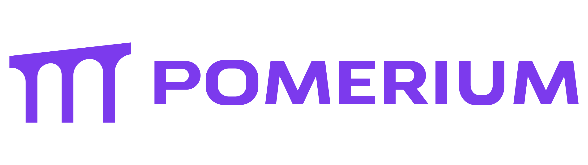

[][godocs]

Pomerium is an identity and context-aware reverse proxy. Pomerium builds secure, clientless connections to internal web apps and other services without a corporate VPN.

Pomerium is:

- **Easier** with [clientless access](https://www.pomerium.com/clientless-access).
- **Faster** by being [tunnel-free and deployed where your apps and services are](https://www.pomerium.com/vpn-replacement).
- **Safer** because [every single action is verified](https://www.pomerium.com/continuous-verification-auditing) before allowed to execute.
- **Tailored** to your organization’s needs by integrating all data for [context-aware access](https://www.pomerium.com/context-aware-access).

It’s not a VPN alternative – it’s the trusted, foolproof way to protect your business. Want a hosted control plane and management GUI? [Give Pomerium Zero a try today](https://console.pomerium.app/create-account?utm_source=github&utm_medium=readme&utm_campaign=github)!

## Docs

For comprehensive docs, and tutorials see our [documentation].

## Contributing

See [Contributing] for information on how you can contribute to Pomerium.

[contributing]: https://www.pomerium.com/docs/community/contributing
[documentation]: https://www.pomerium.com/docs/
[godocs]: https://pkg.go.dev/github.com/pomerium/pomerium
