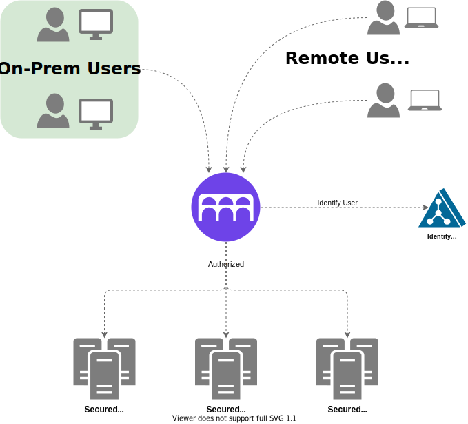
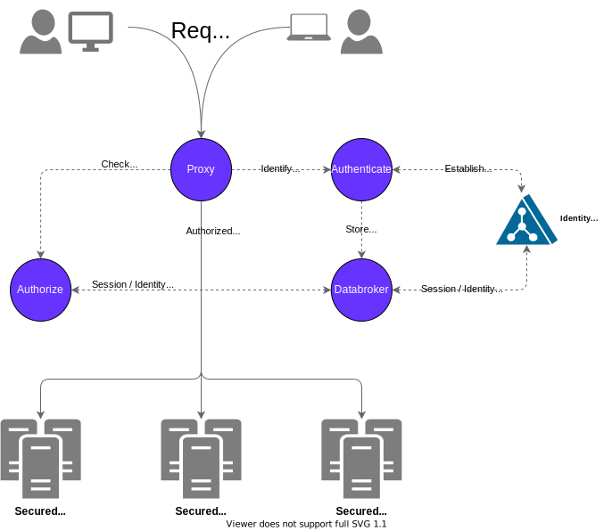
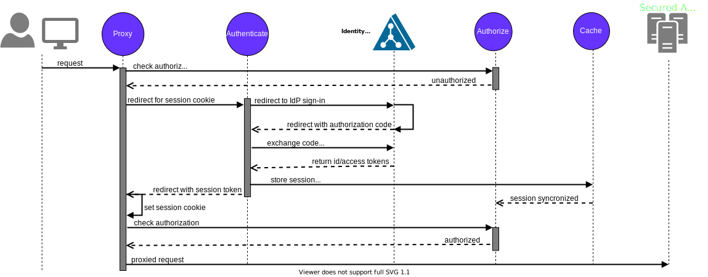

# Architecture

## System Level

Pomerium sits between end users and services requiring strong authentication. After verifying identity with your identity provider (IdP), Pomerium uses a configurable policy to decide how to route your user's request and if they are authorized to access the service.

## Component Level

Pomerium is composed of 4 logical components:

- Proxy Service

  - All user traffic flows through the proxy
  - Verifies all requests with Authentication service
  - Directs users to Authentication service to establish session identity
  - Processes policy to determine external/internal route mappings

- Authentication Service

  - Handles authentication flow to your IdP as needed
  - Handles identity verification after initial Authentication
  - Establishes user session cookie
  - Stores user OIDC tokens in databroker service

- Authorization Service

  - Processes policy to determine permissions for each service
  - Handles authorization check for all user sessions
  - Directs Proxy service to initiate Authentication flow as required
  - Provides additional security related headers for upstream services to consume

- Data Broker Service

  - Retrieves identity provider related data such as group membership
  - Stores and refreshes identity provider access and refresh tokens
  - Provides streaming authoritative session and identity data to Authorize service
  - Stores session and identity data in persistent storage

In production deployments, it is recommended that you deploy each component separately. This allows you to limit external attack surface, as well as scale and manage the services independently.

In test deployments, all four components may run from a single binary and configuration.

## Authentication Flow

Pomerium's internal and external component interactions during full authentication from a fresh user are diagramed below.

After initial authentication to provide a session token, only the authorization check interactions occur.

]
