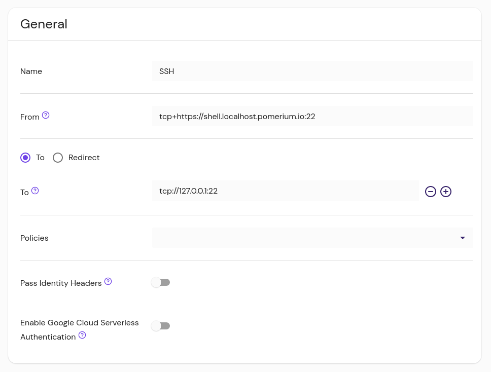
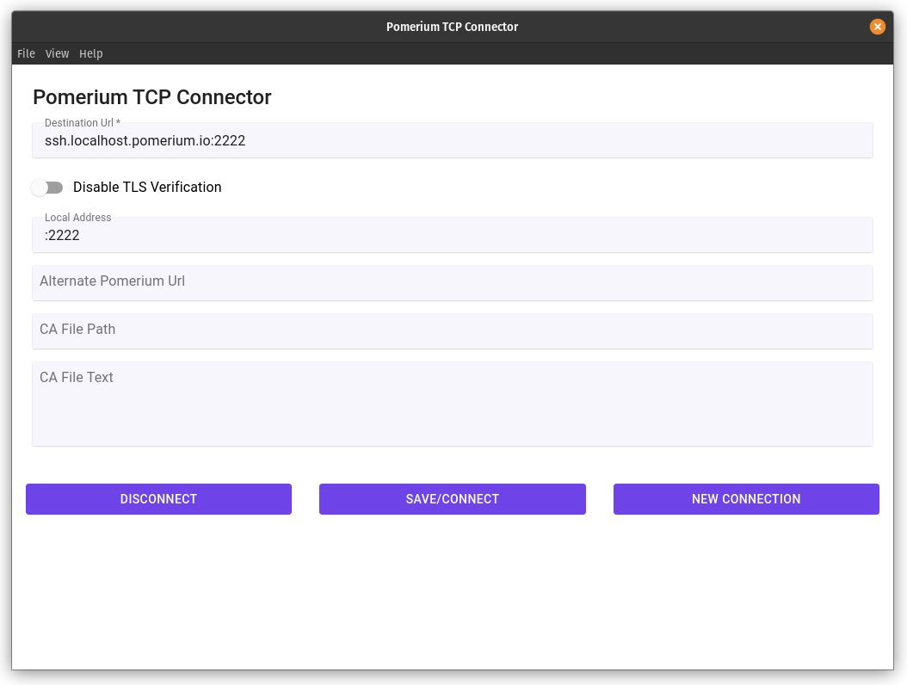

# Pomerium Desktop and CLI Clients

Pomerium is capable of creating secure connections to services like SSH, Redis, and more by creating a TCP tunnel to the service with a local client. This article describes configuring a route to accept TCP connections, and using either the CLI or GUI client to connect to it.

## Create a TCP Route

1. Specify this new Route as a TCP Route by prefixing `tcp+` in the **From** field, along with a port suffix.

   ::: tip
   The port is not used in the connection to the Pomerium gateway; this will always be port 443. Rather, the port defined in **From** is part of the mapping to the individual route. In this way, you can create multiple routes that share a DNS entry, differentiated by the port to determine which route they use.
   :::

1. The **To** field uses `tcp://` as a protocol, and specifies the address and port the service listens on.

The example below demonstrates a route to the SSH service on the host running the Pomerium Core or Pomerium Enterprise service:

::::: tabs
:::: tab Pomerium Core

```yaml
  - from: tcp+https://ssh.localhost.pomerium.io:22
    to: tcp://127.0.0.1:22
    policy:
    - allow:
        or: 
          - email:
              is: user@companydomain.com
```
::::
:::: tab Pomerium Enterprise


::::
:::::

## TCP Client Software

You can connect to this route with either the Pomerium CLI or Pomerium Desktop cient.

::::: tabs

:::: tab Pomerium Desktop
### Install

TBD

### Add a Connection



- **Destination Url**: Matches the [From](/enterprise/reference/manage.md#from) value of the route. <!-- Protocols never, ports always -->

- **Disable TLS Verification**: Allows untrusted certificates from the Pomerium gateway

- **Local Address** (optional): The local address and port number from which to access the service locally. If left blank, the client will choose a random port to listen to on the loopback address. <!-- Only ever port? -->

   In most cases, you only need to specify the port (ex: `:2222`), and the client will listen on all available local addresses. 

- **Alternate Pomerium Url** (optional): The proxy address, needed if the Destination URL isn't publicly resolvable, either from DNS or a local `hosts` entry.

- **CA File Path** or **CA File Text** (optional): If your Pomerium proxy is using a certificate signed by a Certificate Authority (**CA**) in your system's trusted key store, provide the CA certificate here. Alternately, you can toggle **Disable TLS Verification**.

::::
:::: tab Pomerium CLI

### Install

See [Release](/docs/releases.md#pomerium-cli) to learn how to install pomerium-cli in your environment.

### Connect to a TCP Route

1. Invoke `pomerium-cli` with the `tcp` option, and provide the route to your service (As defined in [`from`](/reference/readme.md#from) in your Route specification).

   ```bash
   pomerium-cli tcp ssh.localhost.pomerium.io:22
   2:06PM INF tcptunnel: listening on 127.0.0.1:36397
   ```


   You can optionally supply an address and/or port to the `listen` flag:

   ```bash
   pomerium-cli tcp ssh.localhost.pomerium.io:22 --listen :2222
   2:05PM INF tcptunnel: listening on [::]:2222
   ```

1. Connect to your service using the local address and port specified in the output of `pomerium-cli`:

   ```bash
   ssh 127.0.0.1 -p 2222
   ```

1. When the connection starts, the cli will open your browser and direct you to your Identity Provider to authenticate your session. Once authenticated the connection will continue and you can close the browser window.

1. In this example, since we are using SSH we can consolidate the TCP and SSH connections into a single command:

   ```bash
   ssh -o ProxyCommand='pomerium-cli tcp --listen - %h:%p' ssh.localhost.pomerium.io
   ```

::::
:::::

For more examples and detailed usage information, see [TCP Support](/docs/topics/tcp-support.md)

## Advanced Configuration

TODO: Document tcp routes with non-standard port binding.