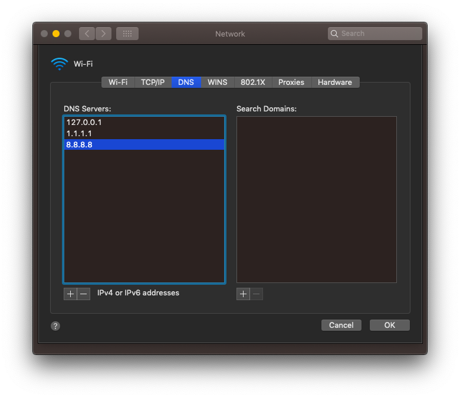
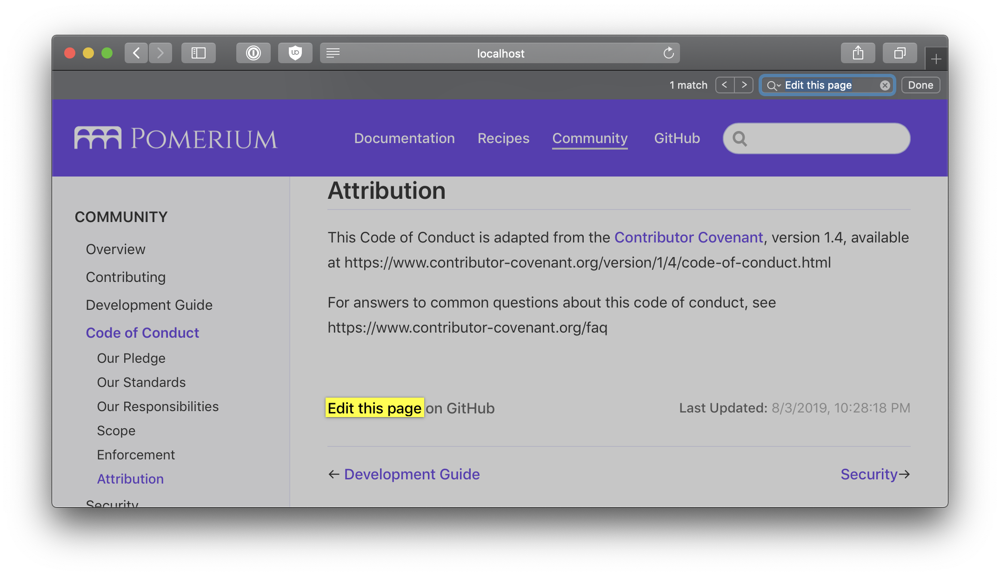
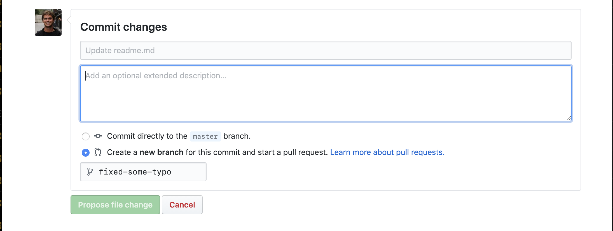

# Contributing

First of all, thank you for considering contributing to Pomerium! You can have a direct impact on Pomerium by helping with its code or documentation. To contribute to Pomerium, open a [pull request](https://github.com/pomerium/pomerium/pulls) (PR). If you're new to our community, that's okay: **we gladly welcome pull requests from anyone, regardless of your native language or coding experience.**

## General

We try to hold contributions to a high standard for quality, so don't be surprised if we ask for revisions--even if it seems small or insignificant. Please don't take it personally. If your change is on the right track, we can guide you to make it mergeable.

Here are some of the expectations we have of contributors:

- If your change is more than just a minor alteration, **open an issue to propose your change first.** This way we can avoid confusion, coordinate what everyone is working on, and ensure that changes are in-line with the project's goals and the best interests of its users. If there's already an issue about it, comment on the existing issue to claim it.

- **Keep pull requests small.** Smaller PRs are more likely to be merged because they are easier to review! We might ask you to break up large PRs into smaller ones. [An example of what we DON'T do.](https://twitter.com/iamdevloper/status/397664295875805184)

- **Keep related commits together in a PR.** We do want pull requests to be small, but you should also keep multiple related commits in the same PR if they rely on each other.

- **Write tests.** Tests are essential! Written properly, they ensure your change works, and that other changes in the future won't break your change. CI checks should pass.

- **Benchmarks should be included for optimizations.** Optimizations sometimes make code harder to read or have changes that are less than obvious. They should be proven with benchmarks or profiling.

- **[Squash](http://gitready.com/advanced/2009/02/10/squashing-commits-with-rebase.html) insignificant commits.** Every commit should be significant. Commits which merely rewrite a comment or fix a typo can be combined into another commit that has more substance. Interactive rebase can do this, or a simpler way is `git reset --soft <diverging-commit>` then `git commit -s`.

- **Own your contributions.** Pomerium is a growing project, and it's much better when individual contributors help maintain their change after it is merged.

- **Use comments properly.** We expect good godoc comments for package-level functions, types, and values. Comments are also useful whenever the purpose for a line of code is not obvious.

- **Recommended reading**

  - [CodeReviewComments](https://github.com/golang/go/wiki/CodeReviewComments) for an idea of what we look for in good, clean Go code
  - [Linus Torvalds describes a good commit message](https://gist.github.com/matthewhudson/1475276)
  - [Best Practices for Maintainers](https://opensource.guide/best-practices/)
  - [Shrinking Code Review](https://alexgaynor.net/2015/dec/29/shrinking-code-review/)

## Code

### Build From Source

The following quick-start guide covers how to retrieve and build Pomerium from its source-code as well as how to run Pomerium using a minimal but complete configuration. One of the benefits of compiling from source is that Go supports building static binaries for a [wide array of architectures and operating systems](https://gist.github.com/asukakenji/f15ba7e588ac42795f421b48b8aede63) -- some of which may not yet be supported by Pomerium's official images or binaries.

#### Prerequisites

- [git](https://git-scm.com/)
- [go](https://golang.org/doc/install) programming language
- A configured [identity provider]
- A [wild-card TLS certificate]

#### Download

Retrieve the latest copy of pomerium's source code by cloning the repository.

```bash
git clone https://github.com/pomerium/pomerium.git $HOME/pomerium
```

#### Make

Build Pomerium from source in a single step using make.

```bash
cd $HOME/pomerium
make
```

[Make] will run all the tests, some code linters, then build the binary. If all is good, you should now have a freshly builtPpomerium binary for your architecture and operating system in the `pomerium/bin` directory.

#### Configure

Pomerium supports setting [configuration variables] using both environmental variables and using a configuration file.

#### Configuration file

Create a config file (`config.yaml`). This file will be use to determine Pomerium's configuration settings, routes, and access-policies. Consider the following example:

<<< @/docs/configuration/examples/config/config.minimal.yaml

#### Environmental Variables

As mentioned above, Pomerium supports mixing and matching where configuration details are set. For example, we can specify our secret values and domains certificates as [environmental configuration variables].

<<< @/docs/configuration/examples/config/config.minimal.env

#### Run

Finally, source the the configuration `env` file and run Pomerium specifying the configuration file `config.yaml`.

```bash
source ./env
./bin/pomerium -config config.yaml
```

#### Navigate

Browse to `external-httpbin.your.domain.example`. Connections between you and [httpbin] will now be proxied and managed by Pomerium.

### Offline Domains (OPTIONAL)

Publicly resolvable domains are central in how Pomerium works. For local offline development, we'll have to do some additional configuration to mock that public workflow on our local machine.

The following guide assumes you do _not_ want to expose your development server to the public internet and instead want to do everything, with the exception of identity provider callbacks, locally.

If you are comfortable with a public development configuration, see the Synology quick-start which covers how to set up your network, domain, and retrieve wild-card certificates from LetsEncrypt, the only difference being you would route traffic to your local development machine instead of the docker image.

#### Pick an identity provider friendly domain name

Though typically you would want to use one of the TLDs specified by [RFC-2606](http://tools.ietf.org/html/rfc2606) for testing, unfortunately, google explicitly does not support oauth calls to test domains. As such, it's recommended to use a domain you control using a wildcard-subdomain that you know will not be used.

If you do not control a domain, you can use `*.localhost.pomerium.io` which I've established for this use and has a [public A record](https://en.wikipedia.org/wiki/List_of_DNS_record_types) pointing to localhost.

#### Wildcard domain resolution with `dnsmasq`

If you are on a plane (for example), you may not be able to access public DNS. Unfortunately, `/etc/hosts` does not support wildcard domains and would require you specifying a new entry for each Pomerium managed route. The workaround is to use [dnsmasq](https://en.wikipedia.org/wiki/Dnsmasq) locally which _does_ support local resolution of wildcard domains.

#### OSX

1. Install `brew update && brew install dnsmasq`
2. Edit `/usr/local/etc/dnsmasq.conf` to tell dnsmasq to resolve your test domains.

```bash
echo 'address=/.localhost.pomerium.io/127.0.0.1' > $(brew --prefix)/etc/dnsmasq.conf
```

```bash
sudo mkdir -pv /etc/resolver
sudo bash -c 'echo "nameserver 127.0.0.1" > /etc/resolver/localhost.pomerium.io'
```

1. Restart `dnsmasq`

```bash
sudo brew services restart dnsmasq
```

1. Tell OSX to use `127.0.0.1` as a the primary DNS resolver (followed by whatever public DNS you are using). 

#### Locally trusted wildcard certificates

In production, we'd use a public certificate authority such as LetsEncrypt. For local development, enter [mkcert](https://mkcert.dev/) which is a "simple zero-config tool to make locally trusted development certificates with any names you'd like."

1. Install `mkcert`.

```bash
go get -u github.com/FiloSottile/mkcert
```

1. Bootstrap `mkcert`'s root certificate into your operating system's trust store.

```bash
mkcert -install
```

1. Create your wildcard domain.

```bash
mkcert "*.localhost.pomerium.io"
```

1. Viola! Now you can use locally trusted certificates with pomerium!

| Setting                      | Certificate file location                   |
| ---------------------------- | ------------------------------------------- |
| `certificate_file`           | `./_wildcard.localhost.pomerium.io-key.pem` |
| `certificate_key_file`       | `./_wildcard.localhost.pomerium.io.pem`     |
| `certificate_authority_file` | `$(mkcert -CAROOT)/rootCA.pem`              |

See also:

- [Set up a local test domain with dnsmasq](https://github.com/aviddiviner/til/blob/master/devops/set-up-a-local-test-domain-with-dnsmasq.md)
- [USE DNSMASQ INSTEAD OF /ETC/HOSTS](https://www.stevenrombauts.be/2018/01/use-dnsmasq-instead-of-etc-hosts/)
- [How to setup wildcard dev domains with dnsmasq on a mac](https://hedichaibi.com/how-to-setup-wildcard-dev-domains-with-dnsmasq-on-a-mac/)
- [mkcert](https://github.com/FiloSottile/mkcert) is a simple tool for making locally-trusted development certificates

## Docs

Pomerium's documentation is available at <https://www.pomerium.io/docs>. If you find a typo, feel a section could be better described, or have an idea for a totally new application or section, don't hesitate to make a pull request change. There are few ways you can do this.

### Simple edits

The easiest way to fix minor documentation issues in Pomerium is to click on "Edit this page in Github" on any page.



Doing so will create a [fork](https://help.github.com/en/articles/fork-a-repo) of the project, allow you to [update the page](https://guides.github.com/features/mastering-markdown/), and create a [pull request](https://help.github.com/en/articles/about-pull-requests).



### Bigger changes

If you need to add a new page, or would like greater control over the editing process you can edit the docs similar to how you would make changes to the source code.

#### Pre-reqs

We use [VuePress](https://vuepress.vuejs.org) to generate our docs. Vuepress is a simple, [markdown](https://v1.vuepress.vuejs.org/config/#markdown) and [Vue.js](https://v1.vuepress.vuejs.org/config/#markdown) based static site generator. Before building the docs, you'll need to install the following pre-requisites.

1. [Node.js](https://nodejs.org/en/download/).
2. [Yarn](https://yarnpkg.com/lang/en/docs).

#### Make changes

Once you have Nodejs and Yarn installed, simply run `make docs` in a terminal which will install any required node packages as well as start up a development server. You should see something like the below, with a link to the local doc server.

```bash
success [19:02:54] Build f9f5f7 finished in 246 ms! ( http://localhost:8081/ )
```

Once you have the development server up and running, any changes you make will automatically be reloaded and accessible in your browser.

To add a new document, simply add a new file with the `.md` markdown extension. For example, this document would be `docs/community/contributing.md`.

To add a new document to the side or top-bar navigation, see `docs/.vuepress/config.js` and add that document to the desired section.

### PR Previews

We use [Netlify](https://www.netlify.com) to build and host our docs. One of nice features of Netlify, is that a preview of the docs are automatically created for each new pull request that is made, which lets you be sure that the version of your docs that you see locally match what will ultimately be deployed in production.

[configuration variables]: ../reference/readme.md
[download]: https://github.com/pomerium/pomerium/releases
[environmental configuration variables]: https://12factor.net/config
[httpbin]: https://httpbin.org/
[identity provider]: ../identity-providers/readme.md
[make]: https://en.wikipedia.org/wiki/Make_(software)
[wild-card tls certificate]: ../reference/certificates.md
