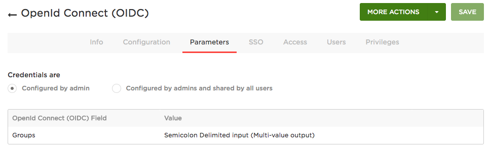

# Identity Provider Configuration

This article describes how to configure Pomerium to use a third-party identity service for single-sign-on.

There are a few configuration steps required for identity provider integration. Most providers support [OpenID Connect] which provides a standardized identity and authentication interface.

In this guide we'll cover how to do the following for each identity provider:

1. Set a **Redirect URL** pointing back to Pomerium. That is, `https://${AUTHENTICATE_SERVICE_URL}/oauth2/callback` 
2. Generate a **[Client ID]** and **[Client Secret]**.
3. Configure Pomerium to use the **[Client ID]** and **[Client Secret]** keys.

## Azure Active Directory

If you plan on allowing users to log in using a Microsoft Azure Active Directory account, either from your company or from external directories, you must register your application through the Microsoft Azure portal. If you don't have a Microsoft Azure account, you can [signup](https://azure.microsoft.com/en-us/free) for free.

You can access the Azure management portal from your Microsoft service, or visit <https://portal.azure.com> and sign in to Azure using the global administrator account used to create the Office 365 organization.

::: tip

There is no way to create an application that integrates with Microsoft Azure AD without having **your own** Microsoft Azure AD instance.

:::

If you have an Office 365 account, you can use the account's Azure AD instance instead of creating a new one. To find your Office 365 account's Azure AD instance:

1. [Sign in](https://portal.office.com) to Office 365.
2. Navigate to the [Office 365 Admin Center](https://portal.office.com/adminportal/home#/homepage).
3. Open the **Admin centers** menu drawer located in the left menu.
4. Click on **Azure AD**.

This will bring you to the admin center of the Azure AD instance backing your Office 365 account.

### Create a new application

Login to Microsoft Azure and choose **Azure Active Directory** from the sidebar.


Then under **MANAGE**, select **App registrations**.


Then click on the **+ ADD** button to add a new application.

Enter a name for the application, select **Web app/API** as the **Application Type**, and for **Sign-on URL** enter your application URL.


Next you will need to create a key which will be used as the **[Client Secret]** in Pomerium's configuration settings. Click on **Keys** from the **Settings** menu.

Enter a name for the key and choose the desired duration.

::: tip

If you choose an expiring key, make sure to record the expiration date in your calendar, as you will need to renew the key (get a new one) before that day in order to ensure users don't experience a service interruption.

:::

Click on **Save** and the key will be displayed. **Make sure to copy the value of this key before leaving this screen**, otherwise you may need to create a new key. This value is used as the **[Client Secret]**.


Next you need to ensure that the Pomerium's Redirect URL is listed in allowed reply URLs for the created application. Navigate to **Azure Active Directory** -> **Apps registrations** and select your app. Then click **Settings** -> **Reply URLs** and add Pomerium's redirect URL. For example, `https://authenticate.corp.beyondperimeter.com/oauth2/callback`.


Next, in order to retrieve group information from Active Directory, we need to enable the necessary permissions for the [Microsoft Graph API](https://docs.microsoft.com/en-us/graph/auth-v2-service#azure-ad-endpoint-considerations).

On the **App registrations** page, click **API permissions**. Click the **Add a permission** button and select **Microsoft Graph API**, select **Delegated permissions**. Under the **Directory** row, select the checkbox for **Directory.Read.All**.


You can also optionally select **grant admin consent for all users** which will suppress the permission screen on first login for users.

The final, and most unique step to Azure AD provider, is to take note of your specific endpoint. Navigate to **Azure Active Directory** -> **Apps registrations** and select your app.


Click on **Endpoints**


The **OpenID Connect Metadata Document** value will form the basis for Pomerium's **Provider URL** setting.

For example if the **Azure OpenID Connect** url is:

```bash
https://login.microsoftonline.com/0303f438-3c5c-4190-9854-08d3eb31bd9f/v2.0/.well-known/openid-configuration`
```

**Pomerium Identity Provider URL** would be

```bash
https://login.microsoftonline.com/0303f438-3c5c-4190-9854-08d3eb31bd9f/v2.0
```

### Configure Pomerium

Finally, configure Pomerium with the identity provider settings retrieved in the pervious steps. Your [environmental variables] should look something like:

```bash
# Azure
IDP_PROVIDER="azure"
IDP_PROVIDER_URL="https://login.microsoftonline.com/{REPLACE-ME-SEE-ABOVE}/v2.0"
IDP_CLIENT_ID="REPLACE-ME"
IDP_CLIENT_SECRET="REPLACE-ME"
```

## Gitlab

:::warning

Support was removed in v0.0.3 because Gitlab does not provide callers with a user email, under any scope, to a caller unless that user has selected her email to be public. Pomerium support is blocked until [this gitlab bug](https://gitlab.com/gitlab-org/gitlab-ce/issues/44435#note_88150387) is fixed.

:::

Log in to your Gitlab account and go to the [APIs & services](https://console.developers.google.com/projectselector/apis/credentials).

Navigate to **User Settings** then **Applications** using the left-hand menu.

On the **Applications** page, add a new application by setting the following parameters:

Field        | Description
------------ | --------------------------------------------------------------------
Name         | The name of your web app
Redirect URI | Redirect URL (e.g.`https://authenticate.corp.example.com/oauth2/callback`)
Scopes       | **Must** select **read_user** and **openid**


1.Click **Save Application** to proceed.

Your [Client ID] and [Client Secret] will be displayed:


Set [Client ID] and [Client Secret] in Pomerium's settings. Your [environmental variables] should look something like this.

```bash
IDP_PROVIDER="gitlab"
# NOTE!!! Provider url is optional, but should be set if you are running an on-premise instance
# defaults to : https://gitlab.com, a local copy would look something like `http://gitlab.corp.beyondperimeter.com`
IDP_PROVIDER_URL="https://gitlab.com"
IDP_CLIENT_ID="yyyy"
IDP_CLIENT_SECRET="xxxxxx"
```

When a user first uses Pomerium to login, they will be presented with an authorization screen similar to the following.


## Google

Log in to your Google account and go to the [APIs & services](https://console.developers.google.com/projectselector/apis/credentials). Navigate to **Credentials** using the left-hand menu.


On the **Credentials** page, click **Create credentials** and choose **OAuth [Client ID]**.


On the **Create [Client ID]** page, select **Web application**. In the new fields that display, set the following parameters:

Field                    | Description
------------------------ | --------------------------------------------------------------------
Name                     | The name of your web app
Authorized redirect URIs | Redirect URL (e.g.`https://authenticate.corp.example.com/oauth2/callback`)


Click **Create** to proceed. The [Client ID] and [Client Secret] settings will be displayed for later configuration with Pomerium.


In order to have Pomerium validate group membership, we'll also need to configure a [service account](https://console.cloud.google.com/iam-admin/serviceaccounts) with [G-suite domain-wide delegation](https://developers.google.com/admin-sdk/directory/v1/guides/delegation) enabled.

1. Open the [Service accounts](https://console.cloud.google.com/iam-admin/serviceaccounts) page.
2. If prompted, select a project.
3. Click **Create service** account. In the Create service account window, type a name for the service account, and select Furnish a new private key and Enable Google Apps Domain-wide Delegation.
4. Then click **Save**.


Then, you'll need to manually open an editor and add an `impersonate_user` field to the downloaded public/private key file. In this case, we'd be impersonating the admin account `user@pomerium.io`.

::: warning

 [Google requires](https://stackoverflow.com/questions/48585700/is-it-possible-to-call-apis-from-service-account-without-acting-on-behalf-of-a-u/48601364#48601364) that service accounts act on behalf of another user. You MUST add the `impersonate_user` field to your json key file.

:::


```json
{
  "type": "service_account",
  "client_id": "109818058799274859509",
  ...
  "impersonate_user": "user@pomerium.io"
  ...
}
```

The base64 encoded contents of this public/private key pair json file will used for the value of the `IDP_SERVICE_ACCOUNT` configuration setting. 

Next we'll delegate G-suite group membership access to the service account we just created .

1. Go to your G Suite domain's [Admin console](http://admin.google.com/).
2. Select **Security** from the list of controls. If you don't see Security listed, select More controls 1\. from the gray bar at the bottom of the page, then select Security from the list of controls.
3. Select **Advanced settings** from the list of options.
4. Select **Manage API client** access in the Authentication section.
5. In the **Client name** field enter the service account's **Client ID**.
6. In the **One or More API Scopes** field enter the following list of scopes: `https://www.googleapis.com/auth/admin.directory.group.readonly` `https://www.googleapis.com/auth/admin.directory.user.readonly`
7. Click the **Authorize** button.


Your [environmental variables] should look something like this.

```bash
IDP_PROVIDER="google"
IDP_PROVIDER_URL="https://accounts.google.com"
IDP_CLIENT_ID="yyyy.apps.googleusercontent.com"
IDP_CLIENT_SECRET="xxxxxx"
IDP_SERVICE_ACCOUNT="zzzz" # output of `cat service-account-key.json | base64`
```

## Okta

[Log in to your Okta account](https://login.okta.com) and head to your Okta dashboard. Select **Applications** on the top menu. On the Applications page, click the **Add Application** button to create a new app.


On the **Create New Application** page, select the **Web** for your application.


Next, provide the following information for your application settings:

Field                        | Description
---------------------------- | ---------------------------------------------------------------------
Name                         | The name of your application.
Base URIs (optional)         | The domain(s) of your application.
Login redirect URIs          | Redirect URL (e.g.`https://authenticate.corp.example.com/oauth2/callback`).
Group assignments (optional) | The user groups that can sign in to this application.
Grant type allowed           | **You must enable Refresh Token.**


Click **Done** to proceed. You'll be taken to the **General** page of your app.

Go to the **General** page of your app and scroll down to the **Client Credentials** section. This section contains the **[Client ID]** and **[Client Secret]** to be used in the next step.


Next, we'll configure Okta to pass along a custom OpenID Connect claim to establish group membership. To do so, click the **API** menu item, and select **Authorization Servers**.


Select your desired authorization server and navigate to the **claims tab**. Click **Add Claim** and configure the group claim for **ID Token** as follows.


Field                 | Value
--------------------- | ---------------------
Name                  | groups
Include in token type | **ID Token**, Always.
Value Type            | Groups
Filter                | Matches regex `.*`
Include in            | Any scope

Add an another, almost identical, claim but this time for **Access Token**.

Field                 | Value
--------------------- | -------------------------
Name                  | groups
Include in token type | **Access Token**, Always.
Value Type            | Groups
Filter                | Matches regex `.*`
Include in            | Any scope


Finally, configure Pomerium with the identity provider settings retrieved in the pervious steps. Your [environmental variables] should look something like this.

```bash
IDP_PROVIDER="okta"
IDP_PROVIDER_URL="https://dev-108295-admin.oktapreview.com/"
IDP_CLIENT_ID="0oairksnr0C0fEJ7l0h7"
IDP_CLIENT_SECRET="xxxxxx"
```

## OneLogin

Log in to your [OneLogin](https://www.onelogin.com/) account and head to the dashboard.

Click **Apps** on the top menu. Select the **Add apps** menu item.


On the **Find Application** page, search for **openid**. Select **Openid Connect** by OneLogin, Inc.


On the App Configuration page, **name the app** and **select a logo**. Select **Save**.


Next, set set the **Redirect URI's** setting to be Pomerium's redirect url `https://${AUTHENTICATE_SERVICE_URL}/oauth2/callback`.


Go to the **SSO** page. This section contains the **[Client ID]** and **[Client Secret]** you'll use to configure Pomerium.

Set the application type to **Web** and the token endpoint to be **POST**.

Under **Token Timeout settings** set **Refresh Token** to 60 minutes (or whatever value makes sense for your organization). Note, however, if you don't enable refresh tokens the user will be prompted to authenticate whenever the access token expires which can result in a poor user experience. 


[OneLogin's OIDC implementation](https://developers.onelogin.com/openid-connect/scopes) supports the `groups` which can return either the user's group or role which can be used within pomerium to enforced group-based ACL policy.

To return the user's Active Directory field, configure the group to return `member_of`. In the Default if no value field, select **User Roles** and Select **Semicolon Delimited** in the adjacent field. **Select Save**



**Alternatively**, groups can return the _roles_ a user is assigned. In the Default if no value field, select **User Roles** and Select **Semicolon Delimited** in the adjacent field. **Select Save**


Finally, configure Pomerium with the identity provider settings retrieved in the pervious steps. Your [environmental variables] should look something like this.

```bash
IDP_PROVIDER="onelogin"
IDP_PROVIDER_URL="https://openid-connect.onelogin.com/oidc"
IDP_CLIENT_ID="9e613ce0-1622-0137-452d-0a93c31f8392142934"
IDP_CLIENT_SECRET="3e86ef0cc21b6dcf10c1d91e032568617d37e9fe1609ffd8042d3c25a560c36c"
```

After reloading Pomerium, you should be able to see any login events from your OneLogin events dashboard.


[client id]: ./config-reference.html#identity-provider-client-id
[client secret]: ./config-reference.html#identity-provider-client-secret
[environmental variables]: https://en.wikipedia.org/wiki/Environment_variable
[oauth2]: https://oauth.net/2/
[openid connect]: https://en.wikipedia.org/wiki/OpenID_Connect
