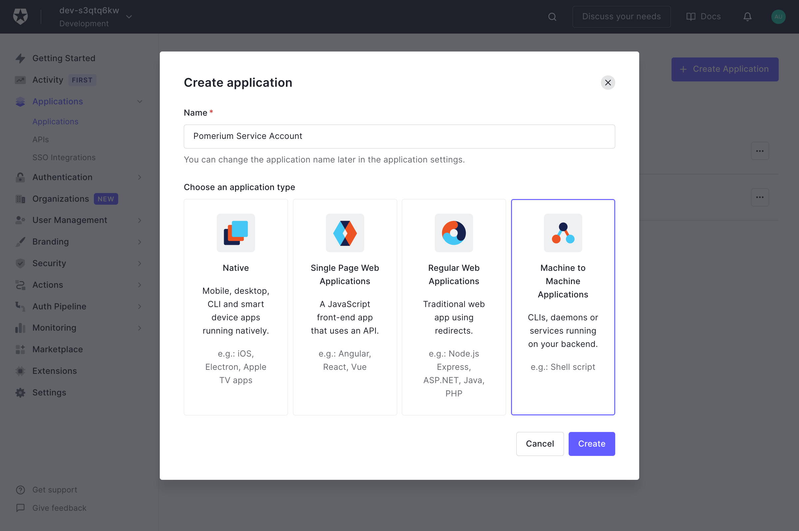
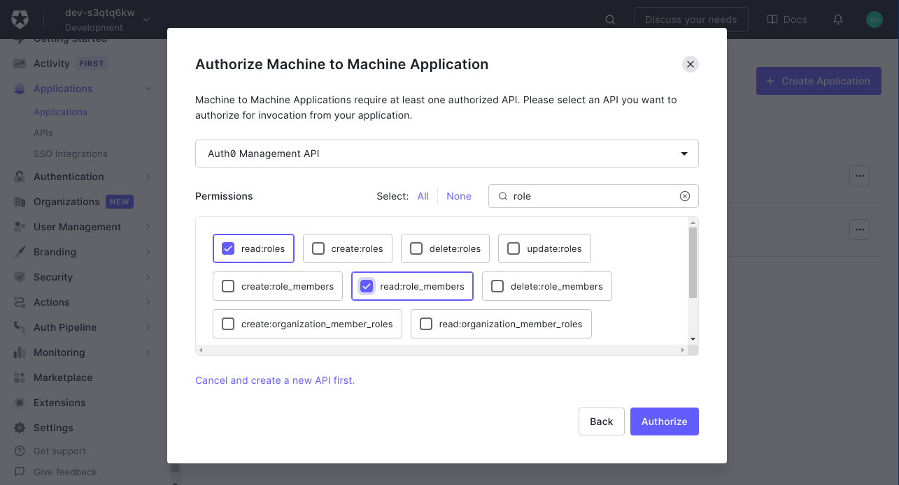

# Auth0

[Log in to your Auth0 account](https://manage.auth0.com/) and head to your dashboard. Select **Applications** on the left menu. On the Applications page, click the **Create Application** button to create a new app.


## Create Regular Web Application

On the **Create New Application** page, name your application and select the **Regular Web Application** for your application. This is the application that your users will login to.


Next, provide the following information for your application settings:

| Field                        | Description                                                               |
| ---------------------------- | ------------------------------------------------------------------------- |
| Name                         | The name of your application.                                             |
| Application Login URI        | Authenticate URL (e.g. `https://${authenticate_service_url}`)             |
| Allowed Callback URLs        | Redirect URL (e.g. `https://${authenticate_service_url}/oauth2/callback`).|

Make sure to click **Save Changes** at the bottom of the page when you're done.

On the same **Settings** page you can copy the **Domain** and use it as the provider url (e.g. `https://dev-xyz.us.auth0.com`), as well as the **[Client ID]** and **[Client Secret]**.

## Service Account

Next we'll create an application to handle machine-to-machine communication from Pomerium to Auth0 in order to retrieve and establish group membership. 

::: tip

Auth0 refers to groups as roles.

:::

Select **Applications** on the left menu. On the Applications page, click the **Create Application** button to create a new app.

On the **Create New Application** page, name your application and select the **Machine to Machine Application** for your application. A different application is used for grabbing roles to keep things more secure.



Click **Create** and on the next page select **Auth0 Management API** from the dropdown. For the scopes use the **Filter** on the right to narrow things down to `role` and choose the `read:roles` and `read:role_members` scopes.



Finish things off by clicking **Authorize**.

To build the `idp_service_account` for Auth0 you need to base64-encode a JSON document containing the **Client ID** and **Client Secret** of the application:

```json
{
  "client_id": "...",
  "secret": "..."
}
```
You can now configure Pomerium with the identity provider settings retrieved in the previous steps. Your [environmental variables] should look something like this.

```bash
IDP_PROVIDER="auth0"
IDP_PROVIDER_URL="https://hayward-jackal.us.auth0.com"
IDP_CLIENT_ID="REPLACE_ME" # from the application the users login to
IDP_CLIENT_SECRET="REPLACE_ME" # from the application the users login to
IDP_SERVICE_ACCOUNT="REPLACE_ME" # built from the machine-to-machine application which talks to the Auth0 Management API
```

[client id]: ../../reference/readme.md#identity-provider-client-id
[client secret]: ../../reference/readme.md#identity-provider-client-secret
[environmental variables]: https://en.wikipedia.org/wiki/Environment_variable
