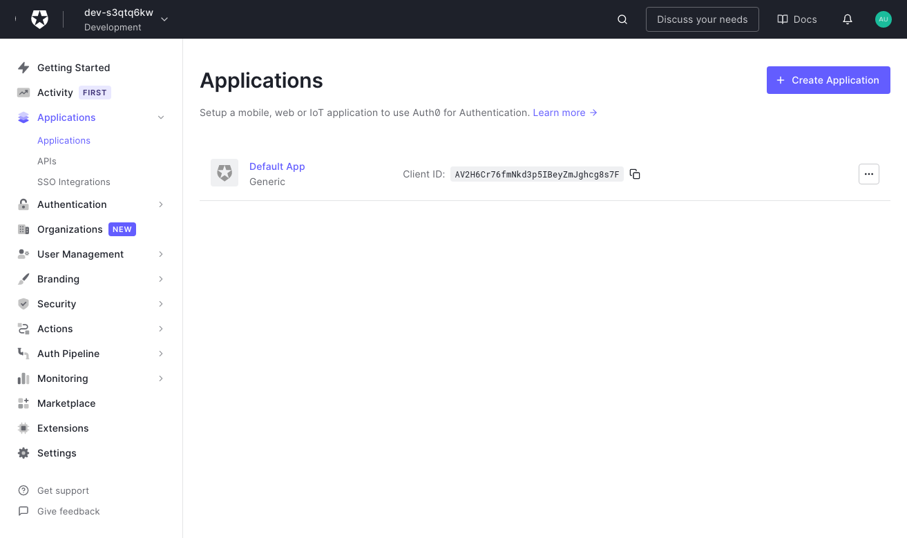
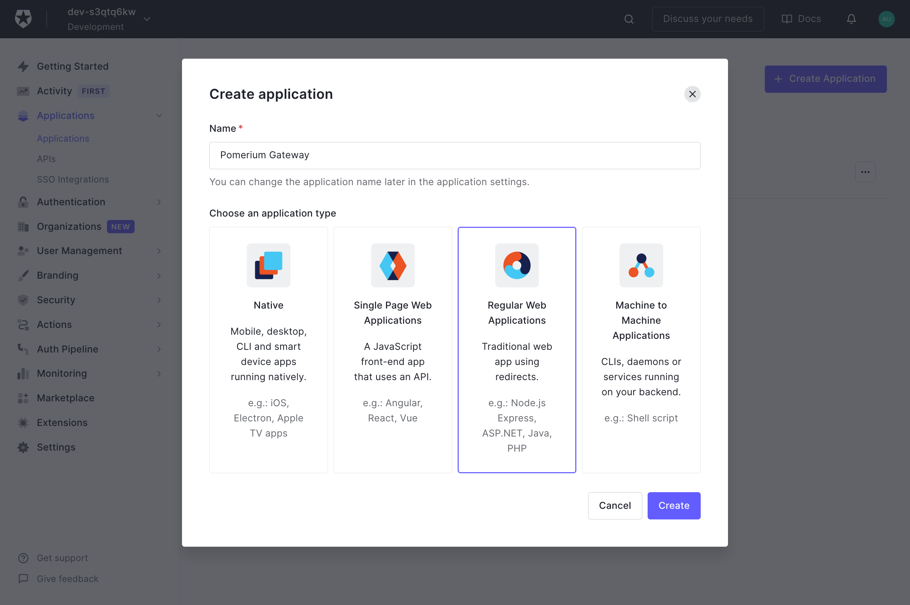

# Auth0

[Log in to your Auth0 account](https://manage.auth0.com/) and head to your dashboard. Select **Applications** on the left menu. On the Applications page, click the **Create Application** button to create a new app.

## Create Regular Web Application

On the **Create New Application** page, select the **Regular Web Application** for your application.

Next, provide the following information for your application settings:

| Field                        | Description                                                               |
| ---------------------------- | ------------------------------------------------------------------------- |
| Name                         | The name of your application.                                             |
| Application Login URI        | Authenticate URL (e.g. `https://${authenticate_service_url}`)             |
| Allowed Callback URLs        | Redirect URL (e.g. `https://${authenticate_service_url}/oauth2/callback`).|

Make sure to click **Save Changes** when you're done.

On the same **Settings** page you can copy the **Domain** and use it as the provider url (e.g. `https://dev-xyz.us.auth0.com`), as well as the **Client ID** and **Client Secret**.
