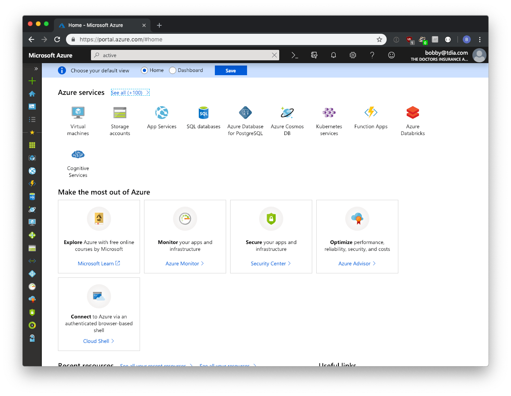
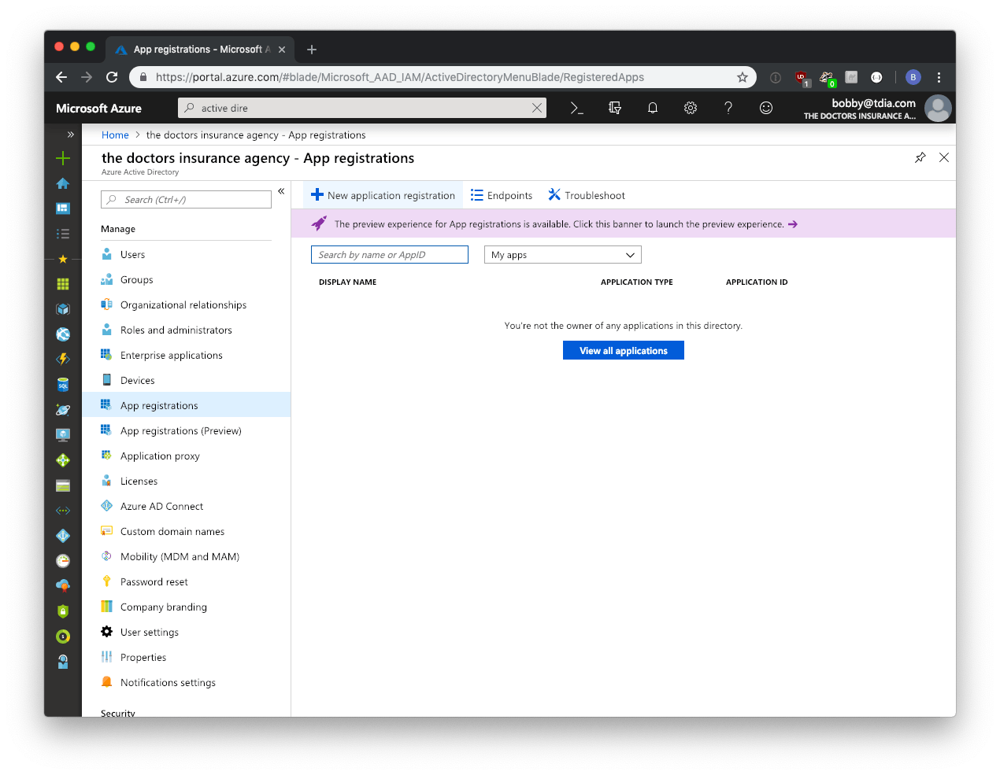
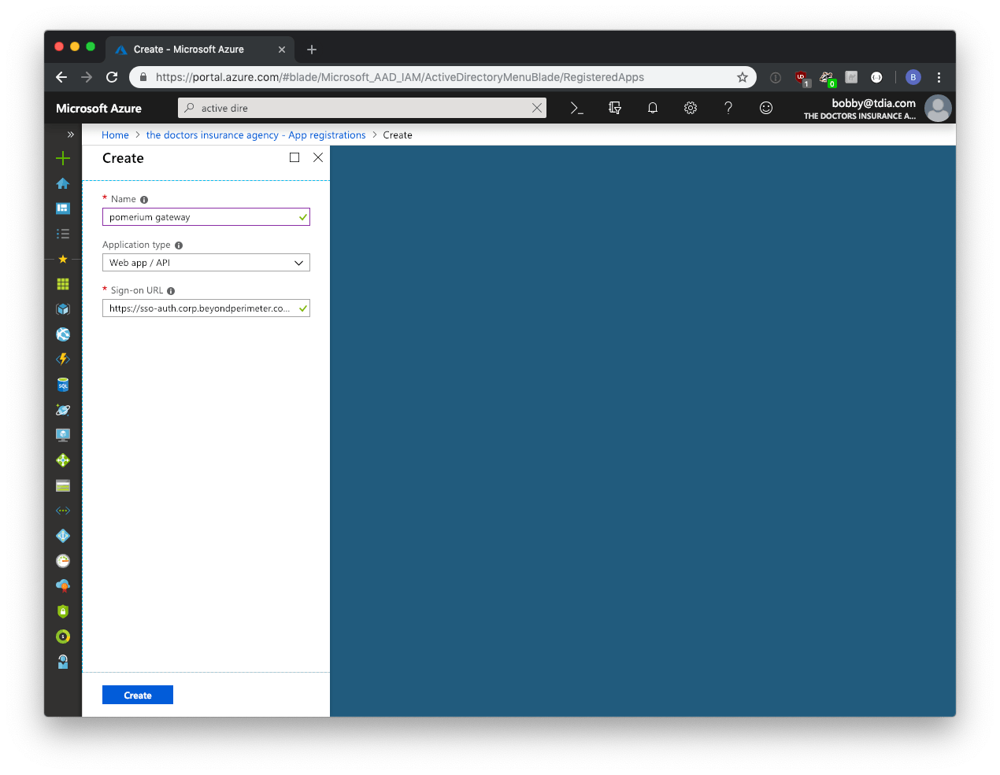
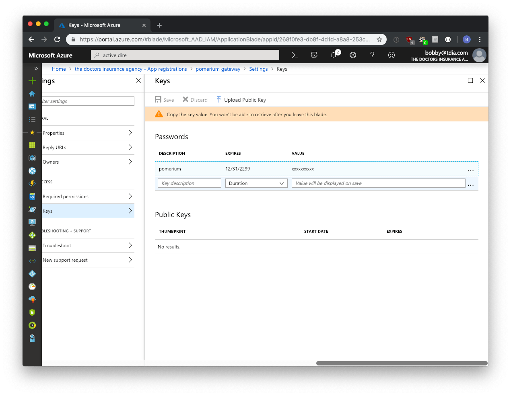
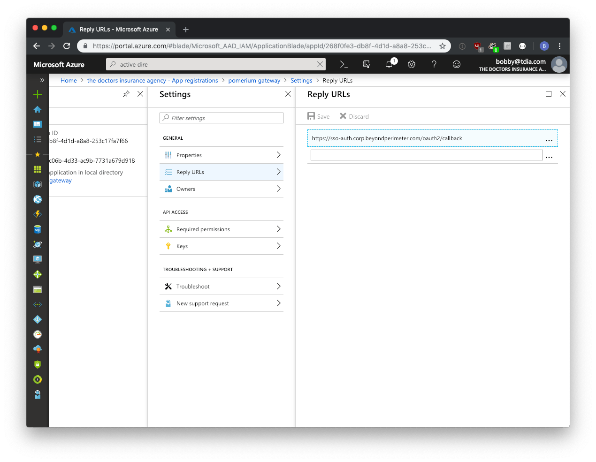
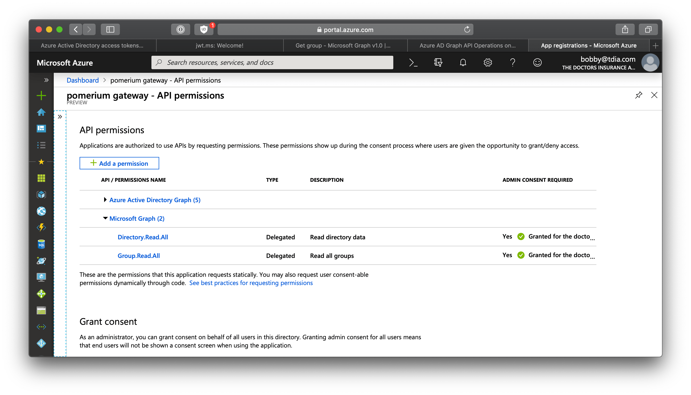
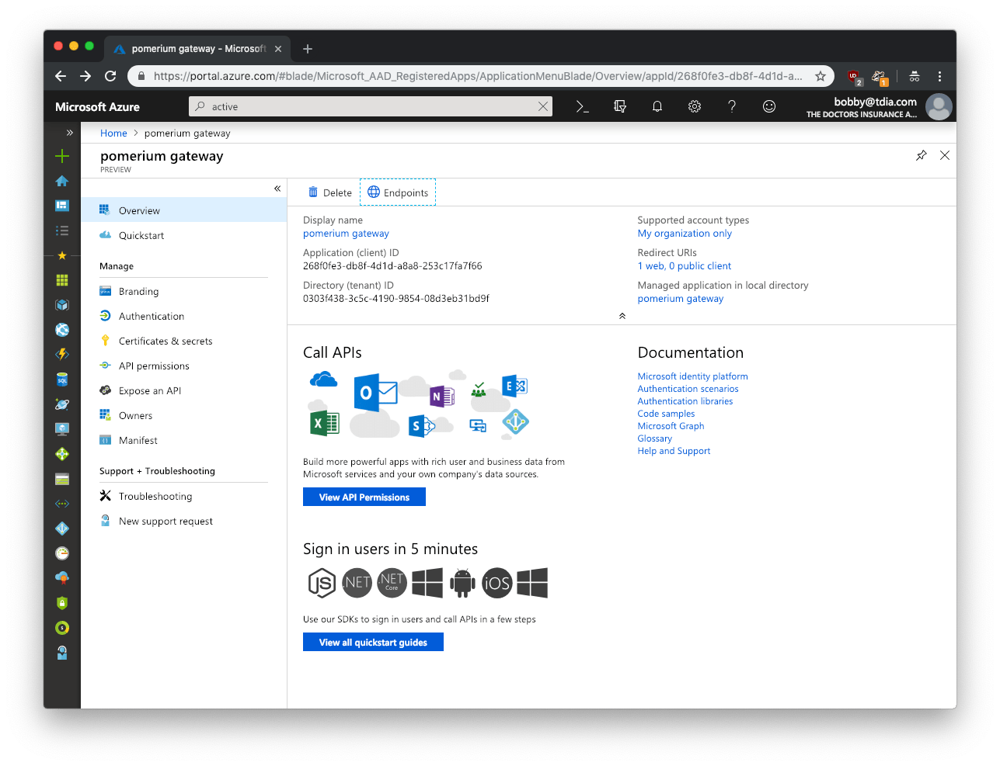
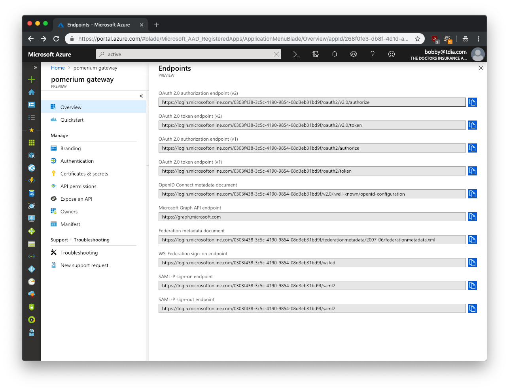
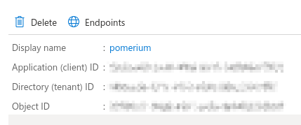

# Azure Active Directory

If you plan on allowing users to log in using a Microsoft Azure Active Directory account, either from your company or from external directories, you must register your application through the Microsoft Azure portal. If you don't have a Microsoft Azure account, you can [signup](https://azure.microsoft.com/en-us/free) for free.

You can access the Azure management portal from your Microsoft service, or visit <https://portal.azure.com> and sign in to Azure using the global administrator account used to create the Office 365 organization.

::: tip

There is no way to create an application that integrates with Microsoft Azure AD without having **your own** Microsoft Azure AD instance.

:::

If you have an Office 365 account, you can use the account's Azure AD instance instead of creating a new one. To find your Office 365 account's Azure AD instance:

1. [Sign in](https://portal.office.com) to Office 365.
2. Navigate to the [Office 365 Admin Center](https://portal.office.com/adminportal/home#/homepage).
3. Open the **Admin centers** menu drawer located in the left menu.
4. Click on **Azure AD**.

This will bring you to the admin center of the Azure AD instance backing your Office 365 account.

**Create a new application**

Login to Microsoft Azure and choose **Azure Active Directory** from the sidebar.



Then under **MANAGE**, select **App registrations**.



Then click on the **+ ADD** button to add a new application.

Enter a name for the application, select **Web app/API** as the **Application Type**, and for **Sign-on URL** enter your application URL.



Next you will need to create a key which will be used as the **[Client Secret]** in Pomerium's configuration settings. Click on **Keys** from the **Settings** menu.

Enter a name for the key and choose the desired duration.

::: tip

If you choose an expiring key, make sure to record the expiration date in your calendar, as you will need to renew the key (get a new one) before that day in order to ensure users don't experience a service interruption.

:::

Click on **Save** and the key will be displayed. **Make sure to copy the value of this key before leaving this screen**, otherwise you may need to create a new key. This value is used as the **[Client Secret]**.



Next you need to ensure that the Pomerium's Redirect URL is listed in allowed reply URLs for the created application. Navigate to **Azure Active Directory** -> **Apps registrations** and select your app. Then click **Settings** -> **Reply URLs** and add Pomerium's redirect URL. For example, `https://${authenticate_service_url}/oauth2/callback`.



Next, in order to retrieve group information from Active Directory, we need to enable the necessary permissions for the [Microsoft Graph API](https://docs.microsoft.com/en-us/graph/auth-v2-service#azure-ad-endpoint-considerations).

Please note, [Group ID](https://docs.microsoft.com/en-us/graph/api/group-get?view=graph-rest-1.0&tabs=http) not group name will be used to affirm group membership.

On the **App registrations** page, click **API permissions**. Click the **Add a permission** button and select **Microsoft Graph API**, select **Delegated permissions**. Under the **Directory** row, select the checkbox for **Group.Read.All**.



You can also optionally select **grant admin consent for all users** which will suppress the permission screen on first login for users.

The final, and most unique step to Azure AD provider, is to take note of your specific endpoint. Navigate to **Azure Active Directory** -> **Apps registrations** and select your app.



Click on **Endpoints**



The **OpenID Connect Metadata Document** value will form the basis for Pomerium's **Provider URL** setting.

For example if the **Azure OpenID Connect** url is:

```bash
https://login.microsoftonline.com/0303f438-3c5c-4190-9854-08d3eb31bd9f/v2.0/.well-known/openid-configuration`
```

**Pomerium Identity Provider URL** would be

```bash
https://login.microsoftonline.com/0303f438-3c5c-4190-9854-08d3eb31bd9f/v2.0
```

## Service Account

To use `allowed_groups` in a policy an `idp_service_account` needs to be set in the Pomerium configuration. The service account for Azure AD uses the same client ID and client secret configured above, as well as the directory (tenant) ID:




The format of the `idp_service_account` for Azure AD is a base64-encoded JSON document:

```json
{
  "client_id": "...",
  "client_secret": "...",
  "directory_id": "..."
}
```

## Pomerium Configuration

Finally, configure Pomerium with the identity provider settings retrieved in the previous steps. Your [environmental variables] should look something like:

```bash
# Azure
IDP_PROVIDER="azure"
IDP_PROVIDER_URL="https://login.microsoftonline.com/{REPLACE-ME-SEE-ABOVE}/v2.0"
IDP_CLIENT_ID="REPLACE-ME"
IDP_CLIENT_SECRET="REPLACE-ME"
```

[client id]: ../../configuration/readme.md#identity-provider-client-id
[client secret]: ../../configuration/readme.md#identity-provider-client-secret
[environmental variables]: https://en.wikipedia.org/wiki/Environment_variable
[oauth2]: https://oauth.net/2/
[openid connect]: https://en.wikipedia.org/wiki/OpenID_Connect
