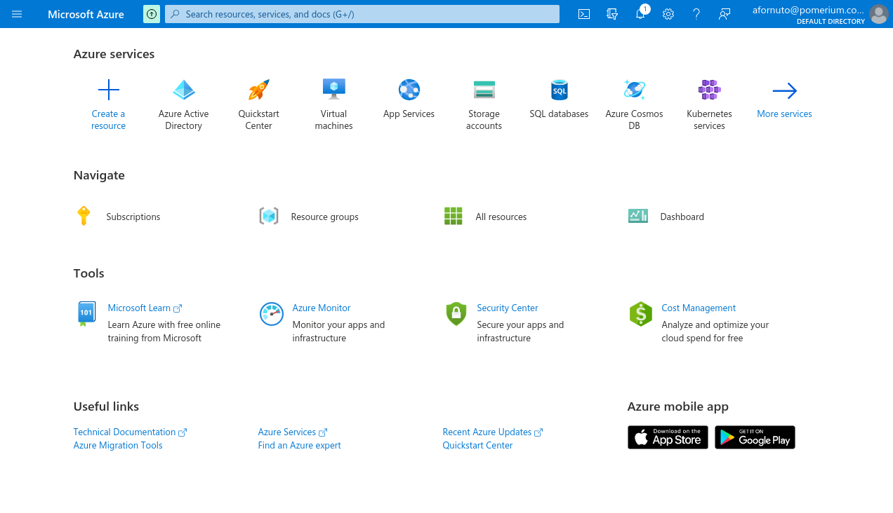
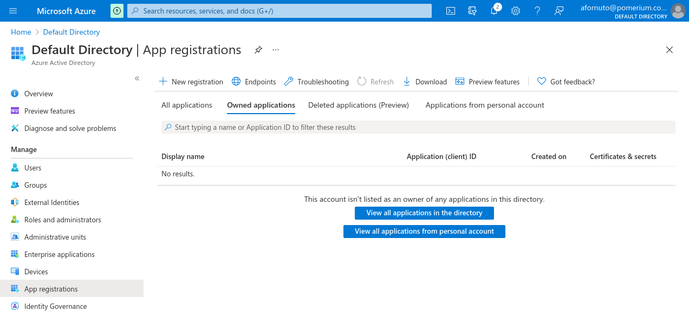
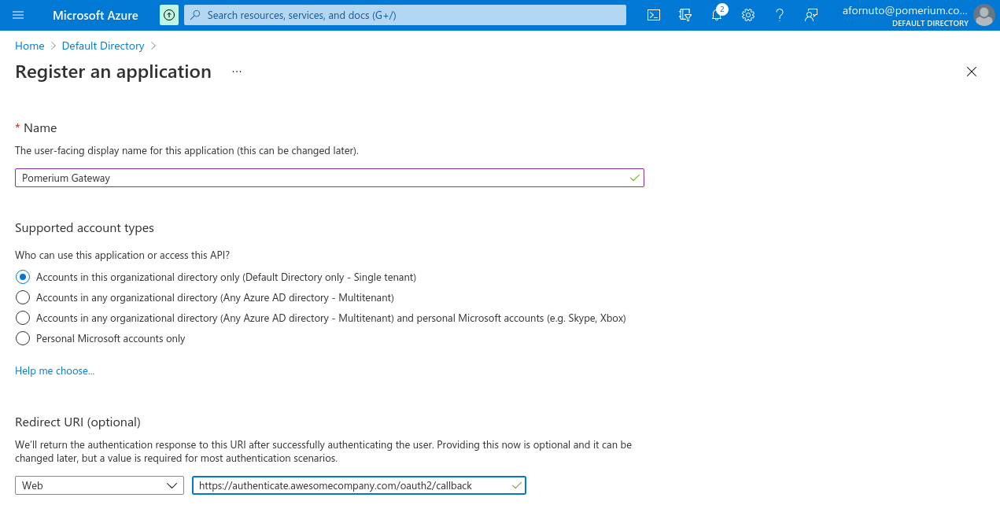
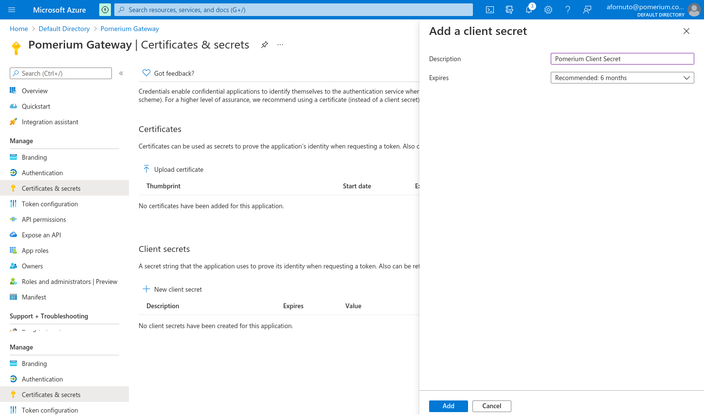
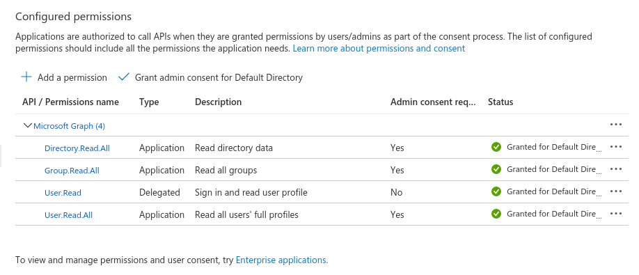
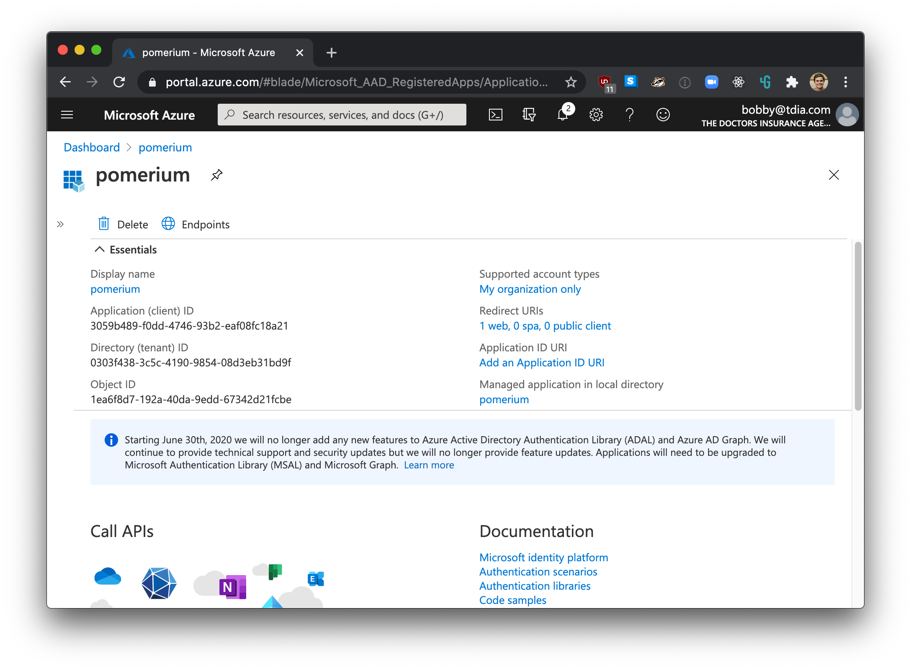
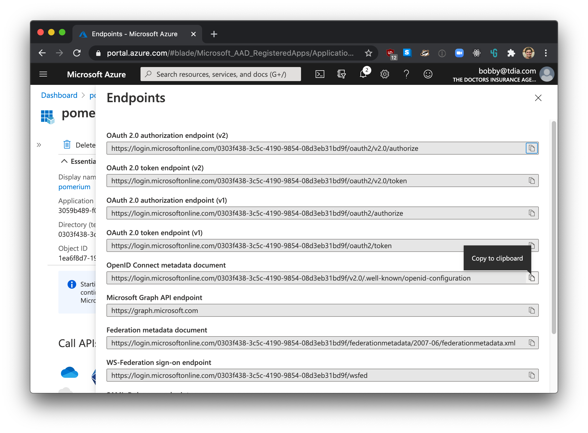

# Azure Active Directory

This page will help you configure Pomerium to use your Azure Active Directory as an IdP. It assumes you have already [installed Pomerium](/docs/install/readme.md)

::: warning
While we do our best to keep our documentation up to date, changes to third-party systems are outside our control. Refer to [Quickstart: Register an application with the Microsoft identity platform](https://docs.microsoft.com/en-us/azure/active-directory/develop/quickstart-register-app) from Microsoft's documentation as needed, or [let us know](https://github.com/pomerium/pomerium/issues/new?assignees=&labels=&template=bug_report.md) if we need to re-visit this page.
:::

If you plan on allowing users to log in using a Microsoft Azure Active Directory account, either from your company or from external directories, you must register your application through the Microsoft Azure portal. If you don't have a Microsoft Azure account, you can [signup](https://azure.microsoft.com/en-us/free) for free.

You can access the Azure management portal from your Microsoft service, or visit <https://portal.azure.com> and sign in to Azure using the global administrator account used to create the Office 365 organization.

::: tip
There is no way to create an application that integrates with Microsoft Azure AD without having **your own** Microsoft Azure AD instance.
:::

If you have an Office 365 account, you can use the account's Azure AD instance instead of creating a new one. To find your Office 365 account's Azure AD instance:

1. [Sign in](https://portal.office.com) to Office 365.
1. Navigate to the [Office 365 Admin Center](https://portal.office.com/adminportal/home#/homepage).
1. Open the **Admin centers** menu drawer located in the left menu.
1. Click on **Azure AD**.

This will bring you to the admin center of the Azure AD instance backing your Office 365 account.

## Create a New Application

1. Login to Microsoft Azure and choose **Azure Active Directory**.

   

1. Under **Manage**, select **App registrations**.

   

   Then click on the **+ New registration** button to add a new application.

1. Enter a name for the application, and set the redirect URI as `https://${authenticate_service_url}/oauth2/callback`. You can confirm your authenticate service URL from your Pomerium configuration.

   

   After you register the application, note the Application (client) ID, and Directory (tenant) ID.

1. Under Client credentials, click **Add a certificate or secret**. The secret you create will be used as the **[Client Secret]** in Pomerium's configuration settings.

1. Under **Client secrets** click **+ New client secret**. Enter a name for the key and choose the desired duration.

   

   ::: tip
   If you choose an expiring key, make sure to record the expiration date in your calendar, as you will need to renew the key (get a new one) before that day to ensure users don't experience a service interruption.
   :::

   Click on **Add** and the key will be displayed. **Make sure to copy the value of this key before leaving this screen**, otherwise you may need to create a new key.

### API Permissions

In order to retrieve group information from Active Directory, we need to enable the necessary permissions for the [Microsoft Graph API](https://docs.microsoft.com/en-us/graph/auth-v2-service#azure-ad-endpoint-considerations).

Please note, [Group ID](https://docs.microsoft.com/en-us/graph/api/group-get?view=graph-rest-1.0&tabs=http) not group name will be used to affirm group membership.

1. From the application page, click **API permissions**. Click the **+ Add a permission** button and select **Microsoft Graph API**. Select **Application permissions**. Use the filter to select the checkboxes for **Directory.Read.All**, **Group.Read.All** and **User.Read.All**, then click **Add permissions**.

   

   You can also optionally select **Grant admin consent for Default Directory** which will suppress the permission screen on first login for users.

1. The most unique step to Azure AD provider, is to take note of your specific endpoint. Navigate to **Azure Active Directory** -> **Apps registrations** and select your app.

   

   Click on **Endpoints**

   

The **OpenID Connect Metadata Document** value will form the basis for Pomerium's **Provider URL** setting.

For example if the **Azure OpenID Connect** url is:

```bash
https://login.microsoftonline.com/0303f438-3c5c-4190-9854-08d3eb31bd9f/v2.0/.well-known/openid-configuration`
```

**Pomerium Identity Provider URL** would be

```bash
https://login.microsoftonline.com/0303f438-3c5c-4190-9854-08d3eb31bd9f/v2.0
```

## Service Account (Optional)

::: tip

By default, this information will be inferred from your provider URL, and you should not need to set this key. If you are using a different [OAuth2] credential set, you may need to set these values separately.
:::

To use `allowed_groups` in a policy an `idp_service_account` needs to be set in the Pomerium configuration. The service account for Azure AD uses the same [client ID] and client secret configured above, as well as the directory (tenant) ID:


The format of the `idp_service_account` for Azure AD is a base64-encoded JSON document:

```json
{
  "client_id": "...",
  "client_secret": "...",
  "directory_id": "..."
}
```

## Pomerium Configuration

Configure Pomerium with the identity provider settings retrieved in the previous steps.

:::: tabs
::: tab config.yaml
```bash
idp_provider: "azure"
idp_provider_url: "https://login.microsoftonline.com/{REPLACE-ME-SEE-ABOVE}/v2.0"
idp_client_id: "REPLACE-ME"
idp_client_secret: "REPLACE-ME"
# Optional, if service account credentials are different
# or cannot be inferred from the above credential set.
# idp_service_account: "REPLACE-ME-SEE-ABOVE"
```
:::
::: tab Environment Variables
```bash
IDP_PROVIDER="azure"
IDP_PROVIDER_URL="https://login.microsoftonline.com/{REPLACE-ME-SEE-ABOVE}/v2.0"
IDP_CLIENT_ID="REPLACE-ME"
IDP_CLIENT_SECRET="REPLACE-ME"
# Optional, if service account credentials are different
# or cannot be inferred from the above credential set.
# IDP_SERVICE_ACCOUNT="REPLACE-ME-SEE-ABOVE"
```
:::
::::

## Troubleshooting

- In our testing, we found that users could be created in an Active Directory without an email address as part of their user claim. Pomerium user identity depends largely on the associated email address.
- If your default user in the Active Directory is unauthorized (403) even when specified as allowed in a policy by user, you can mitigate by creating a group membership and corresponding policy.

[client id]: /reference/readme.md#identity-provider-client-id
[client secret]: /reference/readme.md#identity-provider-client-secret
[environmental variables]: https://en.wikipedia.org/wiki/Environment_variable
[oauth2]: https://oauth.net/2/
