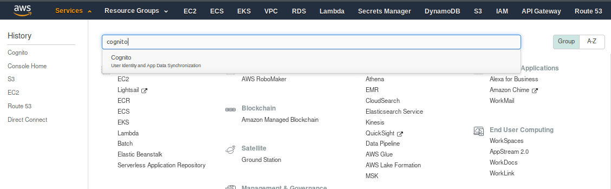
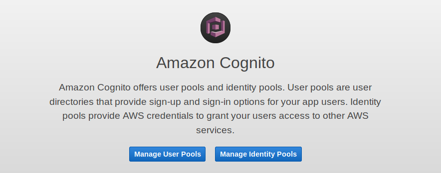
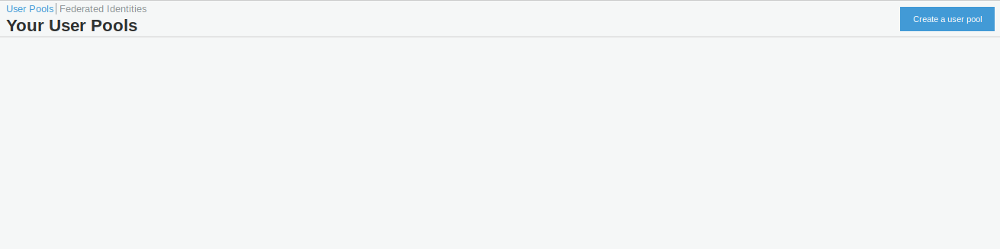
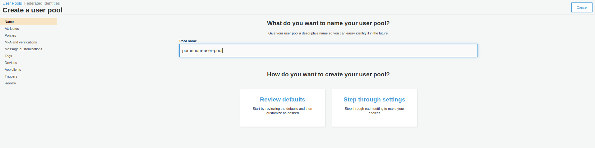
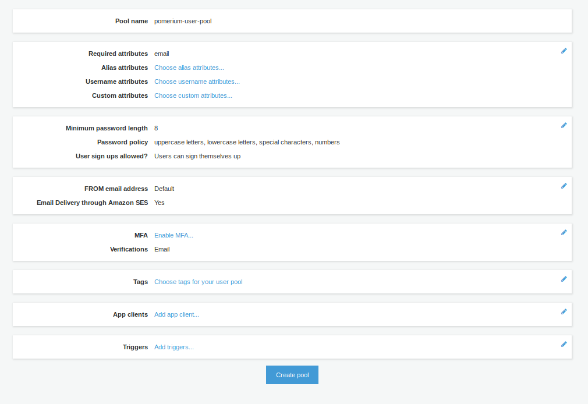
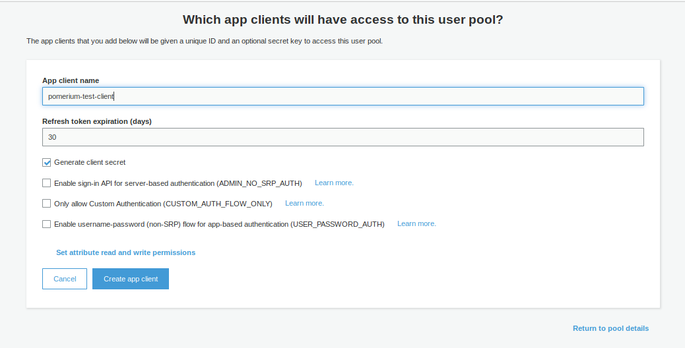
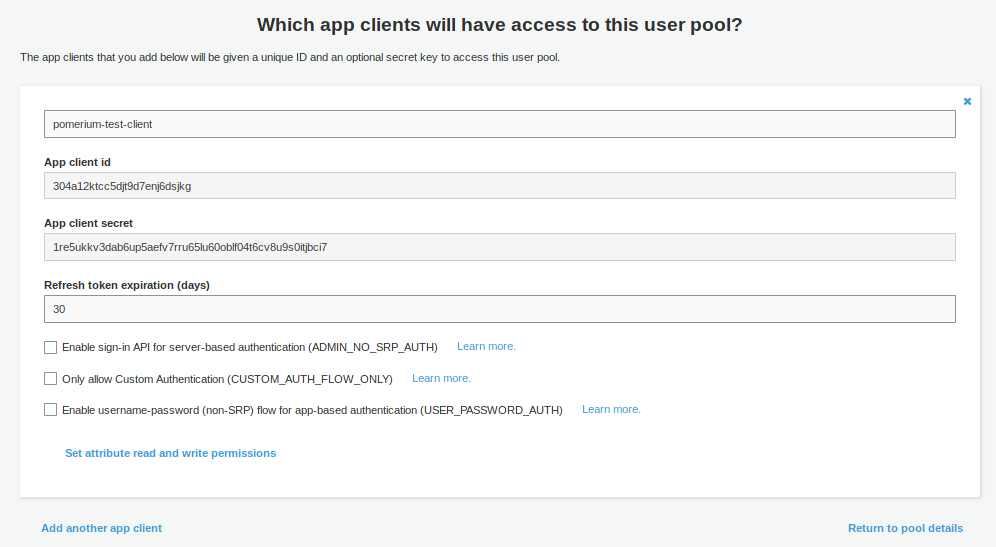
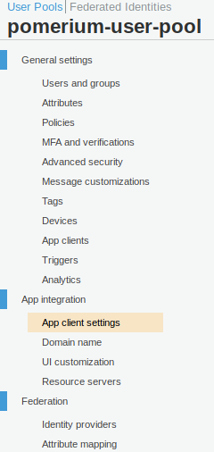
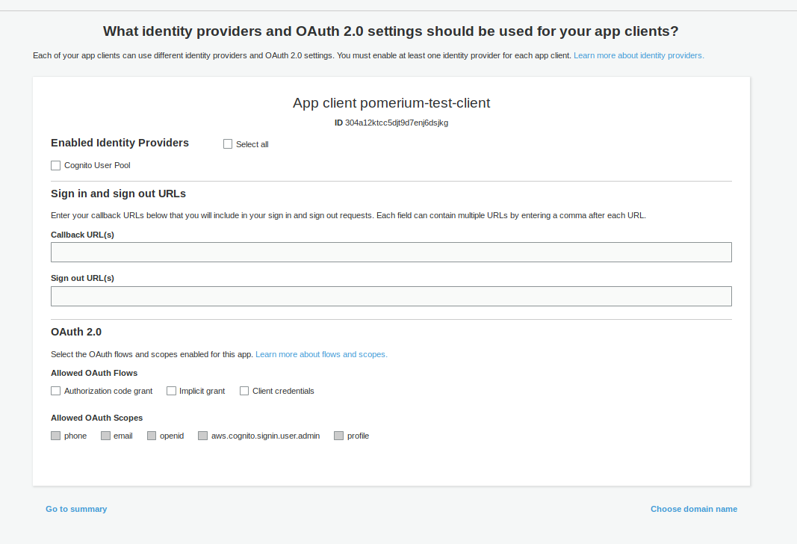
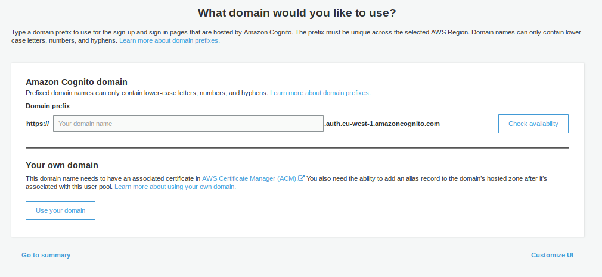

# AWS Cognito

## Setting up AWS Cognito

Log in to the [AWS Console](https://console.aws.amazon.com) account.

Go to **Services** on the top menu, and then search for **Cognito**



Once you have selected **Cognito**, you will be presented with the option of **Manage User Pools** or **Manage Identity Pools**. Pick **Manage User Pools**



You will now be shown any User Pools you have created already, or the option to **Create a User Pool**



Give the pool a name, and then choose to either **Review defaults** or **Step through settings**. It is entirely up to you as to whether you choose to Review the defaults (and make some customization) or to set up every setting individually.



Assuming you have chosen to **Review defaults**, you will be presented with the following: -



You can enable Multi-Factor Authentication (MFA), change your Password requirements, Tag the pool, among many other settings.

If you need to make changes after creating your pool, be aware that some settings will recreate the pool rather than update the existing pool. This will also generate new **Client IDs** and **Client Secrets**. An example would be changing _How do you want your end users to sign in?_ in **Attributes** from **Username** to **Email address or phone number**

Once you have created the pool, you can create an **App Client**. This is where you will configure the Pomerium application settings. Choose **Add an App Client**



Once the Client is created, you should then be able to retrieve the **Client ID** and the **Client Secret**



After this is done, go to **App client settings** (in the Side menu under **App Integration**)



In the setings for **Pomerium** app, put in the following details

| **Field**                  | **Description**                                                                              |
| -------------------------- | -------------------------------------------------------------------------------------------- |
| Callback URL(s)            | https://authenticate.corp.example.com/oauth2/callback                                        |
| Enabled Identity Providers | Choose **Cognito User Pool**, unless you have set up another **Identity Provider** (eg SAML) |
| Allowed OAuth Flows        | Authorization code grant                                                                     |
| Allowed OAuth Scopes       | Email, OpenID, Profile                                                                       |



**IMPORTANT**: For OAuth2 to work correctly with AWS Cognito, you must configure a **Domain name**. This is under **App integration** in the side menu



You can choose whether to use your own **Domain Name**, or use an AWS-provided one. The AWS-provided domain names are in the format `https://${DOMAIN-PREFIX}.auth.${AWS-REGION}.amazoncognito.com`

## Pomerium Configuration

Once you have configured AWS Cognito, you can place your settings in the **Pomerium** config. An example is below: -

```bash
IDP_PROVIDER="oidc"
IDP_PROVIDER_URL="https://cognito-idp.${AWS-REGION}.amazonaws.com/${USER-POOL-ID}"
IDP_CLIENT_ID="304a12ktcc5djt9d7enj6dsjkg"
IDP_CLIENT_SECRET="1re5ukkv3dab6up5aefv7rru65lu60oblf04t6cv8u9s0itjbci7"
IDP_SCOPES="openid,profile,email"
```

To retrieve the **User Pool ID**, go to **General Settings** in the Cognito Side menu within your pool, and you'll see the **Pool ID** (just above the **Pool ARN**)

An example of using this in a Kubernetes ConfigMap is below: -

```yaml
apiVersion: v1
data:
  config.yaml: |
    # Main configuration flags : https://www.pomerium.io/reference/
    authenticate_service_url: https://k8s-auth-prod.example.com # The URL you have set up for the Pomerium Authentication service
    authorize_service_url: https://pomerium-authorize-service.default.svc.cluster.local


    idp_provider: oidc
    idp_provider_url: https://cognito-idp.${AWS-REGION}.amazonaws.com/${USER_POOL_ID}
    idp_client_id: 304a12ktcc5djt9d7enj6dsjkg 
    idp_client_secret: "1re5ukkv3dab6up5aefv7rru65lu60oblf04t6cv8u9s0itjbci7"
    idp_scopes: ["openid", "email", "profile"]
kind: ConfigMap
metadata:
  name: pomerium-config
```
