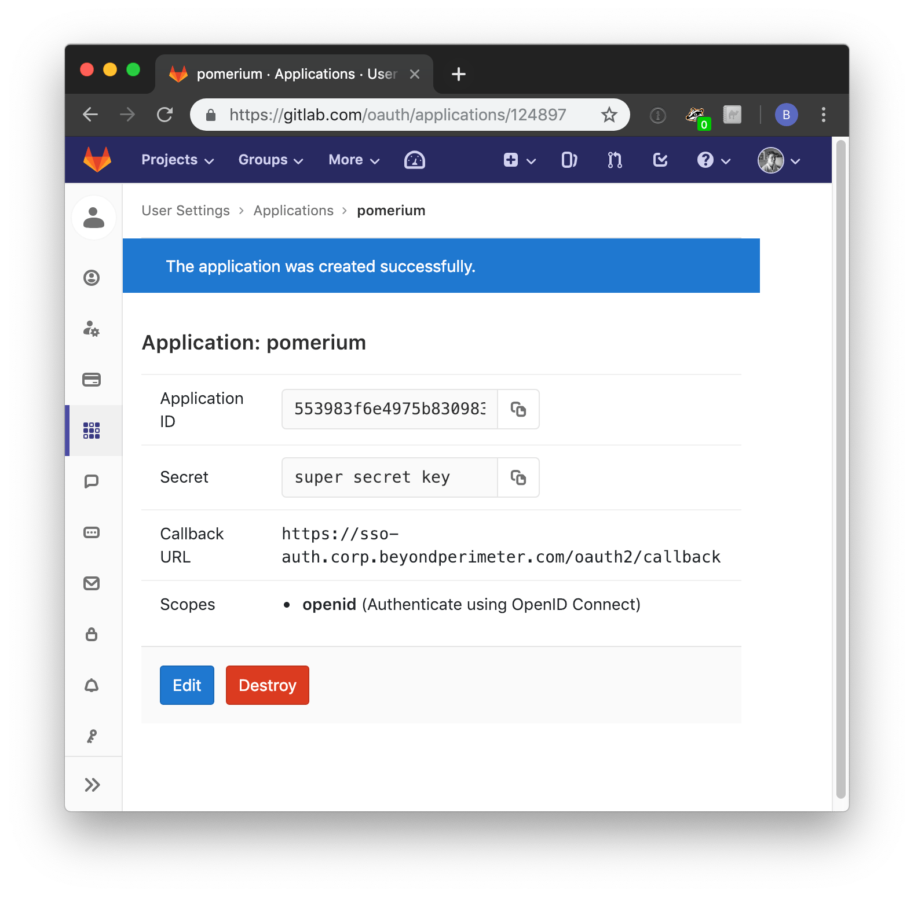
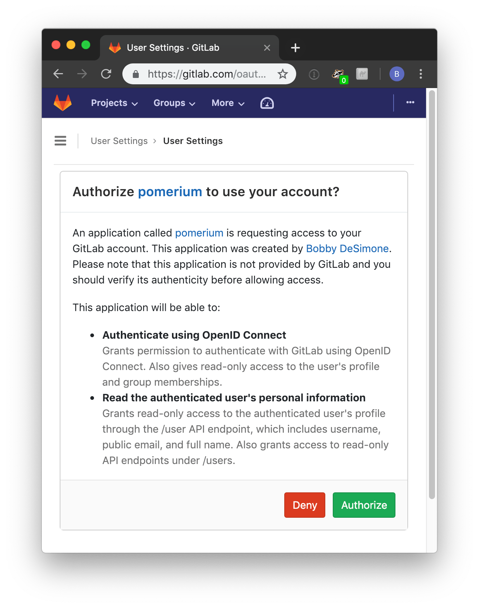

# Gitlab

:::warning

Support was removed in v0.0.3 because Gitlab does not provide callers with a user email, under any scope, to a caller unless that user has selected her email to be public. Pomerium support is blocked until [this gitlab bug](https://gitlab.com/gitlab-org/gitlab-ce/issues/44435#note_88150387) is fixed.

:::

Log in to your Gitlab account and go to the [APIs & services](https://console.developers.google.com/projectselector/apis/credentials).

Navigate to **User Settings** then **Applications** using the left-hand menu.

On the **Applications** page, add a new application by setting the following parameters:

| Field        | Description                                                                |
| ------------ | -------------------------------------------------------------------------- |
| Name         | The name of your web app                                                   |
| Redirect URI | Redirect URL (e.g.`https://authenticate.corp.example.com/oauth2/callback`) |
| Scopes       | **Must** select **read_user** and **openid**                               |


1.Click **Save Application** to proceed.

Your [Client ID] and [Client Secret] will be displayed:



Set [Client ID] and [Client Secret] in Pomerium's settings. Your [environmental variables] should look something like this.

```bash
IDP_PROVIDER="gitlab"
# NOTE!!! Provider url is optional, but should be set if you are running an on-premise instance
# defaults to : https://gitlab.com, a local copy would look something like `http://gitlab.corp.beyondperimeter.com`
IDP_PROVIDER_URL="https://gitlab.com"
IDP_CLIENT_ID="yyyy"
IDP_CLIENT_SECRET="xxxxxx"
```

When a user first uses Pomerium to login, they will be presented with an authorization screen similar to the following.



[client id]: ../reference/reference.md#identity-provider-client-id
[client secret]: ../reference/reference.md#identity-provider-client-secret
[environmental variables]: https://en.wikipedia.org/wiki/Environment_variable
[oauth2]: https://oauth.net/2/
[openid connect]: https://en.wikipedia.org/wiki/OpenID_Connect
