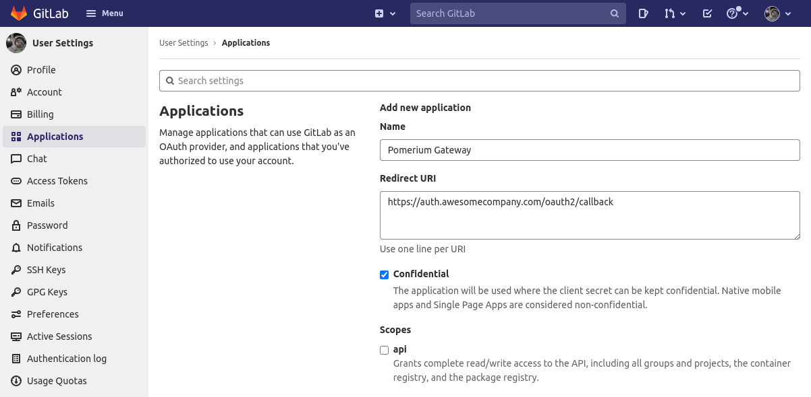
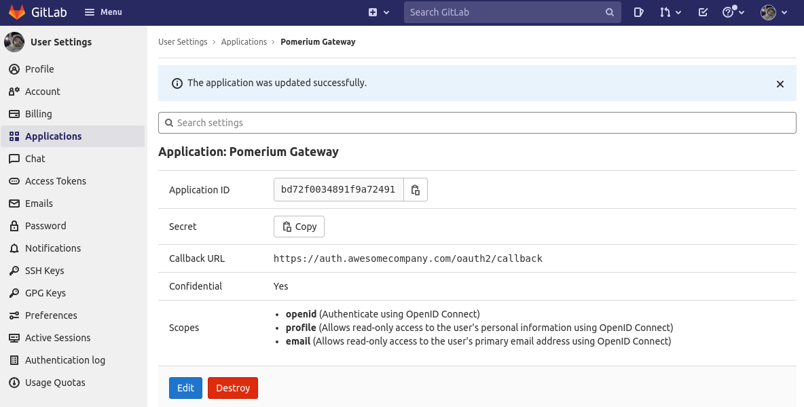
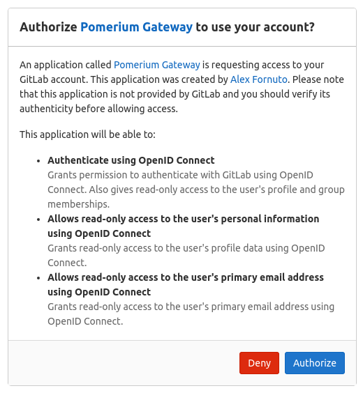

# GitLab

This document describes the use of GitLab as an identity provider with Pomerium.

## Setting up GitLab OAuth2 for your Application

1. Log in to your GitLab account or create one [here](https://gitlab.com/users/sign_in).

2. Go to the user settings which can be found in the user profile to [create an application](https://gitlab.com/profile/applications) like below:



3. Add a new application by setting the following parameters:

Field        | Description
------------ | --------------------------------------------
Name         | The name of your web app
Redirect URI | `https://${authenticate_service_url}/oauth2/callback`
Scopes       | **Must** select **openid**, **read_user** and **read_api**

If no scopes are set, we will use the following scopes: `openid`, `read_api`, `read_user`, `profile`, `email`.

Your `Client ID` and `Client Secret` will be displayed like below:



4. Set `Client ID` and `Client Secret` in Pomerium's settings.


Your configuration should look like the following example: 

```bash
authenticate_service_url: https://authenticate.localhost.pomerium.io
idp_provider: "gitlab"
idp_client_id: "REDACTED"   // gitlab application ID
idp_client_secret: "REDACTED"   // gitlab application secret
```

When a user first uses pomerium to login, they will be presented with an authorization screen similar to the following depending on the scope parameters setup:



Please be aware that [Group ID](https://docs.gitlab.com/ee/api/groups.html#details-of-a-group) will be used to affirm group(s) a user belongs to.
