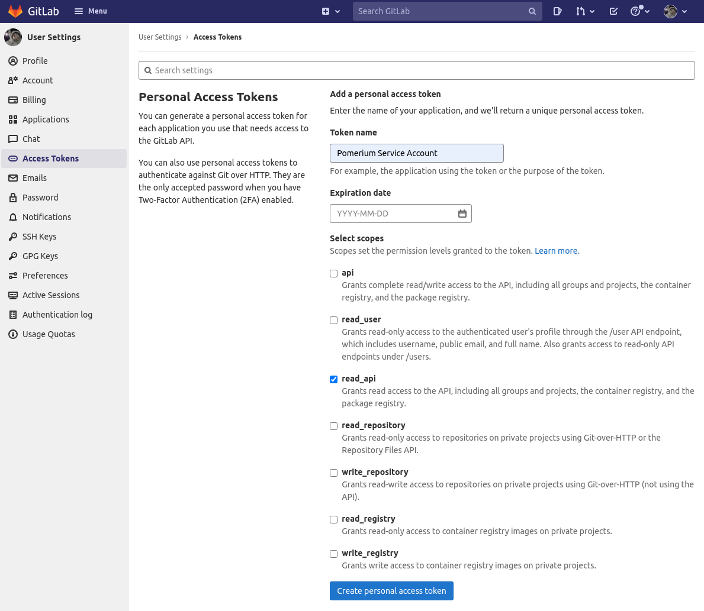

# GitLab

This document describes the use of GitLab as an identity provider with Pomerium.

## Setting up GitLab OAuth2 for your Application

1. Log in to your GitLab account or create one [here](https://gitlab.com/users/sign_in).

2. Go to the user settings which can be found in the user profile to [create an application](https://gitlab.com/profile/applications) like below:


3. Add a new application by setting the following parameters:

Field        | Description
------------ | --------------------------------------------
Name         | The name of your web app
Redirect URI | `https://${authenticate_service_url}/oauth2/callback`
Scopes       | `openid` required; `read_api`, `profile`, `email` as necessary for your policies.

Your `Client ID` and `Client Secret` will be displayed like below:


4. Set `Client ID` and `Client Secret` in Pomerium's settings.

## Service Account

To use `allowed_groups` in a policy an `idp_service_account` needs to be set in the Pomerium configuration. The service account for Gitlab uses a personal access token generated at: [gitlab.com/profile/personal_access_tokens](https://gitlab.com/profile/personal_access_tokens) with `read_api` access:




The format of the `idp_service_account` for Gitlab is a base64-encoded JSON document:

```json
{
  "private_token": "..."
}
```

## Pomerium Configuration

When a user first uses pomerium to login, they will be presented with an authorization screen similar to the following depending on the scope parameters setup:


Please be aware that [Group ID](https://docs.gitlab.com/ee/api/groups.html#details-of-a-group) will be used to affirm group(s) a user belongs to.

[identity scopes]: ../../reference/readme.md#identity-provider-scopes

#### GitLab.com

Your configuration should look like the following example:

```
authenticate_service_url: https://authenticate.localhost.pomerium.io
idp_provider: "gitlab"
idp_client_id: "REDACTED"   // gitlab application ID
idp_client_secret: "REDACTED"   // gitlab application secret
idp_service_account: "REDACTED"   // gitlab service account, base64 json
```

#### Self-Hosted GitLab

Self-hosted CE/EE instances should be configured as a generic OpenID Connect provider:

```
idp_provider: oidc
idp_client_id: "REACTED"
idp_client_secret: "REDACTED"
idp_scopes: openid,email // Intersects with scopes 
idp_provider_url: https://gitlab.example.com // Base URL of GitLab instance
idp_service_account: "REDACTED"   // gitlab service account, base64 json
```
