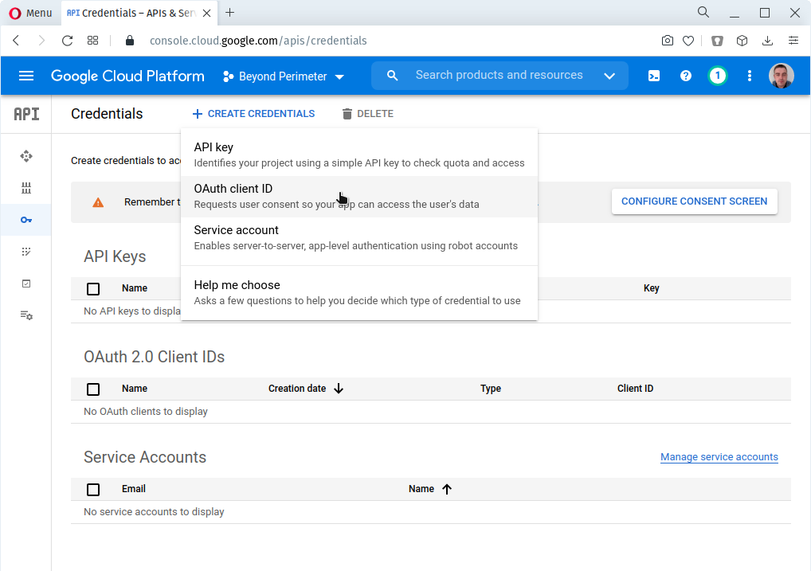
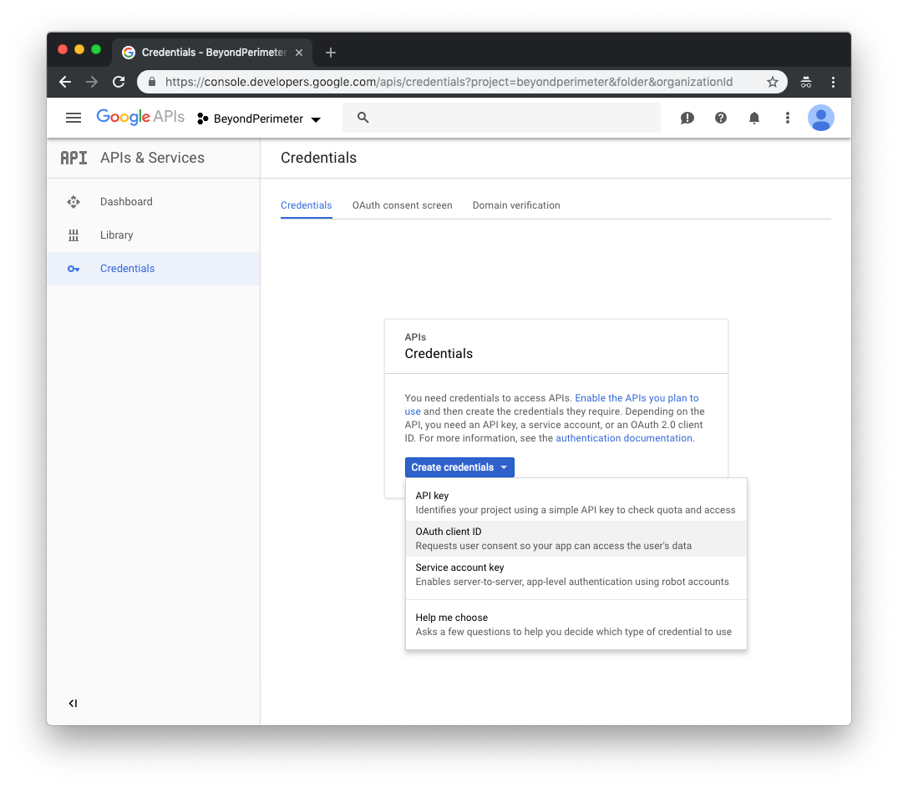
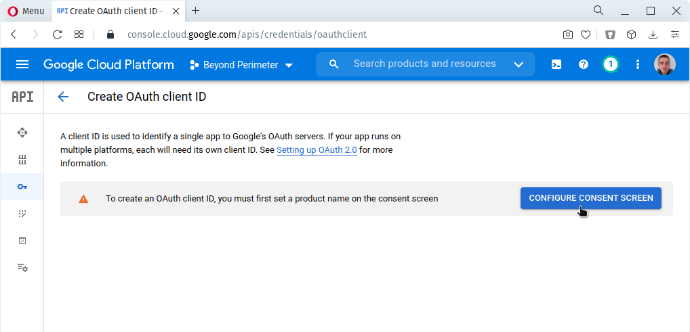
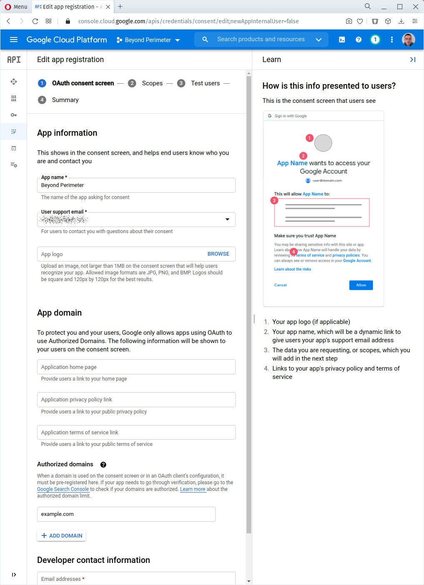
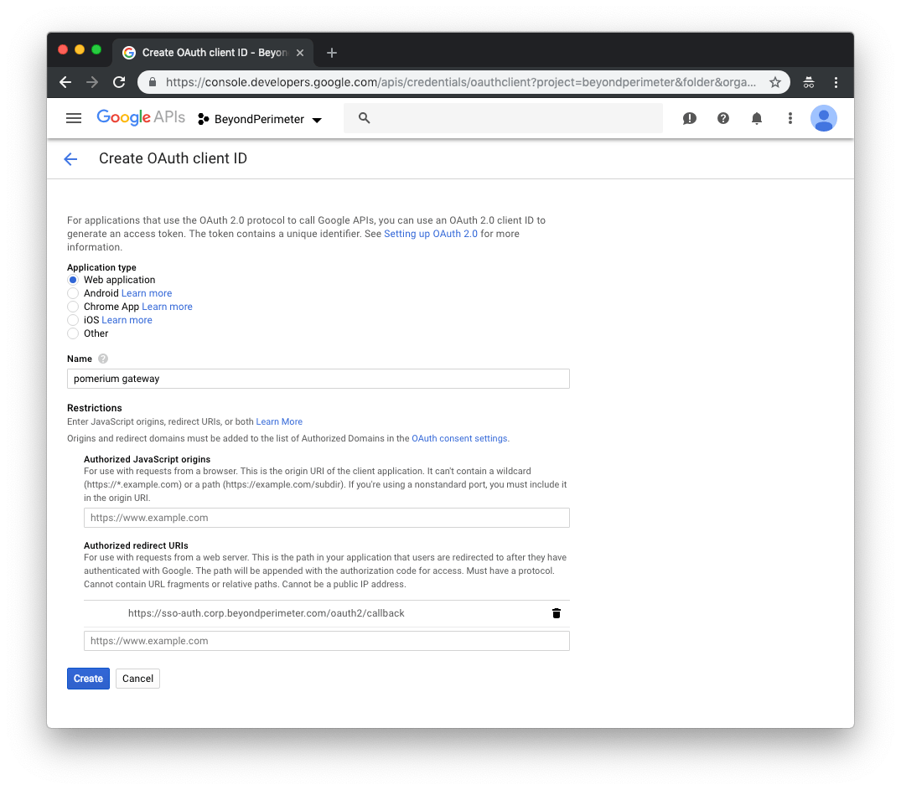
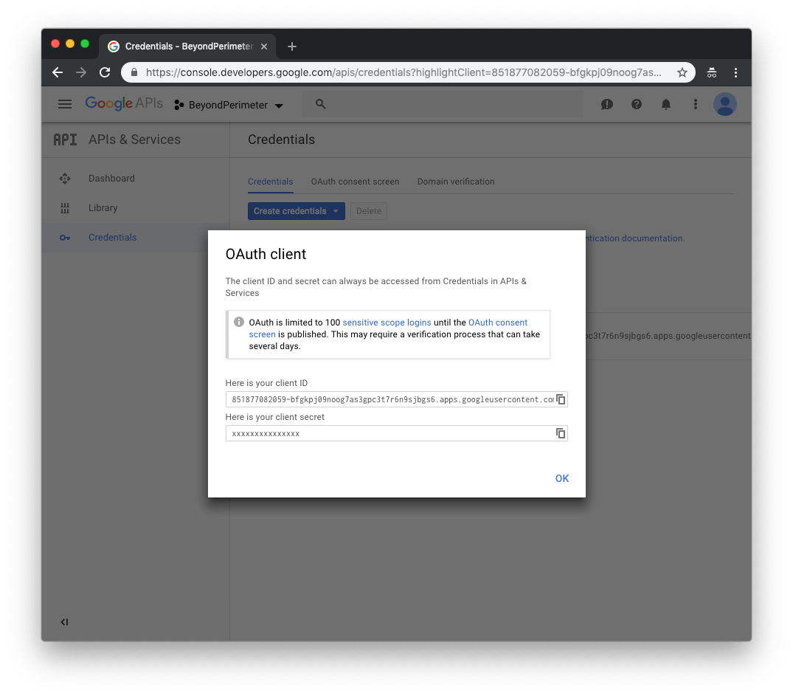
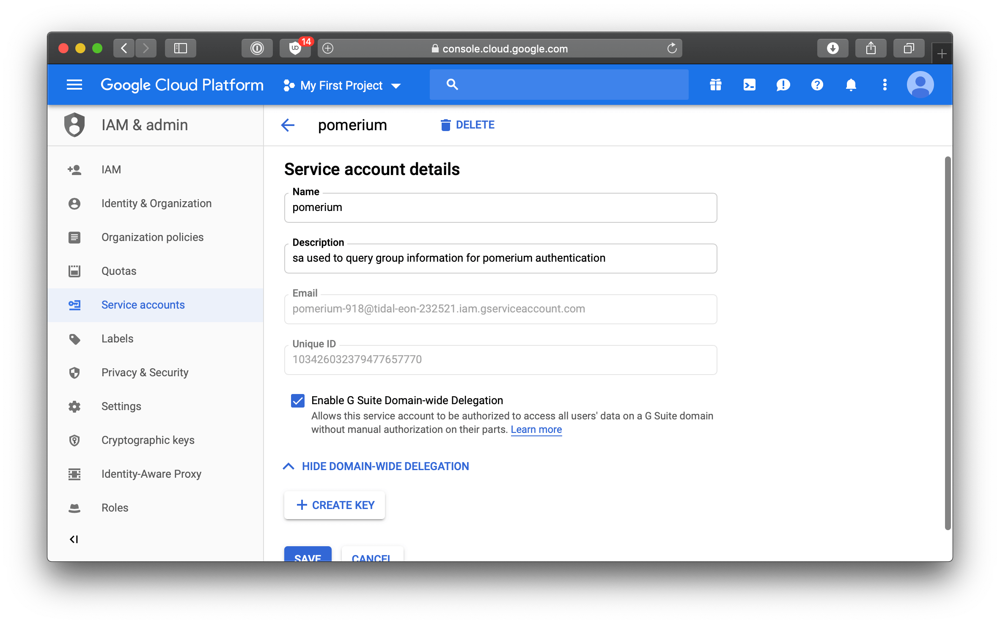
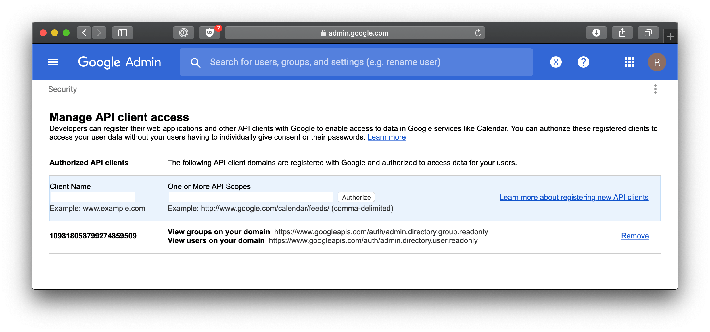

# Google

Log in to your Google account and go to the [APIs & services](https://console.developers.google.com/projectselector/apis/credentials). Navigate to **Credentials** using the left-hand menu.



On the **Credentials** page, click **Create credentials** and choose **OAuth [Client ID]**.



If you don't currently have an OAuth consent page configured, google will not allow you to create credentials until this is completed, and you will likely see **this** banner on the page.



Click the button on the banner to go to the consent screen configuration. If all you are configuring is pomerium, you only need to fill in "Application Name" with your desired moniker, and "Authorized Domains" with the domain that pomerium will be calling google from. Afterwards, return to the credential creation page.



On the **Create [Client ID]** page, select **Web application**. In the new fields that display, set the following parameters:

| Field        | Description                                                              |
| ------------ | ------------------------------------------------------------------------ |
| Name         | The name of your web app                                                 |
| Redirect URI | Redirect URL (e.g.`https://${authenticate_service_url}/oauth2/callback`) |



Click **Create** to proceed. The [Client ID] and [Client Secret] settings will be displayed for later configuration with Pomerium.



In order to have Pomerium validate group membership, we'll also need to configure a [service account](https://console.cloud.google.com/iam-admin/serviceaccounts) with [G-suite domain-wide delegation](https://developers.google.com/admin-sdk/directory/v1/guides/delegation) enabled.

1. Open the [Service accounts](https://console.cloud.google.com/iam-admin/serviceaccounts) page.
2. If prompted, select a project.
3. Click **Create service** account. In the Create service account window, type a name for the service account, and select Furnish a new private key and Enable Google Apps Domain-wide Delegation.
4. Then click **Save**.



Then, you'll need to manually open an editor and add an `impersonate_user` field to the downloaded public/private key file. In this case, we'd be impersonating the admin account `user@pomerium.io`.

::: warning

[Google requires](https://stackoverflow.com/questions/48585700/is-it-possible-to-call-apis-from-service-account-without-acting-on-behalf-of-a-u/48601364#48601364) that service accounts act on behalf of another user. You MUST add the `impersonate_user` field to your json key file.

:::

```git
{
  "type": "service_account",
  "client_id": "109818058799274859509",
  ...
+  "impersonate_user": "user@pomerium.io"
  ...
}
```

The base64 encoded contents of this public/private key pair json file will used for the value of the `IDP_SERVICE_ACCOUNT` configuration setting.

Next we'll delegate G-suite group membership access to the service account we just created .

1. Go to your G Suite domain's [Admin console](http://admin.google.com/).
2. Select **Security** from the list of controls. If you don't see Security listed, select More controls 1\. from the gray bar at the bottom of the page, then select Security from the list of controls.
3. Select **Advanced settings** from the list of options.
4. Select **Manage API client** access in the Authentication section.
5. In the **Client name** field enter the service account's **Client ID**.
6. In the **One or More API Scopes** field enter the following list of scopes: `https://www.googleapis.com/auth/admin.directory.group.readonly` `https://www.googleapis.com/auth/admin.directory.user.readonly`
7. Click the **Authorize** button.



Your [environmental variables] should look something like this.

```bash
IDP_PROVIDER="google"
IDP_PROVIDER_URL="https://accounts.google.com"
IDP_CLIENT_ID="yyyy.apps.googleusercontent.com"
IDP_CLIENT_SECRET="xxxxxx"
IDP_SERVICE_ACCOUNT="zzzz" # output of `base64 -i service-account-key.json`
```

[client id]: ../../configuration/readme.md#identity-provider-client-id
[client secret]: ../../configuration/readme.md#identity-provider-client-secret
[environmental variables]: https://en.wikipedia.org/wiki/Environment_variable
[oauth2]: https://oauth.net/2/
[openid connect]: https://en.wikipedia.org/wiki/OpenID_Connect
