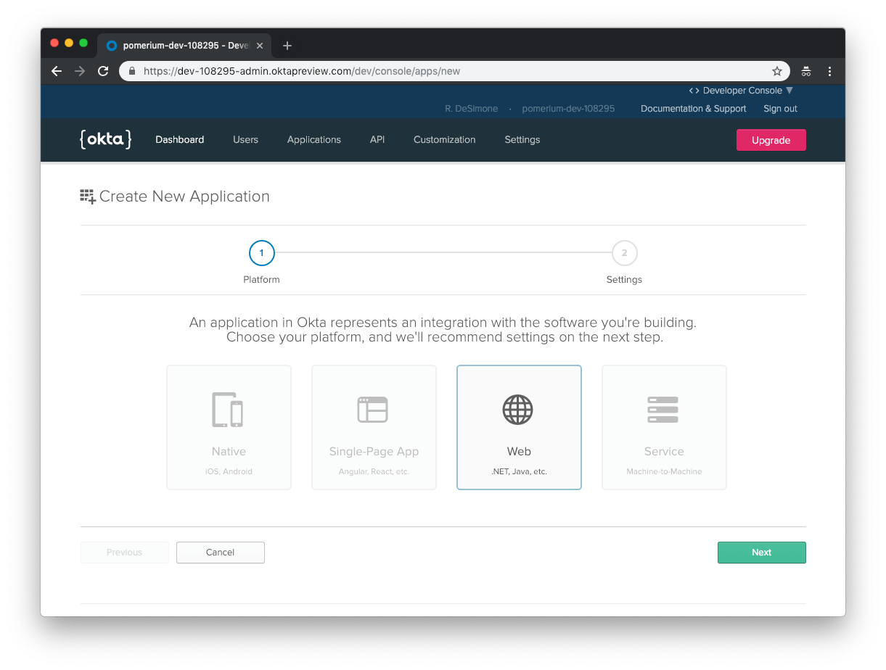
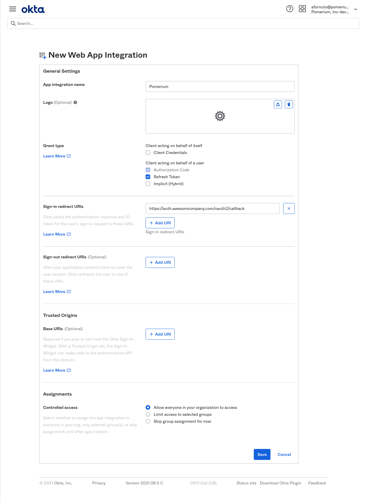
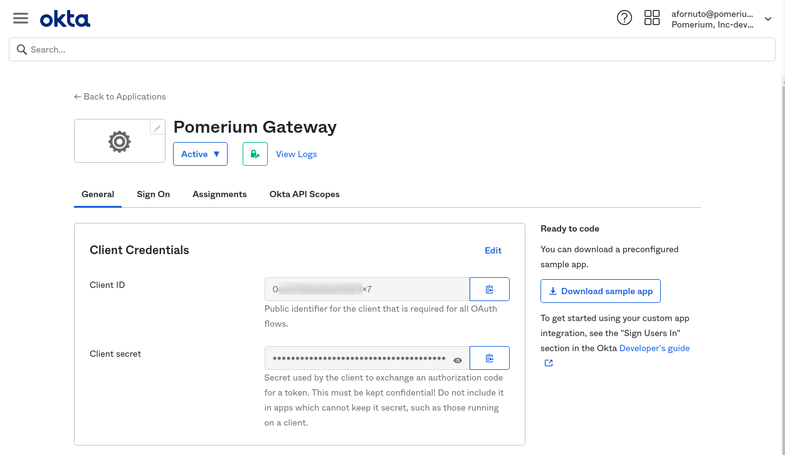

# Okta

[Log in to your Okta account](https://login.okta.com) and head to your Okta dashboard. Select **Applications** on the top menu. On the Applications page, click the **Add Application** button to create a new app.

## Create OpenID Connect Application


On the **Create New Application** page, select the **Web** for your application.



Next, provide the following information for your application settings:

| Field                        | Description                                                                 |
| ---------------------------- | --------------------------------------------------------------------------- |
| Name                         | The name of your application.                                               |
| Base URIs (optional)         | The domain(s) of your application.                                          |
| Login redirect URIs          | Redirect URL (e.g.`https://authenticate.corp.example.com/oauth2/callback`). |
| Group assignments (optional) | The user groups that can sign in to this application.                       |
| Grant type allowed           | **You must enable Refresh Token.**                                          |



Click **Done** to proceed. You'll be taken to the **General** page of your app.

Go to the **General** page of your app and scroll down to the **Client Credentials** section. This section contains the **[Client ID]** and **[Client Secret]** to be used in the next step.

## Service account



Next, we'll create API token so that Pomerium can retrieve and establish group membership. To do so, click the **API** menu item, and select **Tokens**.


Set this token in pomerium as your `IDP_SERVICE_ACCOUNT`. [Group ID](https://developer.okta.com/docs/reference/api/groups/) will be used to affirm group membership.

Finally, configure Pomerium with the identity provider settings retrieved in the previous steps. Your [environmental variables] should look something like this.

```bash
IDP_PROVIDER="okta"
IDP_PROVIDER_URL="https://dev-108295-admin.oktapreview.com/"
IDP_CLIENT_ID="REPLACE_ME"
IDP_CLIENT_SECRET="REPLACE_ME"
IDP_SERVICE_ACCOUNT="REPLACE_ME" # api token
```

[client id]: ../../configuration/readme.md#identity-provider-client-id
[client secret]: ../../configuration/readme.md#identity-provider-client-secret
[environmental variables]: https://en.wikipedia.org/wiki/Environment_variable
[oauth2]: https://oauth.net/2/
[openid connect]: https://en.wikipedia.org/wiki/OpenID_Connect
