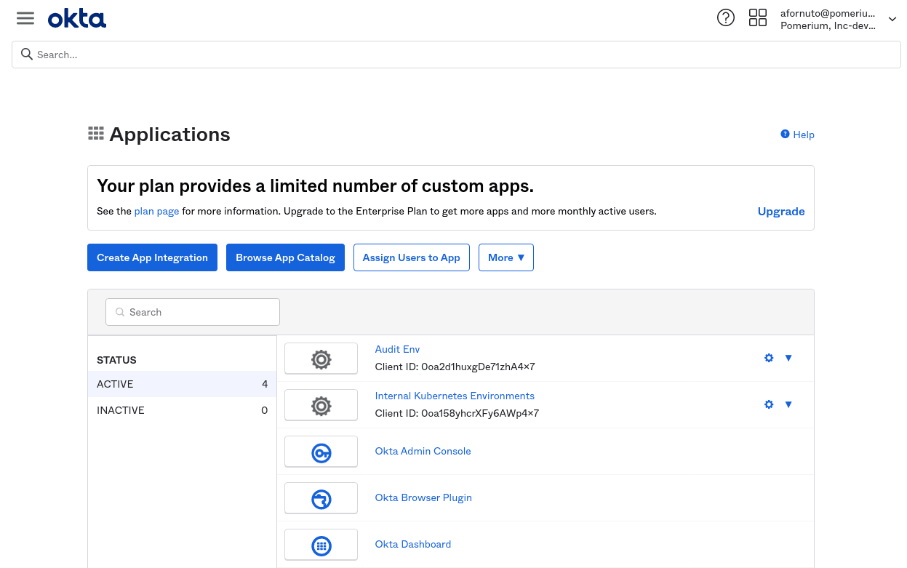
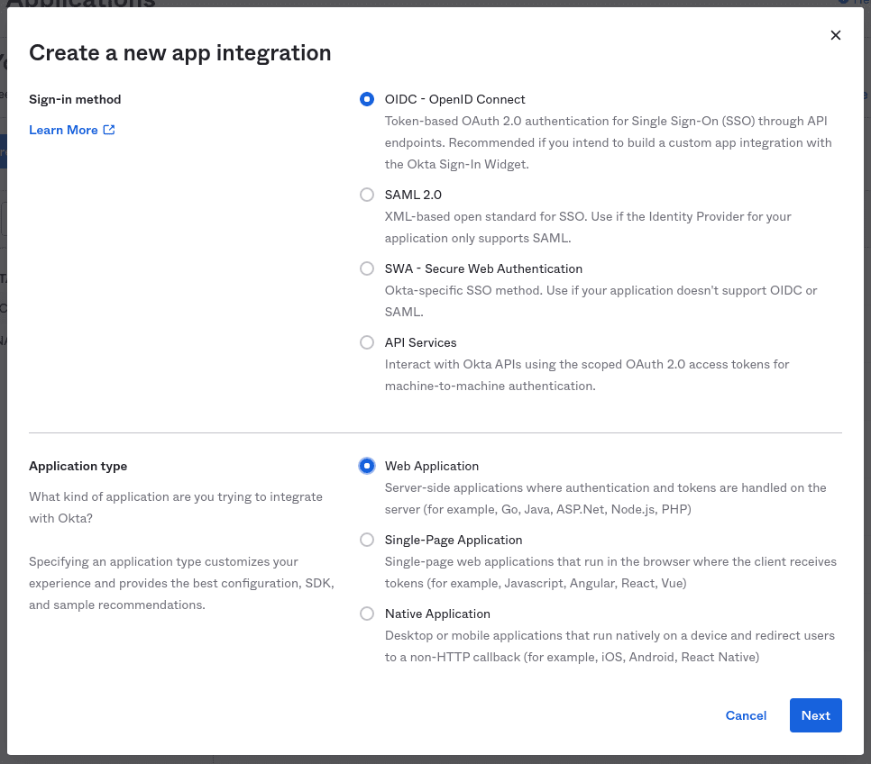
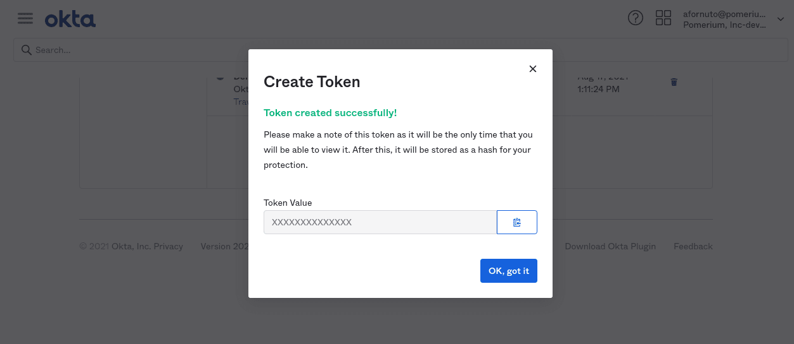

# Okta

Okta is a popular identity provider used by businesses of all sizes. Integrating Pomerium with Okta allows you to use the identity Okta provides to apply context-driven policies from Pomerium to your infrastructure.

This page covers configuring Okta to communicate with Pomerium as an [IdP](/docs/glossary.md#identity-provider). It assumes you have already [installed Pomerium][pomerium-install] before you begin.

::: warning
While we do our best to keep our documentation up to date, changes to third-party systems are outside our control. Refer to [Create an Okta app Integration](https://developer.okta.com/docs/guides/sign-into-web-app/aspnet/create-okta-application/) from Okta's developer docs as needed, or [let us know](https://github.com/pomerium/pomerium/issues/new?assignees=&labels=&template=bug_report.md) if we need to re-visit this page.
:::

## Create OpenID Connect Application

1. [Log in to your Okta account](https://login.okta.com) From the left-hand menu, Select **Applications → Applications** on the top menu.

   

1. Click the **Create App Integration** button. Select **OIDC** as the sign-in method. and **Web Application** as the application type:

   

   Click **Next** to continue.

1. Provide the following information for your application settings:

   | Field                        | Description                                                               |
   | ---------------------------- | ------------------------------------------------------------------------- |
   | Name                         | The name of your application.                                             |
   | Grant type allowed           | **You must enable Refresh Token.**                                        |
   | Base URIs                    | **Optional**: The domain(s) of your application.                          |
   | Sign-in redirect URIs        | Redirect URL (e.g.`https://${authenticate_service_url}/oauth2/callback`). |
   | Controlled Access            | The user groups that can sign in to this application. See [Group ID] for more information. |

   

   Click **Save** to proceed. You'll be taken to the **General** tab of your app.

1. From the **General** tab, scroll down to the **Client Credentials** section. This section contains the **[Client ID]** and **[Client Secret]**. Temporarily save these values to apply to the Pomerium configuration.

   

## Create Service account

Next, we'll create API token so that Pomerium can retrieve and establish group membership.

1. From the main menu, navigate to **Security → API**. Select the **Tokens** tab, and click the **Create Token** button. Name the token, then save the value to apply to our Pomerium configuration:

   

1. The API token will be provided as the value of the `idp_service_account` key, formatted as a base64-encoded JSON document::

   ```json
   {
     "api_key": "XXXXXXXXXX"
   }
   ```

   You can save the object as a temporary file to encode:

   ```bash
   cat tmp.json | base64 -w 0
   ```

## Configure Pomerium

Finally, configure Pomerium with the identity provider settings retrieved in the previous steps. Your [environmental variables] should look something like this.

:::: tabs
::: tab config.yaml
```yaml
idp_provider: "okta"
idp_provider_url: "https://awesomecompany.okta.com"
idp_client_id: "REPLACE ME"
idp_client_secret: "REPLACE ME"
idp_service_account: "REPLACE ME" # base64 encoded JSON object
```
:::
::: tab Environment Variables
```bash
IDP_PROVIDER="okta"
IDP_PROVIDER_URL="https://dev-108295.okta.com"
IDP_CLIENT_ID="REPLACE_ME"
IDP_CLIENT_SECRET="REPLACE_ME"
IDP_SERVICE_ACCOUNT="REPLACE_ME" # base64 encoded JSON object
```
:::
::::

[client id]: ../../reference/readme.md#identity-provider-client-id
[client secret]: ../../reference/readme.md#identity-provider-client-secret
[environmental variables]: https://en.wikipedia.org/wiki/Environment_variable
[oauth2]: https://oauth.net/2/
[openid connect]: https://en.wikipedia.org/wiki/OpenID_Connect
[pomerium-install]: /docs/install/readme.md
[Group ID]: https://developer.okta.com/docs/reference/api/groups/
