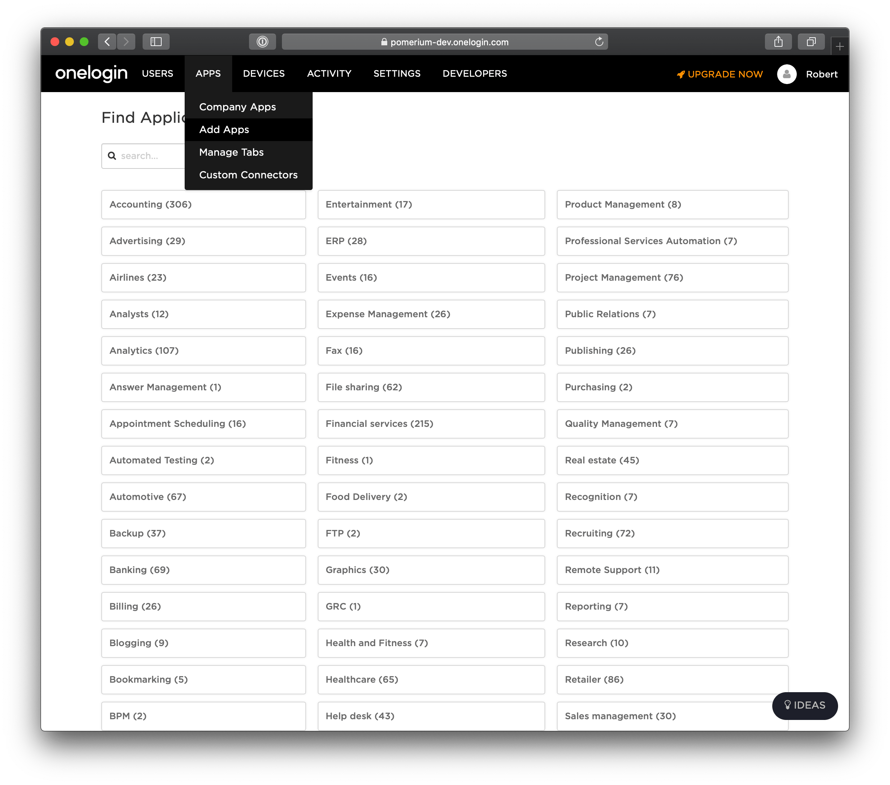
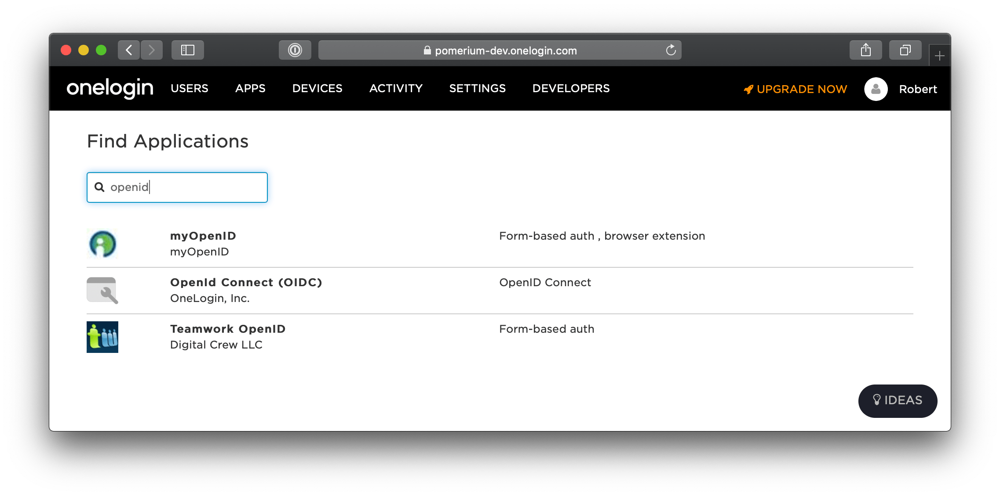
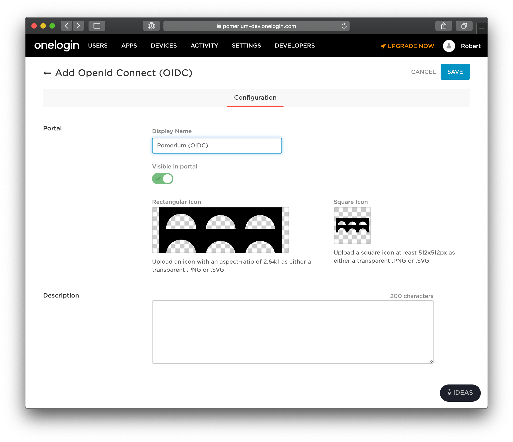
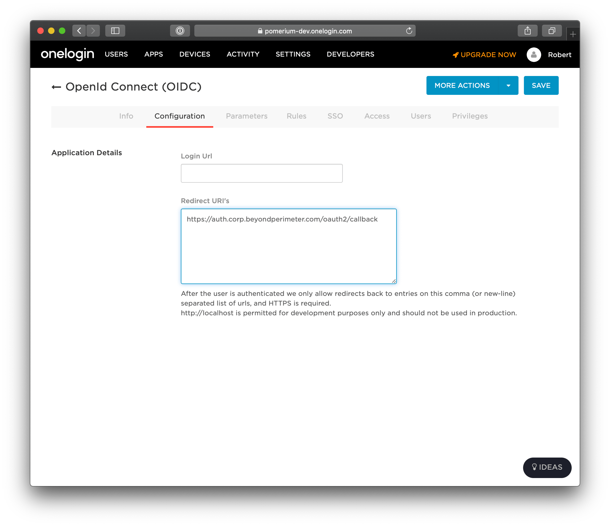
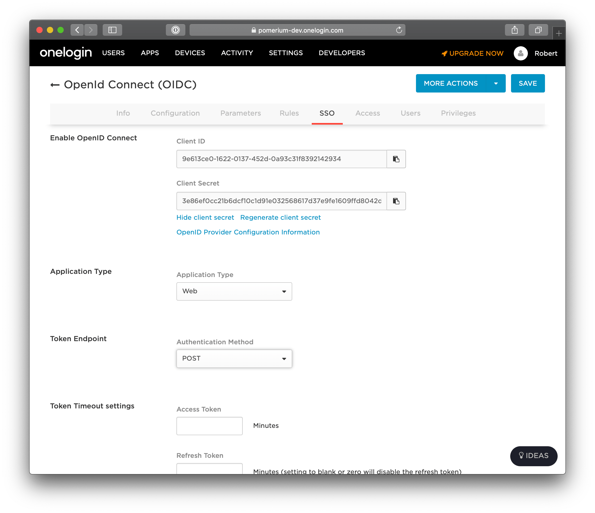
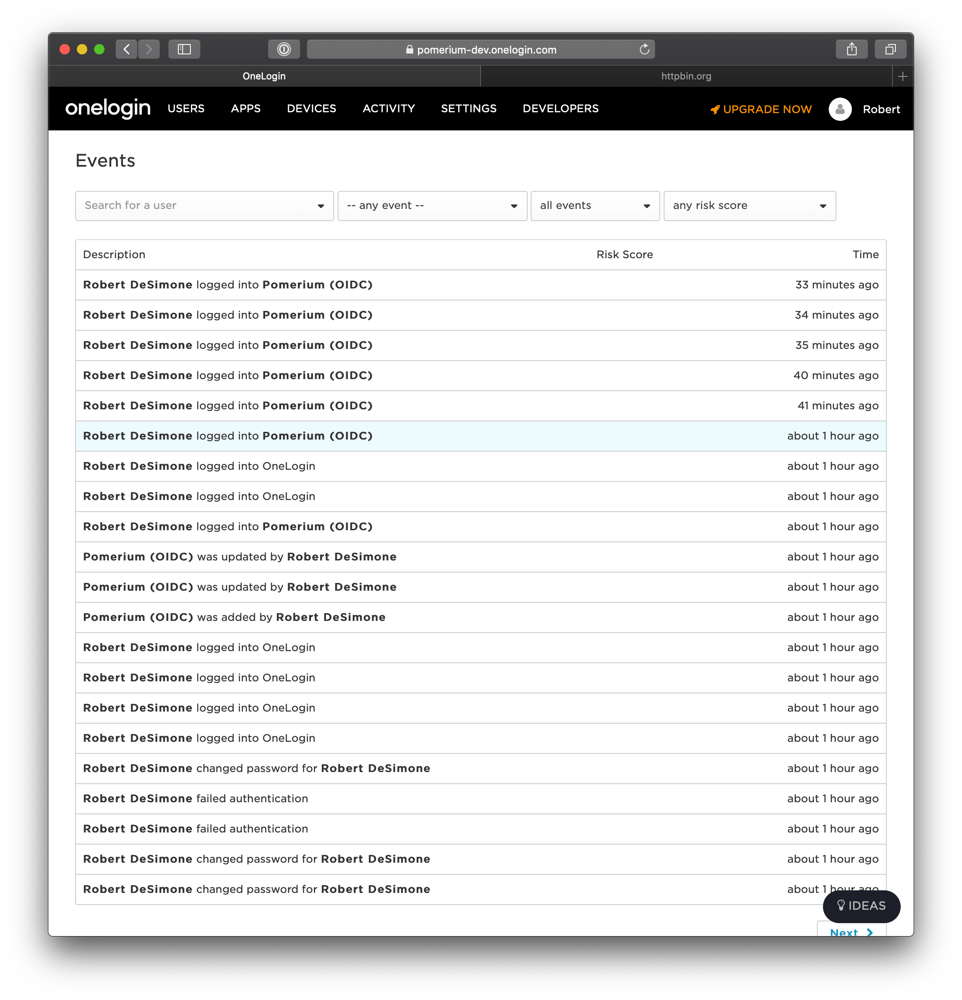

# OneLogin

Log in to your [OneLogin](https://www.onelogin.com/) account and head to the dashboard.

## Create OpenID Connect App

Click **Apps** on the top menu. Select the **Add apps** menu item.



On the **Find Application** page, search for **openid**. Select **Openid Connect** by OneLogin, Inc.



On the App Configuration page, **name the app** and **select a logo**. Select **Save**.



Next, set set the **Redirect URI's** setting to be Pomerium's redirect url `https://${authenticate_service_url}/oauth2/callback`.



Go to the **SSO** page. This section contains the **[Client ID]** and **[Client Secret]** you'll use to configure Pomerium.

Set the application type to **Web** and the token endpoint to be **POST**.

Under **Token Timeout settings** set **Refresh Token** to 60 minutes (or whatever value makes sense for your organization). Note, however, if you don't enable refresh tokens the user will be prompted to authenticate whenever the access token expires which can result in a poor user experience.



## Groups

Group membership will be fetched using a follow up HTTP API call using your `CLIENT_ID` and `CLIENT_SECRET` as credentials. A [Group's ID](https://developers.onelogin.com/openid-connect/api/user-info) will be used to affirm user group membership.

## Pomerium Configuration

```bash
IDP_PROVIDER="onelogin"
IDP_PROVIDER_URL="https://openid-connect.onelogin.com/oidc"
IDP_CLIENT_ID="9e613ce0-1622-0137-452d-0a93c31f8392142934"
IDP_CLIENT_SECRET="3e86ef0cc21b6dcf10c1d91e032568617d37e9fe1609ffd8042d3c25a560c36c"
```

After reloading Pomerium, you should be able to see any login events from your OneLogin events dashboard.



[client id]: ../../configuration/readme.md#identity-provider-client-id
[client secret]: ../../configuration/readme.md#identity-provider-client-secret
[environmental variables]: https://en.wikipedia.org/wiki/Environment_variable
[oauth2]: https://oauth.net/2/
[openid connect]: https://en.wikipedia.org/wiki/OpenID_Connect
