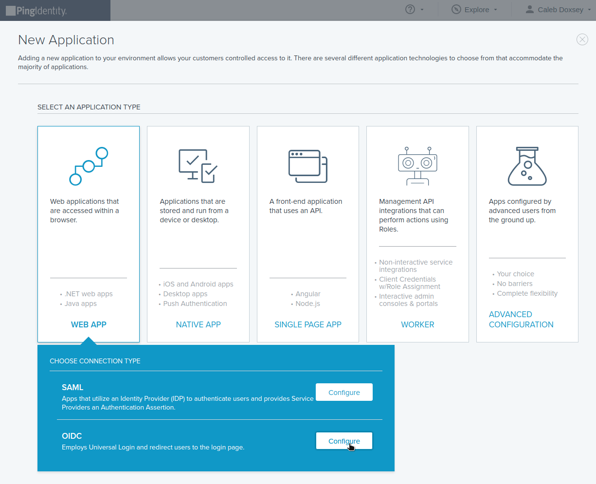
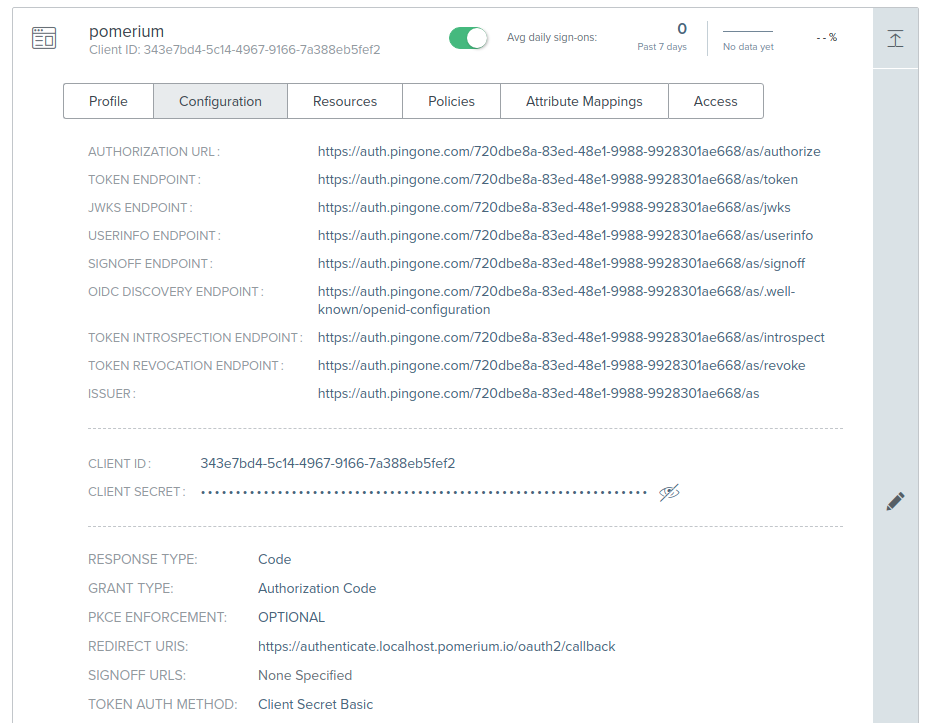
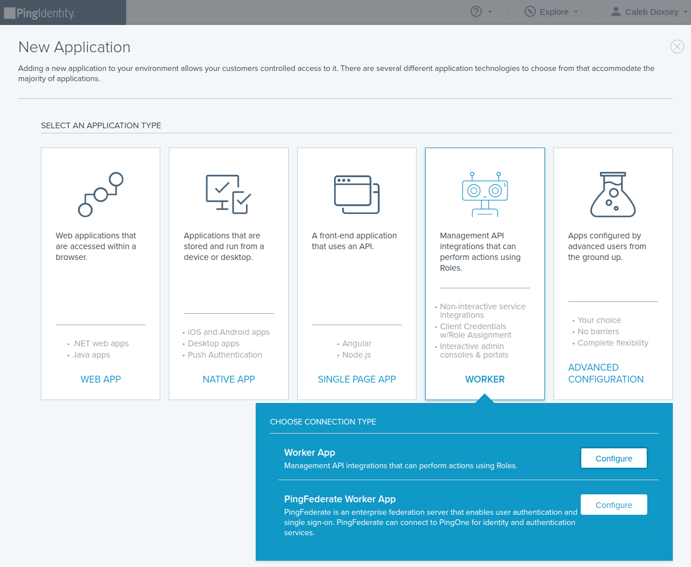

# Ping

To use the Ping identity provider, first go to the [Ping One](https://console.pingone.com) console.

## Create OpenID Connect App

Click **Connections** in the side menu, select **Applications** and click **Add Application**



Name the application and use the Pomerium authenticate redirect URL. For example: `https://authenticate.localhost.pomerium.io/oauth2/callback`.

Underneath `Configuration` there are several options which will be used in the Pomerium configuration:

* The `idp_provider` is set to `ping`.
* `Issuer`: used as the `idp_provider_url` (e.g. `https://auth.pingone.com/720dbe8a-83ed-48e1-9988-9928301ae668/as`)
* `Client ID`: used as the `idp_client_id`
* `Client Secret`: used as the `idp_client_secret`



## Service Account

To use `allowed_groups` in a policy, an `idp_service_account` needs to be set in the Pomerium configuration. The service account for Ping uses a **different** application and client ID and client secret from the one configured above.

Click **Add Application**, but this time select **Worker**/**Worker App**.



This application's **Client ID** and **Client Secret** will be used as the service account in Pomerium.


The format of the service account is a JSON encoded object with `client_id` and `client_secret` properties:

```yaml
idp_service_account: |
  {
    "client_id": "WORKER_CLIENT_ID_HERE",
    "client_secret": "WORKER_CLIENT_SECRET_HERE"
  }
```

A base64 encoded JSON object is also supported:

```yaml
idp_service_account: ICB7CiAgICAiY2xpZW50X2lkIjogIldPUktFUl9DTElFTlRfSURfSEVSRSIsCiAgICAiY2xpZW50X3NlY3JldCI6ICJXT1JLRVJfQ0xJRU5UX1NFQ1JFVF9IRVJFIgogIH0K
```

## Pomerium Configuration

```bash
IDP_PROVIDER="ping"
IDP_PROVIDER_URL="https://auth.pingone.com/720dbe8a-83ed-48e1-9988-9928301ae668/as"
IDP_CLIENT_ID="CLIENT_ID"
IDP_CLIENT_SECRET="CLIENT_SECRET"
```
