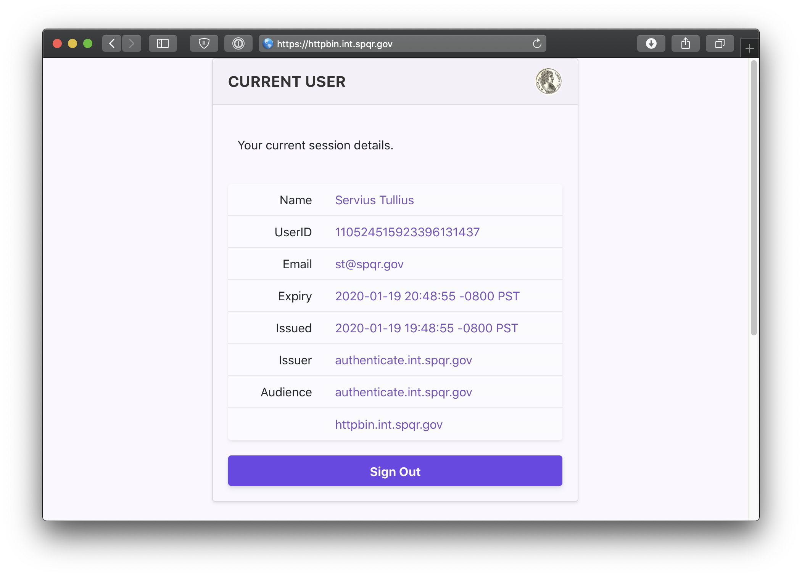

# Pomerium using Helm

This quick-start will show you how to deploy Pomerium with [Helm] on [Kubernetes].

## Prerequisites

- [Install kubectl].
- [Install helm].
- A Kubernetes provider.
   - A cluster, with your local `kubectl` authorized to interact with it. The cluster configuration and node pool will depend on your provider and the scope of your project.
   - Export the configuration file from your Kubernetes host and export it to your `KUBECONFIG` environment variable (usually by placing it in `~/.kube`).

     See [Organizing Cluster Access Using kubeconfig Files] for more information.
   - A namespace in the cluster for Pomerium. This document assumes the namespace `pomerium`.
- A configured [identity provider].
- [TLS certificates]. If you don't yet have a production environment with trusted certificates, this page will cover using [mkcert] to create locally trusted certificates, and [cert-manager] to manage them in the cluster.

::: tip
This configuration installs Redis as the data broker service. While this isn't strictly required when running Pomerium by itself, it is necessary for Pomerium Enterprise, and still highly recommended if not.
:::

## Certificates

This setup uses [mkcert] to generate certificates that are trusted by your local web browser for testing, and cert-manager to manage them. If you already have a certificate solution, you can skip the steps below and move on to [the next stage](#install-pomerium).

### Install mkcert

After [installing mkcert], confirm the presence and names of your local CA files:

```bash
mkcert -install
The local CA is already installed in the system trust store! 👍
The local CA is already installed in the Firefox and/or Chrome/Chromium trust store! 👍

ls $(mkcert -CAROOT)
rootCA-key.pem  rootCA.pem
```

The output of `mkcert -install` may vary depending on you operating system.

## Install and Configure cert-manager

If you haven't already, install cert-manager and create a CA issuer. You can follow their docs (listed below) or use the steps provided:

   - [cert-manager: Installing with Helm]
   - [cert-manager: CA]

1. Create a namespace for cert-manager:

   ```bash
   kubectl create namespace cert-manager
   ```

1. Add the jetstack.io repository and update Helm:

   ```bash
   helm repo add jetstack https://charts.jetstack.io
   helm repo update
   ```

1. Install cert-manager to your cluster:

   ```bash
   helm install cert-manager jetstack/cert-manager --namespace cert-manager --create-namespace \
   --version v1.4.0 --set installCRDs=true
   ```

1. Confirm deployment with `kubectl get pods --namespace cert-manager`:

    ```bash
    kubectl get pods --namespace cert-manager
    NAME                                       READY   STATUS    RESTARTS   AGE
    cert-manager-5d7f97b46d-8g942              1/1     Running   0          33s
    cert-manager-cainjector-69d885bf55-6x5v2   1/1     Running   0          33s
    cert-manager-webhook-8d7495f4-s5s6p        1/1     Running   0          33s
    ```

1. In your Pomerium namespace, create a Kubernetes secret for the rootCA-key file in your local CA root:

   ```bash
   kubectl create secret tls pomerium-tls-ca --namespace=pomerium \
   --cert=$(mkcert -CAROOT)/rootCA.pem --key=$(mkcert -CAROOT)/rootCA-key.pem
   ```

1. Define an Issuer configuration in `issuer.yaml`:

   ```yaml
   apiVersion: cert-manager.io/v1
   kind: Issuer
   metadata:
     name: pomerium-issuer
     namespace: pomerium
   spec:
     ca:
       secretName: pomerium-tls-ca
   ```

1. Apply and confirm:

   ```bash
   kubectl apply -f issuer.yaml
   issuer.cert-manager.io/pomerium-issuer created

   kubectl get issuers.cert-manager.io --namespace pomerium
   NAME              READY   AGE
   pomerium-issuer   True    10s
   ```

## Install Pomerium

1. Set your `kubectl` context to the Pomerium namespace:

   ```bash
   kubectl config set-context --current --namespace=pomerium
   ```

1. Create certificate configurations for Pomerium. Our example is named `pomerium-certificates.yaml`, to differentiate from a configuration file for Pomerium Enterprise, if you choose to install it later:

   <<< @/examples/kubernetes/pomerium-certificates.yaml

   ::: tip
   If you already have a domain space for Pomerium with a certificate solution, use it in place of `*.localhost.pomerium.io`.
   :::

1. Apply the certificate configuration, and confirm:

   ```bash
   kubectl apply -f pomerium-certificates.yaml
   ```

   ```bash
   kubectl get certificate
   NAME                    READY   SECRET                 AGE
   pomerium-cert           True    pomerium-tls           10s
   pomerium-redis-cert     True    pomerium-redis-tls     10s
   ```

1. Create a values file for Helm to use when installing Pomerium. Our example is named `pomerium-values.yaml`.

   <<< @/examples/kubernetes/pomerium-values.yaml

   ::: tip
   The options required in the `authenticate.idp` block will vary depending on your [identity provider].

   If you changed the `*.localhost.pomerium.io` value in `pomerium-certificates.yaml` update `config.rootDomain` to match, omitting the `*`.
   :::

1. Add Pomerium's Helm repo:

   ```bash
   helm repo add pomerium https://helm.pomerium.io
   ```

1. So that we can create a valid test route, add Bitnami's Helm repo to pull nginx from:

   ```bash
   helm repo add bitnami https://charts.bitnami.com/bitnami
   ```

1. Update Helm:

   ```bash
   helm repo update
   ```

1. Install nginx to the cluster:

   ```bash
   helm upgrade --install nginx bitnami/nginx --set service.type=ClusterIP
   ```

1. Install Pomerium to the cluster:

   ```bash
   helm upgrade --install pomerium pomerium/pomerium --values ./pomerium-values.yaml
   ```

## Navigate

If you are installing Pomerium with a valid domain name and certificates, update your DNS records to point to the external IP address of the `pomerium-proxy` service:

```none
kubectl get svc pomerium-proxy
NAME             TYPE           CLUSTER-IP       EXTERNAL-IP      PORT(S)                        AGE
pomerium-proxy   LoadBalancer   10.128.117.25    192.0.2.20       443:30006/TCP,9090:30707/TCP   2m37s
```

For development and testing, you can use `kubectl` to create a local proxy:

```bash
sudo -E kubectl --namespace pomerium port-forward service/pomerium-proxy 443:443
```

Open a browser and navigate to `hello.localhost.pomerium.com`.

You can also navigate to the special pomerium endpoint `hello.localhost.pomerium.com/.pomerium/` to see your current user details.



## Next Steps

Congratulations on installing Pomerium to your Kubernetes cluster! If you're installing Pomerium Enterprise next, see [Install Pomerium Enterprise Console in Helm]. If not, check our our [guides](/guides/readme.md) to install common services behind Pomerium.

[cert-manager]: https://cert-manager.io/docs/
[cert-manager: CA]: https://cert-manager.io/docs/configuration/ca/
[cert-manager: Installing with Helm]: https://cert-manager.io/docs/installation/kubernetes/#installing-with-helm
[Helm]: https://helm.sh
[Install helm]: https://helm.sh/docs/using_helm/
[identity provider]: ../identity-providers/readme.md
[Install Pomerium Enterprise Console in Helm]: /enterprise/install/helm.md
[installing mkcert]: https://github.com/FiloSottile/mkcert#installation
[Install kubectl]: https://kubernetes.io/docs/tasks/tools/install-kubectl/
[Kubernetes]: https://kubernetes.io
[mkcert]: https://github.com/FiloSottile/mkcert
[Organizing Cluster Access Using kubeconfig Files]: https://kubernetes.io/docs/concepts/configuration/organize-cluster-access-kubeconfig/
[tls certificates]: ../topics/certificates.md