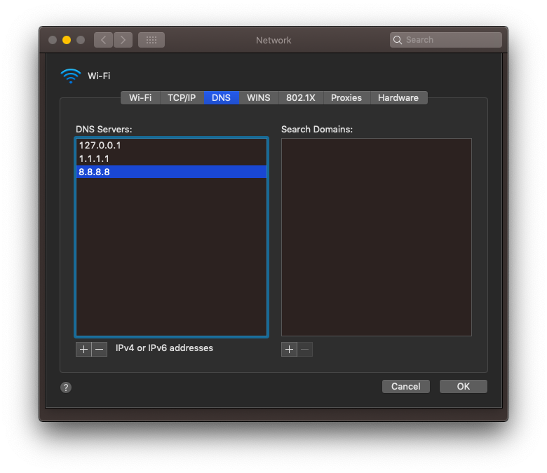

# Developers Guide

The following guide assumes you do _not_ want to expose your development server to the public internet and instead want to do everything, with the exception of identity provider callbacks, locally. 

If you are comfortable with a public development configuration, see the Synology quick-start which covers how to set up your network, domain, and retrieve wild-card certificates from LetsEncrypt, the only difference being you would route traffic to your local development machine instead of the docker image.

## Domains

Publicly resolvable domains are central in how pomerium works. For local development, we'll have to do some additional configuration to mock that public workflow on our local machine.  

### Pick an identity provider friendly domain name

Though typically you would want to  use one of the TLDs specified by [RFC-2606](http://tools.ietf.org/html/rfc2606) for testing, unfortunately, google explicitly does not support oauth calls to test domains. As such, it's recommended to use a domain you control using a wildcard-subdomain that you know will not be used. 

If you do not control a domain, you can use `*.localhost.pomerium.io` which I've established for this use Plus, if you *do* have internet access, this domain already has a [public A record](https://en.wikipedia.org/wiki/List_of_DNS_record_types) pointing to localhost. 

### Wildcard domain resolution with `dnsmasq`

If you are on a plane (for example), you may not be able to access public DNS. Unfortunately, `/etc/hosts` does not support wildcard domains and would require you specifying a new entry for each pomerium managed route. The workaround is to use [dnsmasq](https://en.wikipedia.org/wiki/Dnsmasq) locally which *does* support local resolution of wildcard domains.  

#### OSX 

1. Install `brew update && brew install dnsmasq`
2. Edit `/usr/local/etc/dnsmasq.conf` to tell dnsmasq to resolve your test domains.
   ```bash
    echo 'address=/.localhost.pomerium.io/127.0.0.1' > $(brew --prefix)/etc/dnsmasq.conf
   ```
3. 
    ```bash
    sudo mkdir -pv /etc/resolver
    sudo bash -c 'echo "nameserver 127.0.0.1" > /etc/resolver/localhost.pomerium.io'

    ```
4. Restart `dnsmasq` `sudo brew services restart dnsmasq`
5. Tell  OSX to use `127.0.0.1` as a the primary DNS resolver (followed by whatever public DNS you are using).
    


### Locally trusted wildcard certificates

In production, we'd use a public certificate authority such as LetsEncrypt. For local development, enter [mkcert](https://mkcert.dev/) which is a "simple zero-config tool to make locally trusted development certificates with any names you'd like."

1. Install `mkcert`. 
    ```bash 
    go get -u github.com/FiloSottile/mkcert
    ```
    
2. Bootstrap `mkcert`'s root certificate into your operating system's trust store.
    ```bash
    mkcert -install
    ```
    
3. Create your wildcard domain. 
    ```bash
    mkcert "*.localhost.pomerium.io"
    ```
    
4. Viola! Now you can use locally trusted certificates with pomerium!

    | Setting                      | Certificate file location                   |
    | :--------------------------- | :------------------------------------------ |
    | `certificate_file`           | `./_wildcard.localhost.pomerium.io-key.pem` |
    | `certificate_key_file`       | `./_wildcard.localhost.pomerium.io.pem`     |
    | `certificate_authority_file` | `$(mkcert -CAROOT)/rootCA.pem`              |

    


See also:
- [Set up a local test domain with dnsmasq](https://github.com/aviddiviner/til/blob/master/devops/set-up-a-local-test-domain-with-dnsmasq.md)
- [USE DNSMASQ INSTEAD OF /ETC/HOSTS](https://www.stevenrombauts.be/2018/01/use-dnsmasq-instead-of-etc-hosts/)
- [How to setup wildcard dev domains with dnsmasq on a mac](https://hedichaibi.com/how-to-setup-wildcard-dev-domains-with-dnsmasq-on-a-mac/)
- [mkcert](https://github.com/FiloSottile/mkcert) is a simple tool for making locally-trusted development certificates

