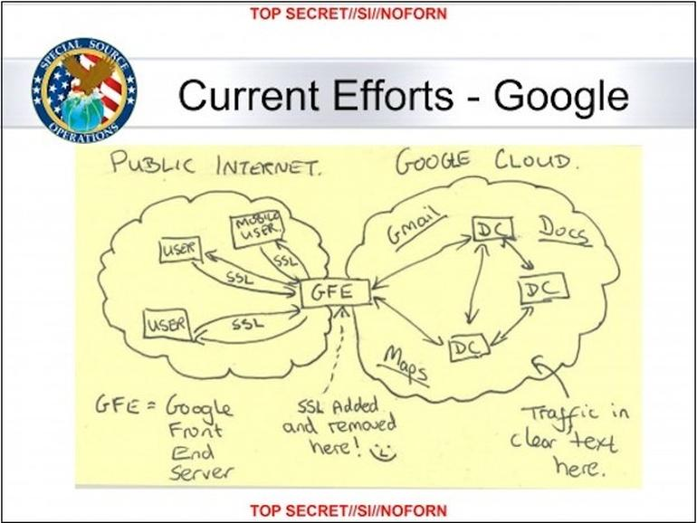

# Overview

## What

Pomerium is an identity-aware access proxy. Pomerium can be used to:

- enable secure remote access to internal websites, without a VPN.
- provide unified authentication ([SSO]) using the [identity provider] of your choice.
- enforce dynamic access policy based on context, identity, and device state.
- aggregate access logs and telemetry data.

## Why

### Perimeter security's shortcomings

For years, secure remote access meant firewalls, network segmentation, and VPNs. However, several [high-profile](https://en.wikipedia.org/wiki/Operation_Aurora) [security](https://krebsonsecurity.com/2014/02/target-hackers-broke-in-via-hvac-company/) breaches have shown the limitations of [perimeter](https://www.redbooks.ibm.com/redpapers/pdfs/redp4397.pdf) [security](https://en.wikipedia.org/wiki/Perimeter_Security), namely:

- Perimeter security does a poor job of addressing the insider-threat and 28% percent of breaches are [by internal actors](http://www.documentwereld.nl/files/2018/Verizon-DBIR_2018-Main_report.pdf).
- The _impenetrable fortress_ theory of perimeter security is anything but in practice; most corporate networks have multiple entry points, lots of firewall rules, and constant pressure to expand network segmentation boundaries.
- Even defining "what" a perimeter is is difficult as corporate networks have come to consist of an increasingly [heterogeneous](https://youtu.be/bDJb8WOJYdA?t=532) mix of on-premise, public, and private clouds.
- VPNs frustrate end-users, give a false sense of security, and often fail to provide defense-in-depth.

Or for the visually inclined.

> SSL added and removed here :^) - [NSA](https://www.zdnet.com/article/google-the-nsa-and-the-need-for-locking-down-datacenter-traffic/)

### Zero-trust

Pomerium attempts to mitigate these shortcomings by adopting principles like:

- Trust flows from identity, device-state, and context; not network location.
- Treat both internal and external networks as completely untrusted.
- Act like you are already breached, because you probably are.
- Every device, user, and application's communication should be authenticated, authorized, and encrypted.
- Access policy should be dynamic, and built from multiple sources.

This security model has typically been referred to as zero-trust or BeyondCorp-inspired. 

## Resources

Pomerium was inspired by the security model originally articulated by [John Kindervag](http://www.virtualstarmedia.com/downloads/Forrester_zero_trust_DNA.pdf) in 2010, and by Google in 2011 as a result of the [Operation Aurora](https://en.wikipedia.org/wiki/Operation_Aurora) breach.

### Books

- [Zero Trust Networks](http://shop.oreilly.com/product/0636920052265.do) by Gilman and Barth

### Papers

- Forrester [Build Security Into Your Network's DNA: The Zero Trust Network Architecture](http://www.virtualstarmedia.com/downloads/Forrester_zero_trust_DNA.pdf)
- Google BeyondCorp 1 [An overview: "A New Approach to Enterprise Security"](https://research.google.com/pubs/pub43231.html)
- Google BeyondCorp 2 [How Google did it: "Design to Deployment at Google"](https://research.google.com/pubs/pub44860.html)
- Google BeyondCorp 3 [Google's front-end infrastructure: "The Access Proxy"](https://research.google.com/pubs/pub45728.html)
- Google BeyondCorp 4 [Migrating to BeyondCorp: Maintaining Productivity While Improving Security](https://research.google.com/pubs/pub46134.html)
- Google BeyondCorp 5 [The human element: "The User Experience"](https://research.google.com/pubs/pub46366.html)
- Google BeyondCorp 6 [Secure your endpoints: "Building a Healthy Fleet"](https://ai.google/research/pubs/pub47356)

### Posts

- Google [Securing your business and securing your fleet the BeyondCorp way](https://cloud.google.com/blog/products/identity-security/securing-your-business-and-securing-your-fleet-the-beyondcorp-way)
- Google [Preparing for a BeyondCorp world: Understanding your device inventory](https://cloud.google.com/blog/products/identity-security/preparing-beyondcorp-world-understanding-your-device-inventory)
- Google [How BeyondCorp can help businesses be more productive](https://www.blog.google/products/google-cloud/how-beyondcorp-can-help-businesses-be-more-productive/)
- Google [How to use BeyondCorp to ditch your VPN, improve security and go to the cloud](https://www.blog.google/products/google-cloud/how-use-beyondcorp-ditch-your-vpn-improve-security-and-go-cloud/)
- Wall Street Journal [Google Moves Its Corporate Applications to the Internet](https://blogs.wsj.com/cio/2015/05/11/google-moves-its-corporate-applications-to-the-internet/)

### Videos

- [USENIX Enigma 2016 - NSA TAO Chief on Disrupting Nation State Hackers](https://youtu.be/bDJb8WOJYdA?list=PLKb9-P1fRHxhSmCy5OaYZ5spcY8v3Pbaf)
- [What, Why, and How of Zero Trust Networking](https://youtu.be/eDVHIfVSdIo?list=PLKb9-P1fRHxhSmCy5OaYZ5spcY8v3Pbaf) by Armon Dadgar, Hashicorp
- [O'Reilly Security 2017 NYC Beyondcorp: Beyond Fortress Security](https://youtu.be/oAvDASLehpY?list=PLKb9-P1fRHxhSmCy5OaYZ5spcY8v3Pbaf) by Neal Muller, Google
- [Be Ready for BeyondCorp: enterprise identity, perimeters and your application](https://youtu.be/5UiWAlwok1s?list=PLKb9-P1fRHxhSmCy5OaYZ5spcY8v3Pbaf) by Jason Kent

[identity provider]: ../docs/identity-providers.md
[sso]: https://en.wikipedia.org/wiki/Single_sign-on
