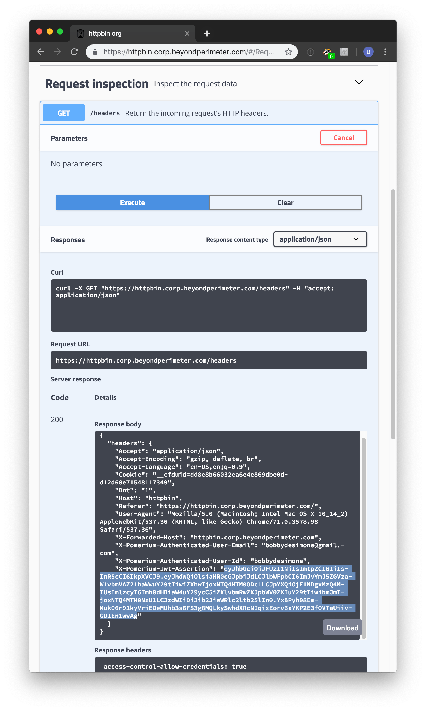

# Getting the user's identity

This article describes how to retrieve a user's identity from a pomerium managed application. Pomerium uses JSON Web Tokens (JWT) to attest that a given request was handled by Pomerium's authorizer service.

## Prerequisites

To secure your app with signed headers, you'll need the following:

- An application you want users to connect to.
- A [JWT] library that supports the `ES256` algorithm.

## Verification

If a [signing key] is set, the user's associated identity information will be included in a signed attestation JWT that will be added to each requests's upstream header `x-pomerium-jwt-assertion`. You should verify that the JWT contains at least the following claims:

 [JWT]   | description
:------: | ------------------------------------------------------------------------------------------------------
 `exp`   | Expiration time in seconds since the UNIX epoch. Allow 1 minute for skew.
 `iat`   | Issued-at time in seconds since the UNIX epoch. Allow 1 minute for skew.
 `aud`   | The client's final domain e.g. `httpbin.corp.example.com`.
 `iss`   | Issuer must be the URL of your authentication domain e.g. `authenticate.corp.example`.
 `sub`   | Subject is the user's id. Can be used instead of the `x-pomerium-authenticated-user-id` header.
`email`  | Email is the user's email. Can be used instead of the `x-pomerium-authenticated-user-email` header.
`groups` | Groups is the user's groups. Can be used instead of the `x-pomerium-authenticated-user-groups` header.

The attestation JWT's signature can be verified using the public key which can be retrieved at Pomerium's `/.well-known/pomerium/jwks.json` endpoint which lives on the authenticate service. A `jwks_uri` is useful when integrating with other systems like [istio](https://istio.io/docs/reference/config/security/istio.authentication.v1alpha1/). For example:

```bash
$ curl https://authenticate.int.example.com/.well-known/pomerium/jwks.json | jq
```

```json
{
  "keys": [
    {
      "use": "sig",
      "kty": "EC",
      "kid": "ccc5bc9d835ff3c8f7075ed4a7510159cf440fd7bf7b517b5caeb1fa419ee6a1",
      "crv": "P-256",
      "alg": "ES256",
      "x": "QCN7adG2AmIK3UdHJvVJkldsUc6XeBRz83Z4rXX8Va4",
      "y": "PI95b-ary66nrvA55TpaiWADq8b3O1CYIbvjqIHpXCY"
    }
  ]
}
```

### Manual verification

Though you will very likely be verifying signed-headers programmatically in your application's middleware, and using a third-party JWT library, if you are new to JWT it may be helpful to show what manual verification looks like.

1\. Provide pomerium with a base64 encoded Elliptic Curve ([NIST P-256] aka [secp256r1] aka prime256v1) Private Key. In production, you'd likely want to get these from your KMS.

```bash
# see ./scripts/generate_self_signed_signing_key.sh
openssl ecparam  -genkey  -name prime256v1  -noout  -out ec_private.pem
openssl req  -x509  -new  -key ec_private.pem  -days 1000000  -out ec_public.pem  -subj "/CN=unused"
# careful! this will output your private key in terminal
cat ec_private.pem | base64
```

Copy the base64 encoded value of your private key to `pomerium-proxy`'s environmental configuration variable `SIGNING_KEY`.

```bash
SIGNING_KEY=ZxqyyIPPX0oWrrOwsxXgl0hHnTx3mBVhQ2kvW1YB4MM=
```

1. Reload `pomerium-proxy`. Navigate to httpbin (by default, `https://httpbin.corp.${YOUR-DOMAIN}.com`), and login as usual. Click **request inspection**. Select `/headers'. Click **try it out** and then **execute**. You should see something like the following.



1. `X-Pomerium-Jwt-Assertion` is the signature value. It's less scary than it looks and basically just a compressed, json blob as described above. Navigate to [jwt.io] which provides a helpful GUI to manually verify JWT values.

2. Paste the value of `X-Pomerium-Jwt-Assertion` header token into the `Encoded` form. You should notice that the decoded values look much more familiar.


1. Finally, we want to cryptographically verify the validity of the token. To do this, we will need the signer's public key. You can simply copy and past the output of `cat ec_public.pem`.


**Viola!** Hopefully walking through a manual verification has helped give you a better feel for how signed JWT tokens are used as a secondary validation mechanism in pomerium.

::: warning

In an actual client, you'll want to ensure that all the other claims values are valid (like expiration, issuer, audience and so on) in the context of your application. You'll also want to make sure you have a safe and reliable mechanism for distributing pomerium-proxy's public signing key to client apps (typically, a [key management service]).

:::

### Automatic verification

In the future, we will be adding example client implementations for:

- Python
- Go
- Java
- C#
- PHP

[developer tools]: https://developers.google.com/web/tools/chrome-devtools/open
[docker-compose.yml]: https://github.com/pomerium/pomerium/blob/master/docker-compose.yml
[httpbin]: https://httpbin.org/
[jwt]: https://jwt.io/introduction/
[jwt.io]: https://jwt.io/
[key management service]: https://en.wikipedia.org/wiki/Key_management
[nist p-256]: https://csrc.nist.gov/csrc/media/events/workshop-on-elliptic-curve-cryptography-standards/documents/papers/session6-adalier-mehmet.pdf
[secp256r1]: https://wiki.openssl.org/index.php/Command_Line_Elliptic_Curve_Operations
[signing key]: ./../../configuration/readme.md#signing-key
