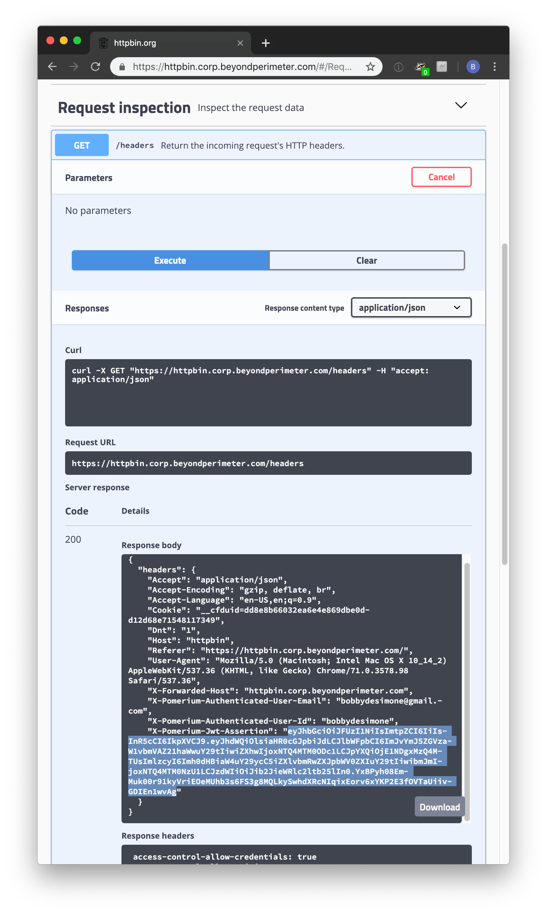
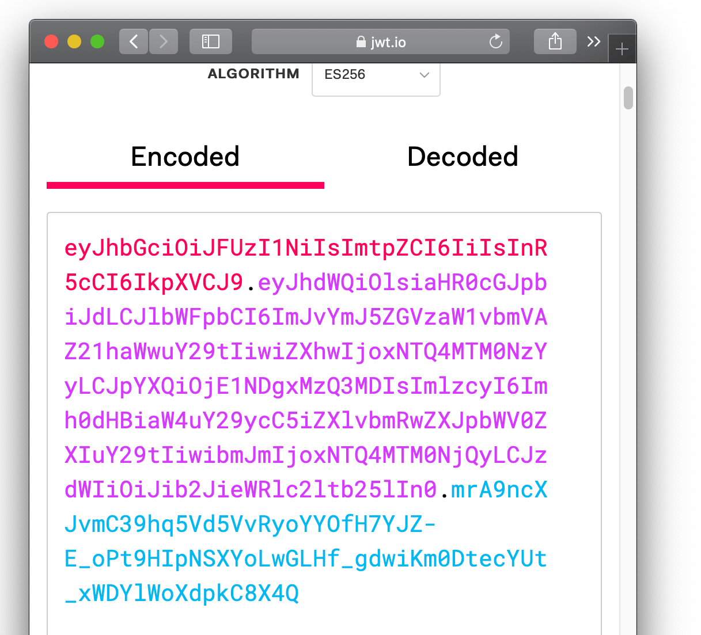
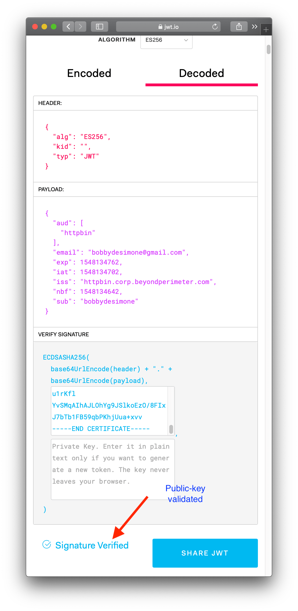

# Securing your app with signed headers

This page describes how to add an additional layer of security to your apps with signed headers. When configured, pomerium uses JSON Web Tokens (JWT) to make sure that a given request was handled by pomerium and the request to your app is authorized.

## Prerequisites

To secure your app with signed headers, you'll need the following:

- An application you want users to connect to.
- A [JWT] library that supports the `ES256` algorithm.

## Rationale

Signed headers provide **secondary** security in case someone bypasses mTLS and network segmentation. This protects your app from the following kind of risks:

- Pomerium is accidentally disabled
- Misconfigured firewalls
- Mutually-authenticated TLS
- Access from within the project.

To properly secure your app, you must use signed headers for all app types.

## Verification

To secure your app with JWT, cryptographically verify the header, payload, and signature of the JWT. The JWT is in the HTTP request header `x-pomerium-iap-jwt-assertion`. If an attacker bypasses pomerium, they can forge the unsigned identity headers, `x-pomerium-authenticated-user-{email,id,groups}`. JWT provides a more secure alternative.

Note that pomerium it strips the `x-pomerium-*` headers provided by the client when the request goes through the serving infrastructure.

Verify that the JWT's header conforms to the following constraints:

 [JWT]   | description
:------: | ------------------------------------------------------------------------------------------------------
 `exp`   | Expiration time in seconds since the UNIX epoch. Allow 1 minute for skew.
 `iat`   | Issued-at time in seconds since the UNIX epoch. Allow 1 minute for skew.
 `aud`   | The client's final domain e.g. `httpbin.corp.example.com`.
 `iss`   | Issuer must be `pomerium-proxy`.
 `sub`   | Subject is the user's id. Can be used instead of the `x-pomerium-authenticated-user-id` header.
`email`  | Email is the user's email. Can be used instead of the `x-pomerium-authenticated-user-email` header.
`groups` | Groups is the user's groups. Can be used instead of the `x-pomerium-authenticated-user-groups` header.

### Manual verification

Though you will very likely be verifying signed-headers programmatically in your application's middleware, and using a third-party JWT library, if you are new to JWT it may be helpful to show what manual verification looks like. The following guide assumes you are using the provided [docker-compose.yml] as a base and [httpbin]. Httpbin gives us a convenient way of inspecting client headers.

1. Provide pomerium with a base64 encoded Elliptic Curve ([NIST P-256] aka [secp256r1] aka prime256v1) Private Key. In production, you'd likely want to get these from your KMS.

  ```bash
  # see ./scripts/generate_self_signed_signing_key.sh
  openssl ecparam  -genkey  -name prime256v1  -noout  -out ec_private.pem
  openssl req  -x509  -new  -key ec_private.pem  -days 1000000  -out ec_public.pem  -subj "/CN=unused"
  # careful! this will output your private key in terminal
  cat ec_private.pem | base64
  ```

  Copy the base64 encoded value of your private key to `pomerium-proxy`'s environmental configuration variable `SIGNING_KEY`.

  ```bash
  SIGNING_KEY=ZxqyyIPPX0oWrrOwsxXgl0hHnTx3mBVhQ2kvW1YB4MM=
  ```

2. Reload `pomerium-proxy`. Navigate to httpbin (by default, `https://httpbin.corp.${YOUR-DOMAIN}.com`), and login as usual. Click **request inspection**. Select `/headers'. Click **try it out** and then **execute**. You should see something like the following.

  

3. `X-Pomerium-Jwt-Assertion` is the signature value. It's less scary than it looks and basically just a compressed, json blob as described above. Navigate to [jwt.io] which provides a helpful GUI to manually verify JWT values.

4. Paste the value of `X-Pomerium-Jwt-Assertion` header token into the `Encoded` form. You should notice that the decoded values look much more familiar.

  

5. Finally, we want to cryptographically verify the validity of the token. To do this, we will need the signer's public key. You can simply copy and past the output of `cat ec_public.pem`.

  

**Viola!** Hopefully walking through a manual verification has helped give you a better feel for how signed JWT tokens are used as a secondary validation mechanism in pomerium.

::: warning

In an actual client, you'll want to ensure that all the other claims values are valid (like expiration, issuer, audience and so on) in the context of your application. You'll also want to make sure you have a safe and reliable mechanism for distributing pomerium-proxy's public signing key to client apps (typically, a [key management service]).

:::

### Automatic verification

In the future, we will be adding example client implementations for:

- Python
- Go
- Java
- C#
- PHP

[developer tools]: https://developers.google.com/web/tools/chrome-devtools/open
[docker-compose.yml]: https://github.com/pomerium/pomerium/blob/master/docker-compose.yml
[httpbin]: https://httpbin.org/
[jwt]: https://jwt.io/introduction/
[jwt.io]: https://jwt.io/
[key management service]: https://en.wikipedia.org/wiki/Key_management
[nist p-256]: https://csrc.nist.gov/csrc/media/events/workshop-on-elliptic-curve-cryptography-standards/documents/papers/session6-adalier-mehmet.pdf
[secp256r1]: https://wiki.openssl.org/index.php/Command_Line_Elliptic_Curve_Operations
