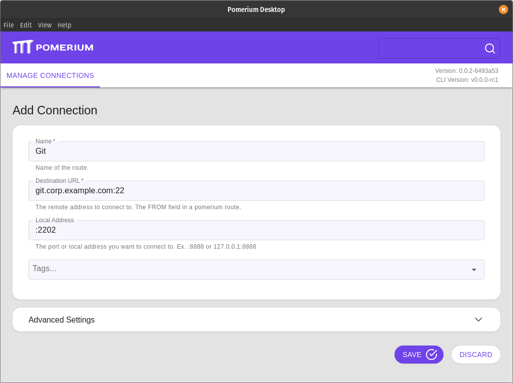

# Tunneled Git Connections

When hosting a self-hosted Git server like [GitLab](/guides/gitlab.md) behind Pomerium, you can protect desktop client access to the source code with the same identity-aware access as the web interface using an encrypted TCP tunnel.


 ## Basic Connection

 1. Create a TCP tunnel, using either [`pomerium-cli`](/docs/releases.md#pomerium-cli) or the Pomerium Desktop client. These examples use Git connections over SSH:

    ::::: tabs
    :::: tab pomerium-cli
    ```bash
    pomerium-cli tcp git.corp.example.com:22 --listen :2202
    ```

    :::tip --listen
    The `--listen` flag is optional. It lets you define what port the tunnel listens on locally. If not specified, the client will choose a random available port.
    :::

    ::::
    :::: tab Pomerium Desktop
    

    :::tip Local Address
    The **Local Address** field is optional. Using it defines what port the tunnel listens on locally. If not specified, Pomerium Desktop will choose a random available port.
    :::

    ::::
    :::::

1. Clone the repository using the tunneled connection as a remote:

    ```bash
    git clone ssh://git@127.0.0.1:2202/username/project-name
    ```

Now when you first initiate a `pull`, `push`, or `fetch` command your web browser will open to authenticate and authorize the connection.

## Always Tunnel through Pomerium

Because Git uses the SSH protocol, we can define a `Host` block in our local SSH configuration file to initiate the tunneled connection whenever it's needed.

1. Open your local SSH configuration file at `~/.ssh/config` and add a new Hosts `block`:

    ```bash
    Host git-tunnel
      HostName git.corp.example.com
      User git
      ProxyCommand pomerium-cli tcp --listen - %h:%p
    ```

1. For each repository, clone using this host:

    ```bash
    git clone git@git-tunnel:userName/projectName
    ```

::: tip
If you've already defined an SSH configuration for all domains managed by Pomerium as described in our [SSH Example](/docs/tcp/ssh.md#always-tunnel-through-pomerium), you can skip the first step above and define your new remote with the Git server's domain name.
:::

## More Resources

- [Git Documentation](https://git-scm.com/doc)
- [Secure GitLab with Pomerium](/guides/gitlab.md)