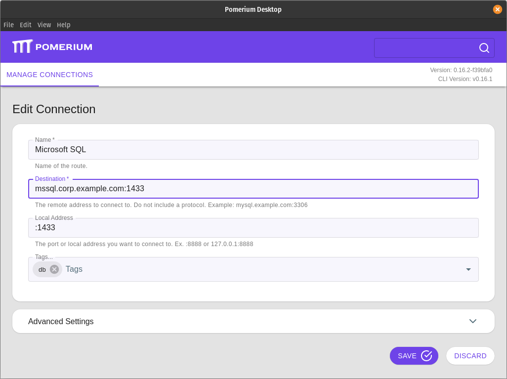

# Tunneled Microsoft SQL Connections

This document explains how to connect to a Microsoft SQL database through an encrypted TCP tunnel. We use the `sqlcmd` command line utility, but the same tunnel can be used by GUI tools.

::: tip
This example assumes you've already [created a TCP route](/docs/tcp/readme.md#configure-routes) for this service.
:::


 ## Basic Connection

 1. Create a TCP tunnel, using either [`pomerium-cli`](/docs/releases.md#pomerium-cli) or the Pomerium Desktop client:

    ::::: tabs
    :::: tab pomerium-cli
    ```bash
    pomerium-cli tcp mssql.corp.example.com:1433 --listen :1433
    ```

    :::tip --listen
    The `--listen` flag is optional. It lets you define what port the tunnel listens on locally. If not specified, the client will choose a random available port.
    :::

    ::::
    :::: tab Pomerium Desktop
    

    :::tip Local Address
    The **Local Address** field is optional. Using it defines what port the tunnel listens on locally. If not specified, Pomerium Desktop will choose a random available port.
    :::

    ::::
    :::::

1. Initiate your $SERVICE connection, pointing to `localhost`:

    ```bash
    /opt/mssql-tools/bin/sqlcmd -S localhost -U SA -P "YOURSTRONGPASSWORD"
    ```

## More Resources

- [Quickstart: Run SQL Server container images with Docker](https://docs.microsoft.com/en-us/sql/linux/quickstart-install-connect-docker)
- [Install the SQL Server command-line tools sqlcmd and bcp on Linux](https://docs.microsoft.com/en-us/sql/linux/sql-server-linux-setup-tools)