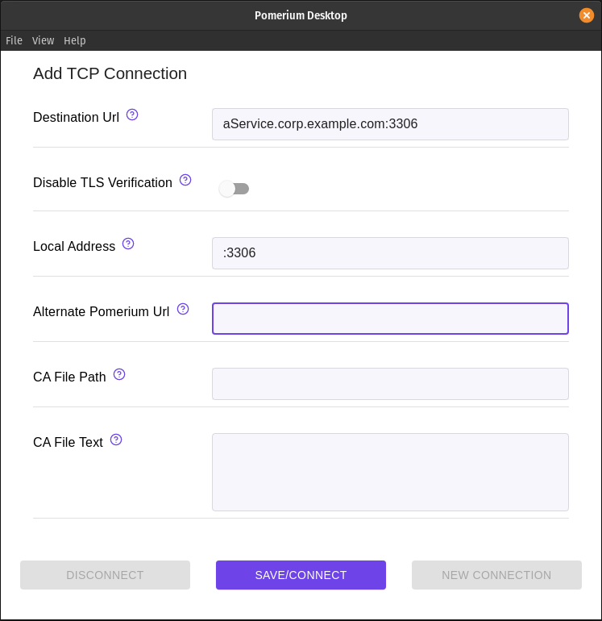

# Tunneled MySQL Connections

This document explains how to connect to a MySQL or MariaDB database through an encrypted TCP tunnel. We use the `mysql` command line utility, but the same tunnel can be used by GUI tools.

::: tip
This example assumes you've already [created a TCP route](/docs/tcp/readme.md#configure-routes) for this service.
:::

 ## Basic Connection

 1. Create a TCP tunnel, using either [`pomerium-cli`](/docs/releases.md#pomerium-cli) or the Pomerium Desktop client:

    ::::: tabs
    :::: tab pomerium-cli
    ```bash
    pomerium-cli tcp aService.corp.example.com:3306 --listen :3306
    ```

    :::tip --listen
    The `--listen` flag is optional. It lets you define what port the tunnel listens on locally. If not specified, the client will choose a random available port.
    :::

    ::::
    :::: tab Pomerium Desktop
    

    :::tip Local Address
    The **Local Address** field is optional. Using it defines what port the tunnel listens on locally. If not specified, Pomerium Desktop will choose a random available port.
    :::

    ::::
    :::::

1. Initiate your MySQL connection, pointing to `localhost`:

    ```bash
    mysql -h 127.0.0.1 -u USER -p
    ```

## Allow Access from Remote Hosts:

1. Your MySQL or MariaDB service may not accept connections from remote hosts. Find the `bind-address` key in the configuration files (usually located in `/etc/mysql/`) and edit it to accept remote connections. For example:

    ```ini
    # Instead of skip-networking the default is now to listen only on
    # localhost which is more compatible and is not less secure.
    bind-address            = 0.0.0.0
    ```

1. When connecting, you may get an error like `ERROR 1130 (HY000): Host '192.0.2.10' is not allowed to connect to this MariaDB/MySQL server`. You can create a user entry in your database for the Pomerium host:

    ```sql
    CREATE USER 'user'@'pomerium.local' IDENTIFIED BY 'some_pass';
    GRANT ALL PRIVILEGES ON *.* TO 'user'@'pomerium.local'
    ```

    Or create a user entry with no host associated:

    ```sql
    CREATE USER 'user'@'%' IDENTIFIED BY 'some_pass';
    GRANT ALL PRIVILEGES ON *.* TO 'user'@'%'
    ```

## More Resources

- [Configuring MariaDB for Remote Client Access](https://mariadb.com/kb/en/configuring-mariadb-for-remote-client-access/)
- [How to Allow Remote Connections to MySQL Database Server](https://linuxize.com/post/mysql-remote-access/)