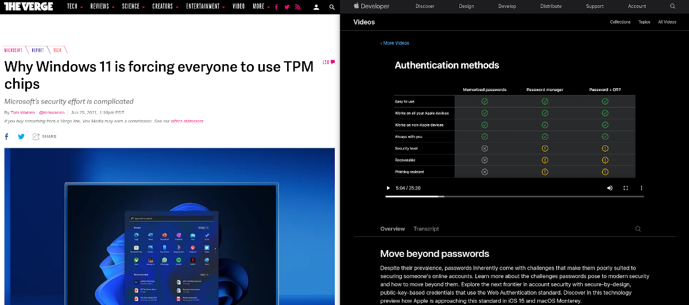

# Device Identity

One of the core components of the zero trust security model is **device identity**, which is the ability for a device to have a unique, unclonable identity string that can be authenticated and factored into access control decisions. This topic page covers the concept of device identity, and how it applies to the zero trust model.

## Why Device Identity Is Important

The history of IT security has, until recently, mostly focused on user identity verification. In this model, access to a service is granted only after verifying a user's identity and authorization to that service. This was usually sufficient in scenarios where the user's access was physically limited to trusted devices in trusted physical and network spaces; a PC sitting in an office in the company headquarters on a local network, for example.

Hardware-backed device identity is becoming more widely discussed as more products begin to implement or require it across all tech industries. For example, Windows 11 generated a lot of news by [requiring TPM 2.0][win11-reqs], and Apple is taking steps to [eliminate passwords][apple-passkeys] :

|  |
|:--|
| **Sources:** - <https://www.theverge.com/2021/6/25/22550376/microsoft-windows-11-tpm-chips-requirement-security> -  <https://developer.apple.com/videos/play/wwdc2021/10106/> |

Device identity protects a trusted user from accessing sensitive data from a potentially unsafe device, like their personal computer or phone. Think of it as similar to multi-factor authentication (**MFA**); where MFA covers "what you know" (password) and "who you are" (biometrics, face recognition, etc), device identity asks "is this device safe?" by confirming that the device you are using to access a system is trusted.

Device identity is similar but unique to MFA. Where MFA is an additional layer of protection on user identity, hardware-backed device identity can be used to enhance and augment authorization decisions beyond the initial authentication flow. Where MFA increases the trust-level of a user, device identity provides trust for the device being used. More importantly, it denies access for non-trusted, potentially insecure devices.

## What Is Device Identity

> When you remove "[the perimeter]" as the source of trust to your infrastructure, you must replace it with a level of trust for every person, **device**, and hop in the communication path. Where the other, more commonly implemented facets of zero trust validates the user and traffic, device identity (through WebAuthn) validates the end user's device.

Device ID is a unique identifying key that can only be created by the specific combination of hardware and software present on a specific device. How this is accomplished is largely dependent on the tools available on the user hardware, which we've detailed below.

### Authenticated Device Types

Device identity is made possible through trusted execution environment (**TEE**) devices that provide a hardware-attested identity. The specific implementation of this general concept is different across the devices that provide device identity, but they generally fall into two categories: [secure enclaves and cross-platform security keys].

#### Secure Enclaves

Also called platform or internal authenticators, a secure enclave is physically bound to a specific computing device.

- TPM (Trusted Platform Module): These devices are usually built into a product's mainboard, or can be installed in devices with a TPM header, as shown [here][toms-hardware-tpm]. They include a small processor to carry out cryptographic functions on the device, instead of on the system's processor where it could be interfered with. Trust is usually derived from a private key or certificate signed by a trusted manufacture's certificate authority.

- Mobile devices: Most newer Apple and Android devices include a [Secure Enclave][apple-enclave] or [Hardware-backed Keystore][android-keystore]

#### Hardware Security Keys

Also known as cross-platform or roaming authenticators, these are authentication devices which can move with the user across different computers.

- FIDO U2F: This [open standard][fido-spec] is used by many products like Yubico's [Yubikey][yubikey-products] and Google's [Titan Security Key](https://support.google.com/titansecuritykey/answer/9115487?hl=en). They usually secure a private key used to decrypt information signed by an accessible public key.

::: tip Note
The nature of cross-platform keys mean they are not associated with a single end-user device. Pomerium policies can be written to allow these keys, or specified to only accept secure enclaves.
:::

## Implement Device Identity with Pomerium

Pomerium supports policies that use device identity since version [0.16.0](/docs/upgrading.md#policy-for-device-identity). We use the [Web Authentication][webauthn-api] (**WebAuthN**) API to bring authentication and authorization based on device identity into your security framework. Pomerium's device identity support enables users to register their devices, and administrators to enforce access to applications and services to a particular set of trusted devices.

To get started, review the following pages:

- [Pomerium Policy Language](/docs/topics/ppl.md) to learn how to build policies that use device ID.
- **End Users** should review [Enroll a Device](/guides/enroll-device.md) to learn how to enroll devices on Pomerium. In Enterprise environments, self-enrollments must be approved by an admin in the Enterprise Console.
- **Enterprise Administrators** can review the [Devices](/enterprise/reference/manage.md#devices) reference material to create pre-approved enrollment links for users.
- [pomerium/webauthn](https://github.com/pomerium/webauthn) on GitHub, our implementation of the WebAuthn specification.

## Looking Ahead: Device Posture

Even if access is restricted to known devices, what happens when a user is found to have a vulnerable OS or browser version? How can an administrator ensure their network is not exposed, and that the user's system is promptly patched and remediated?  As secure enclave technologies evolve, **device posture** -- which is sometimes referred to as device state -- will play an increasingly important role in not only authorization decisions but also in helping to quickly remediate vulnerable corporate devices. Device posture is a more complex superset of device identity, with more information about the device and software being used to generate the resulting identifier.

Designing your security model to use device identity also primes your infrastructure to implement advanced security rules based on device posture down the road.

[android-keystore]: https://source.android.com/security/keystore
[apple-enclave]: https://support.apple.com/guide/security/secure-enclave-sec59b0b31ff/web
[apple-passkeys]: https://developer.apple.com/documentation/authenticationservices/public-private_key_authentication/supporting_passkeys
[fido-spec]: https://fidoalliance.org/specifications/
[secure enclaves and cross-platform security keys]: https://developers.yubico.com/WebAuthn/WebAuthn_Developer_Guide/Platform_vs_Cross-Platform.html
[the perimeter]: https://www.microsoft.com/security/blog/2019/10/23/perimeter-based-network-defense-transform-zero-trust-model/
[toms-hardware-tpm]: https://www.tomshardware.com/reviews/tpm-trusted-platform-module-header,5766.html
[verge-tpm]: https://www.theverge.com/2021/6/25/22550376/microsoft-windows-11-tpm-chips-requirement-security
[webauthn-api]: https://www.w3.org/TR/webauthn-2/#registration-extension
[win11-reqs]: https://www.microsoft.com/en-us/windows/windows-11-specifications
[yubikey-products]: https://www.yubico.com/products/