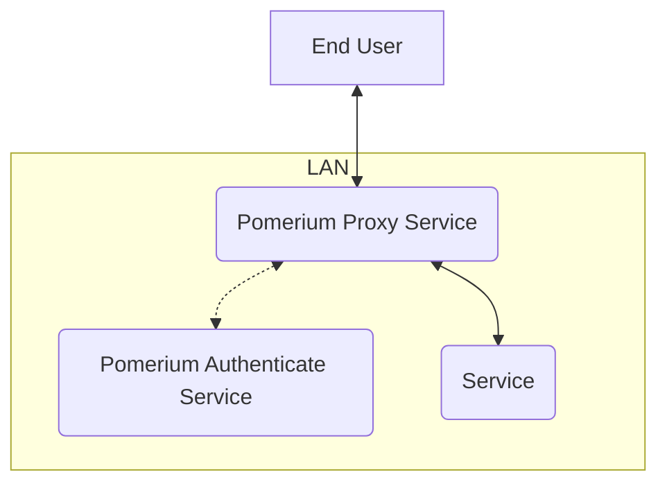
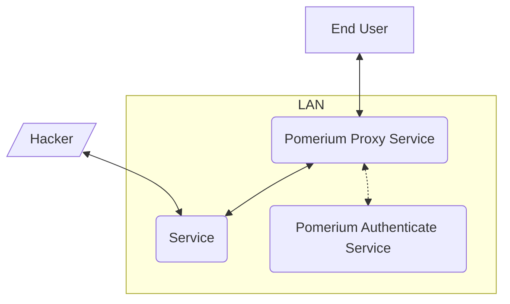
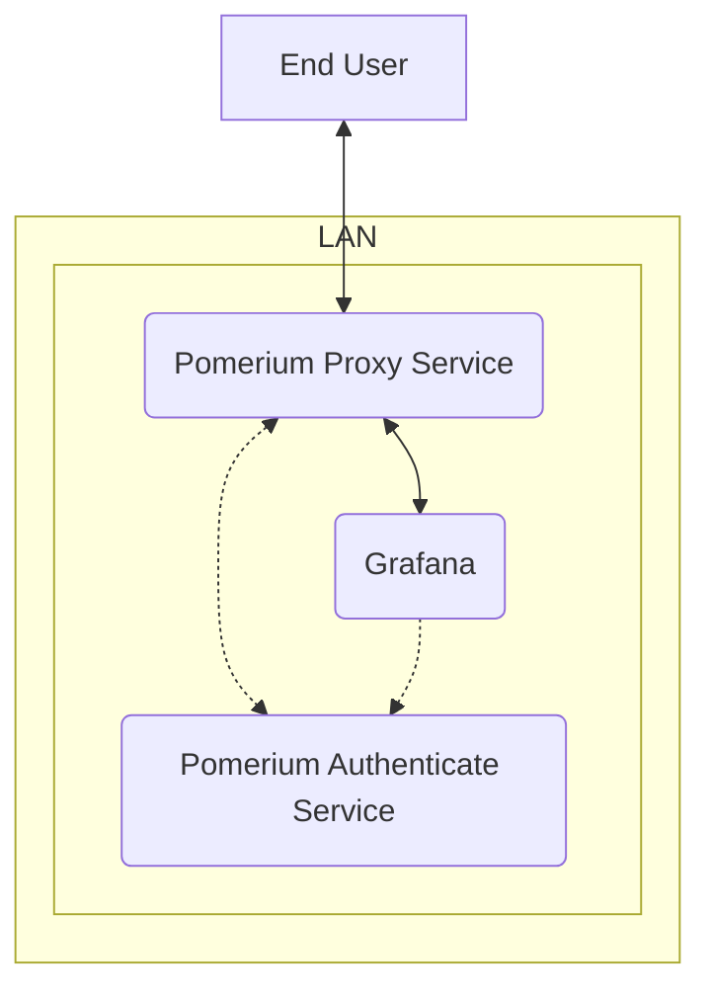
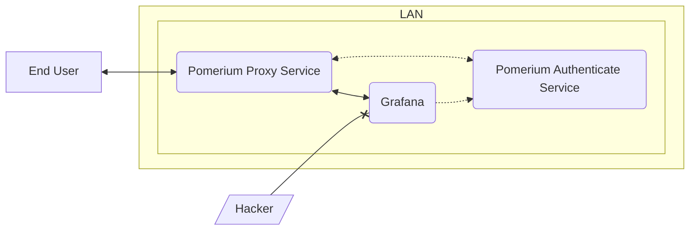
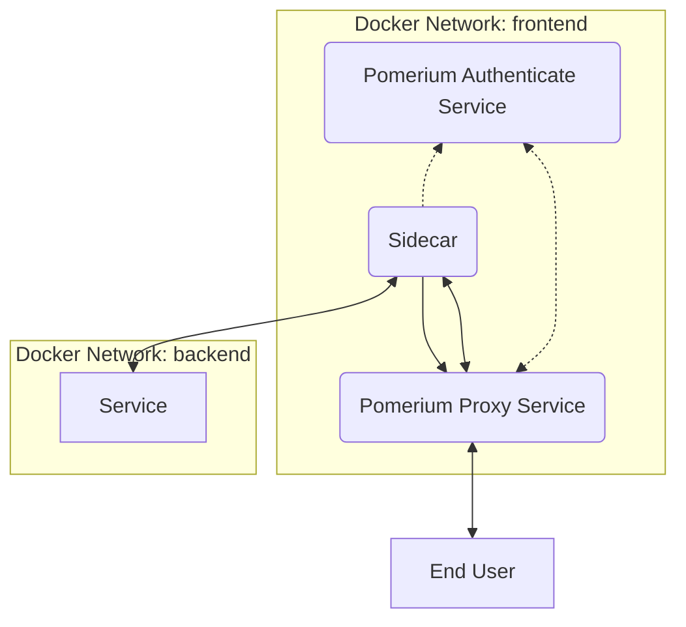
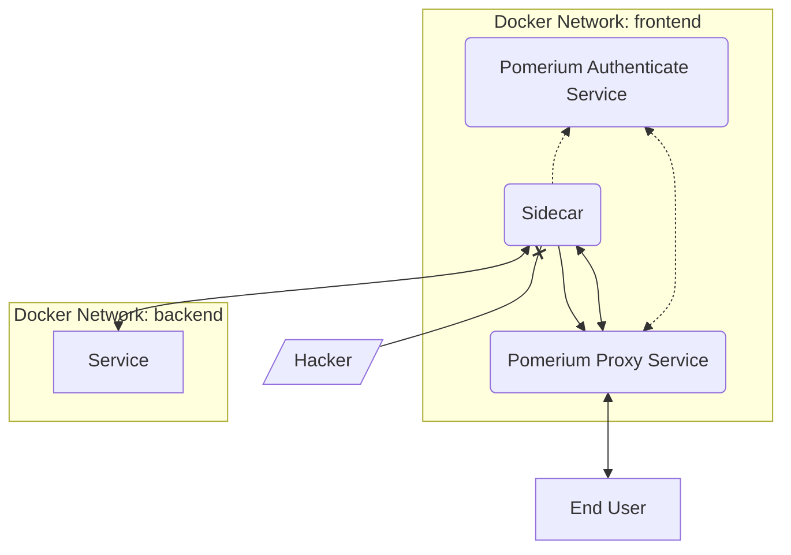

# Mutual Authentication: A Component of Zero-Trust

Pomerium provides a good layer of security out of the box, but it's not (and can't be) configured for complete [zero trust] right out of the box. This page explains the concepts of zero trust with practical examples.

## Pomerium Default

Let's look at a basic installation of Pomerium on a local network, with a single downstream service. This service contains sensitive data that we only want the right people to access.

::: tip Note
This section describes multiple services of Pomerium like Authenticate and Proxy as separate services. If you are running Pomerium in all-in-one mode, these will be a single process/container in your environment.
:::

1. When the user connects to the route `service.example.com` the traffic is received by the Pomerium Proxy service.
1. The proxy redirects to the Authenticate service to validate the user by having them sign in with the identity provider (**IdP**).
1. After authentication succeeds, the proxy verifies that the authenticated (**authn**) user is authorized (**authz**) to access the service, and begins communication with it.

This is great, only the users that are supposed to have access to the service get through. But this model is dependent on the security of your network perimeter. If a bad actor gains access to your local area network (**LAN**), they can now communicate with the service directly:

While your network *should* be secured to only allow traffic at specified ports and directed to specified services, this creates a single point of failure. A hacker need only bypass your firewall to get direct access to your service.

## JWT Verification: Internal Mutual Auth

Many, but not all, modern web applications support json web tokens (**JWTs**). These tokens are provided by Pomerium (with the [`pass_identity_headers`] key) to the downstream service so that it can independently verify that the traffic it receives is authorized.

Let's look at an example, modeled from our [Grafana] integration guide:

1. When the user connects to the route `grafana.example.com` the traffic is received by the Pomerium Proxy service.
1. The proxy redirects to the Authenticate service to validate the user by having them sign in with the identity provider (**IdP**).
1. After authentication succeeds, the proxy verifies that the authenticated (**authn**) user is authorized (**authz**) to access the service, and send the connection to Grafana, including the `X-Pomerium-JWT-Assertion` header containing the JWT signed by the key set in the Pomerium Authenticate service.
1. The service (Grafana) reads the signing key from the Authenticate service, and uses it to validate the JWT. Finding it to match, the traffic is allowed.

Our hacker may be able to forge a basic JWT, but they can't sign it with the key secured in the Pomerium configuration, so Grafana rejects their connections:

## mTLS: External Mutual Auth

A bit here about how mTLS works in a similar fashion as above.

## Mutual Authentication With a Sidecar

If your company depends on software that was not built for mutual authentication, you can still secure those services using a **Sidecar**. This is a piece of software designed to provide a new sole method of accessing a service, and provides the authentication for traffic routed to that service.

We describe the technical steps to test such a configuration using Envoy and Docker containers in our [JWT Verification] guide, but let's describe it conceptually here:

In this example, the service is only network-accessible from the `backend` network. The only other container with access to that network is `sidecar`, which performs the JWT or mTLS authentication before allowing traffic to the service.

Because the `backend` network is inaccessible to any traffic not coming from the sidecar, a bad actor has no way of accessing it:

[zero trust]: https://link-to-something.com
[`pass_identity_headers`]: /reference/readme.md#pass-identity-headers
[Grafana]: /guides/grafana.md
[JWT Verification]: /guides/jwt-verification.md