# Mutual Authentication: A Component of Zero Trust

Pomerium provides a good layer of security out of the box, but it's not (and can't be) configured for complete [zero trust] right out of the box. This page explains several methods of achieving mutual authentication — a big part of the zero trust model — with practical examples.

This is a nuanced topic that dives into several specific security practices that provide mutual authentication. You can use the table of contents below to narrow down to the specific tools you're interested in or read the entire doc for a deeper understanding of how these tools work together to support strong infrastructure security.

[[toc]]

## What Is Mutual Authentication?

The concept of mutual authentication is deceptively simple. It means that both sides of a connection can validate the identity of the other. The application of this concept, however, can be varied and complex. Pomerium provides the features and capability to provide mutual authentication between itself and end users, as well as between itself and upstream services, but configuring those external endpoints can vary depending on each service's features.

## Pomerium Defaults

- **Security**: Moderate
- **Difficulty**: Easy
- **Encrypted**: Yes (from the end user to Pomerium. It's up to the service to provide a TLS endpoint for Pomerium to use.)
- **Mutual Authentication**: None

Let's look at a basic installation of Pomerium on a local network, with a single upstream service. This service contains sensitive data that we want to ensure is confidential and cannot be tampered with.

::: tip Note
Throughout this guide we will diagram Pomerium as a single service, as it is in all-in-one mode. This is the version provided by our [binaries] and in our Docker-based [Quick Start] page.
:::

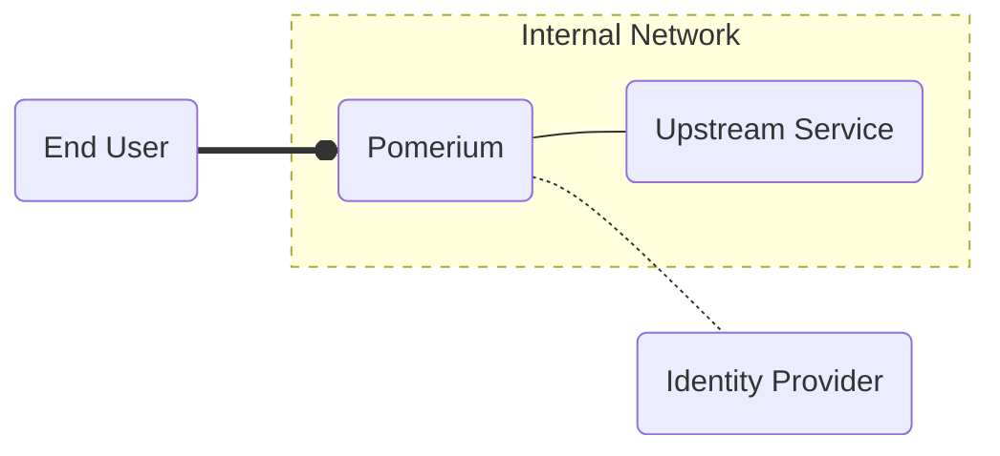

1. When the user connects to the route `service.example.com` the traffic is received by Pomerium.
1. Pomerium redirects the user to the identity provider (**IdP**) to sign in and validate their identity.
1. After signing in to the IdP, Pomerium verifies that the authenticated (**AuthN**) user is authorized (**AuthZ**) to access the service, and begins communication with it.

This is a good start, only the users that are supposed to have access to the service get through. But this model is dependent on the security of your network perimeter. If a bad actor gains access to your internal network, they can now communicate with the service directly:

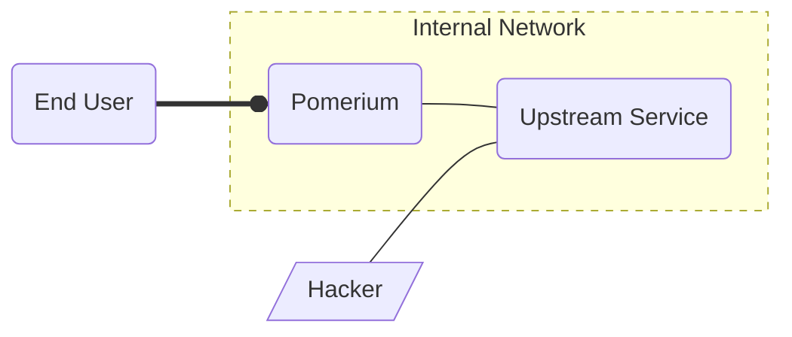

While your network *should* be secured to only allow traffic at specified ports and directed to specified services, this creates a single point of failure. A hacker need only bypass your firewall to get direct access to your service.

## JWT Verification: Application-based Mutual Authentication

- **Security**: Strong
- **Difficulty**: Moderate
- **Encrypted**: Yes (from the end user to Pomerium. It's up to the service to provide a TLS endpoint for Pomerium to use.)
- **Mutual Authentication**: Application Layer

Many, but not all, modern web applications support [JSON web tokens][jwt-rfc] (**JWTs**). These tokens can be provided by Pomerium (with the [`pass_identity_headers`] key) so that an upstream service can independently verify that the traffic has properly gone through Pomerium, and that the incoming user request is authorized.

JWTs are verified the same way as TLS certificates, by checking that they are signed by a trusted authority. Pomerium provides that authority with a JSON web key set (**JWKS**) which signs the JWT. Upstream services that utilize JWTs can be directed to Pomerium for the JWKS.

Let's look at an example:

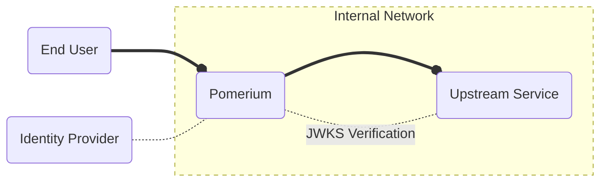

1. When the user connects to the route `service.example.com` the traffic is received Pomerium.
1. Pomerium redirects the user to the identity provider (**IdP**) to sign in and validate their identity.
1. After authentication succeeds, Pomerium verifies that the authenticated user is authorized to access the upstream service, and sends the connection to it, including the `X-Pomerium-JWT-Assertion` header containing the JWT signed by the key set in Pomerium.
1. The upstream service reads the signing key from Pomerium, and uses it to validate the JWT. Finding that the JWT was signed by the trusted key, the traffic is allowed.

Our hacker may be able to forge a basic JWT, but they can't sign it with the key secured in the Pomerium configuration, so the upstream service rejects their connections:

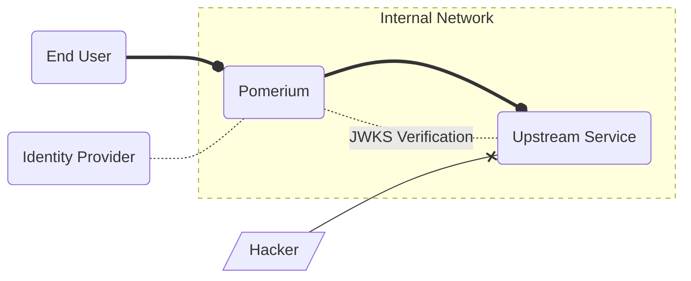

In this way, we've applied a zero trust security model to the application layer of our infrastructure's network model. You can see JWT verification in practice with our [Grafana] integration guide.

## mTLS: Protocol-based Mutual Authentication

- **Difficulty**: Hard
- **Encrypted**: Yes
- **Mutual Authentication**: Protocol Layer

### North-south mTLS

Most tech professionals are familiar with [Transport Layer Security] (**TLS**). The majority of traffic on the web today is sent using TLS. In addition to encrypting data using the server's TLS certificate, the server identity is validated by the certificate and the Certificate Authority (**CA**) that signed it.

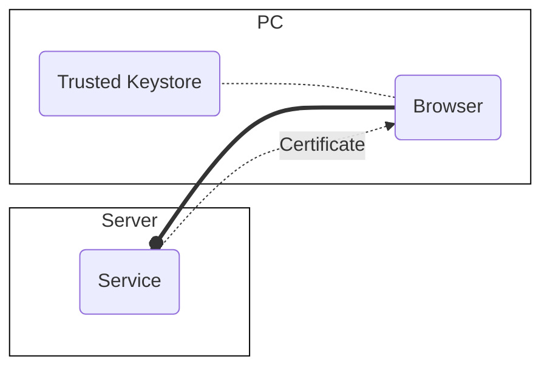

1. The browser initiates a connection to `example.com` over the `http` protocol.
1. The server sends its public certificate to the browser.
1. The browser reads the certificate chain to find the CA, and checks against the computer's keystore to see if the CA is one that it trusts.
1. After confirming the CA is trusted the browser reconnects to the server, this time using the `https` protocol and encrypting the traffic using the public certificate.

The process above, an example of [north-south traffic](https://en.wikipedia.org/wiki/North-south_traffic) over HTTPS, confirms the identity of the *server*, protecting the client. Mutual TLS (**mTLS**) allows the server to confirm the identity of the *client* using a client certificate.

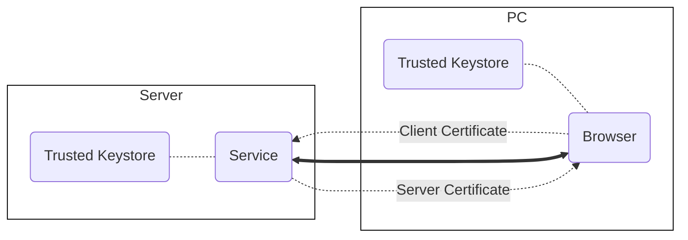

1. After the server certificate is trusted and an `HTTPS` connection is established, the server requests a client certificate.
1. The user is prompted to use one of the certificates previously imported into the browser. This certificate is sent to the server
1. The server validates the client certificate signing authority against its trusted keystore or authorized client CA. Once authorized, the server resumes normal encrypted communication with the client.

### East-west mTLS

Traffic between services in an internal network is referred to as [east-west traffic](https://en.wikipedia.org/wiki/East-west_traffic). mTLS can also be configured between Pomerium and the end user, and/or with an upstream service. Configuring mTLS for many end users is cumbersome, and new technologies like [device identity verification] provide verification of the user and their hardware. But mTLS between Pomerium and an upstream service (the east-west traffic) need only be configured once per service, and minimally maintained by updating certificates.

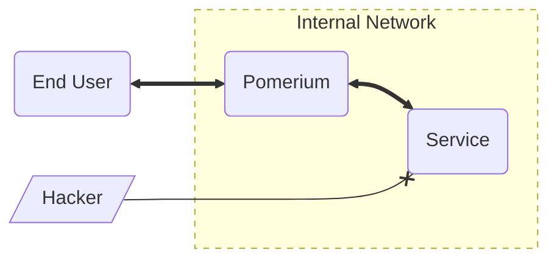

In this way, we've applied a zero trust security model to the protocol layer of our infrastructure's network model.

## Mutual Authentication With a Sidecar

If your company depends on software that was not built for mutual authentication, you can still secure those services using a **Sidecar**. This is a piece of software designed to provide a new sole method of accessing a service, and provides the authentication for traffic routed to that service.

We describe the technical steps to test such a configuration using Envoy and Docker containers in our [JWT Verification] guide, but let's describe it conceptually here:

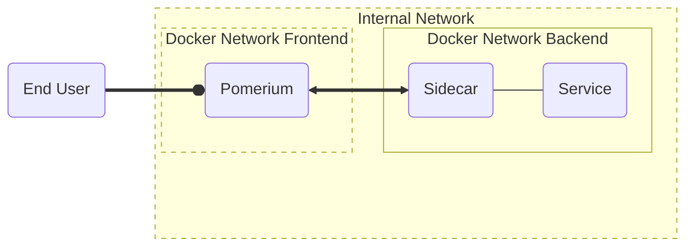

In this example, the service is only network-accessible from the `backend` network. The only other container with access to that network is `sidecar`, which performs the JWT or mTLS authentication before allowing traffic to the service.

Because the `backend` network is inaccessible to any traffic not coming from the sidecar, a bad actor has no way of accessing it:

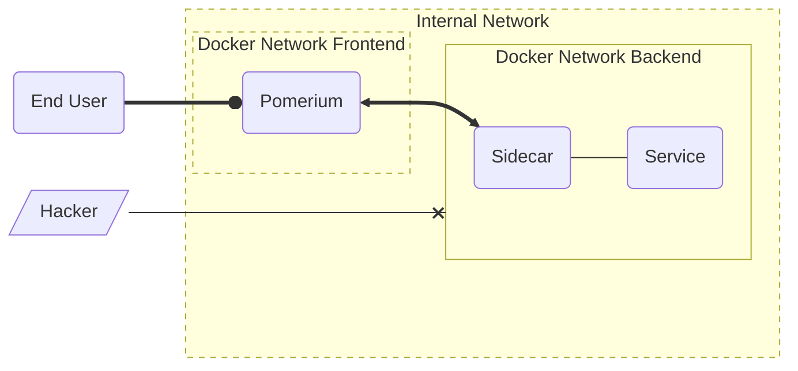

## Putting It All Together

Each of the techniques described above provides an additional form of security. Which you choose to apply to your infrastructure depends on your needs, end users, and what your services and/or infrastructure can support.

Security practices can often seem like a scale with best practices at one end and ease of use at the other. Pomerium is designed to make it reasonably easy to enable the best security model that fits each service. For example, it's usually not reasonable to expect a service with many unique end users to require client certificates for downstream mTLS, but communication between Pomerium and the upstream application or service mesh can use it without any additional overhead for the client.

At this point, the security model becomes difficult to accurately describe with a simple graph... but we'll try anyway.

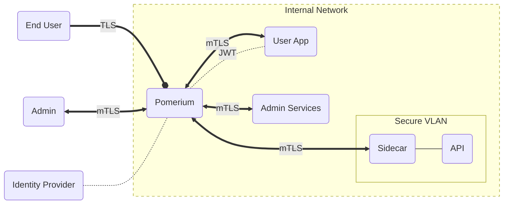

- In this example, End users authenticate with Pomerium to access the user app:
  - Their connection to Pomerium is authenticated after signing in to their identity provider, and encrypted with TLS.
  - The communication between Pomerium and the user app is mutually authenticated with mTLS, and the user's JWT is passed from Pomerium to the app to confirm the user identity to the service. The service validates the JWT against Pomerium's signing Key.
- The admin also authenticates with Pomerium to access their services:
  - The connection is authenticated and encrypted the same as the user's, but the route to the admin app also requires a client certificate for mutual authentication at the protocol layer.
  - The connections from the admin to the admin services are now mutually authenticated both upstream and downstream from Pomerium.
- The API server is required by both the user and admin apps. Rather than build authentication into the API service, it is accessible only through a sidecar. The sidecar only accepts mTLS-authenticated connections from the proxy, so both apps connect to the API through Pomerium.

## Legend

The expandable legend below describes how different elements are used in the graphs above.

::: details Legend
The graphs in this guide use a consistent format to indicate certain aspects of the data flow.

---

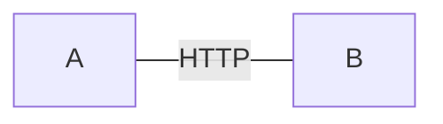

Thin lines represent un-encrypted traffic over HTTP.

---

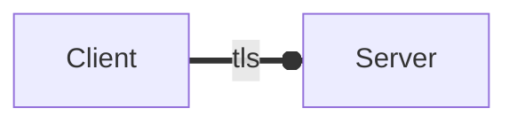

Thick lines represent encrypted traffic using TLS. the circle represents which end of the connection is providing a certificate to establish trust.

---

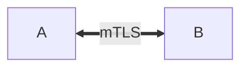

Thick lines with arrows on both ends represent a connection secured by mTLS, where each side provides a TLS certificate and the other can verify its identity.

---

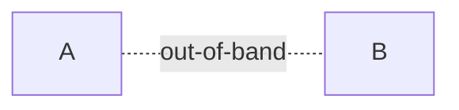

Dashed lines represent out-of-band connections. These occur when, for example, various services talk to each other to validate connections made by the user.

---

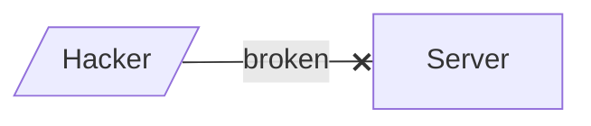

Lines with an **X** represent a failed attempt to gain access to a system.

---

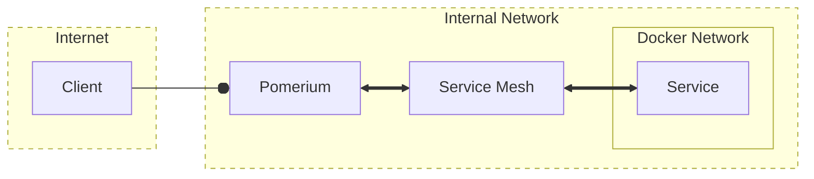

Yellow blocks represent different networks like the internet, an internal network, or a virtual network like Docker provides. Dashed borders represent network perimeters allowing general access. Solid borders represent secured perimeters only permitting the traffic represented in the diagram.
:::

[binaries]: /docs/install/binary.md
[device identity verification]: /docs/topics/device-identity.md
[Grafana]: /guides/grafana.md
[JWT Verification]: /guides/jwt-verification.md
[jwt-rfc]: https://datatracker.ietf.org/doc/html/rfc7519
[Kubernetes]: /docs/k8s/helm.md
[`pass_identity_headers`]: /reference/readme.md#pass-identity-headers
[Quick Start]: /docs/install/readme.md
[Transport Layer Security]: https://en.wikipedia.org/wiki/Transport_Layer_Security
[zero trust]: https://www.pomerium.com/docs/background.html

