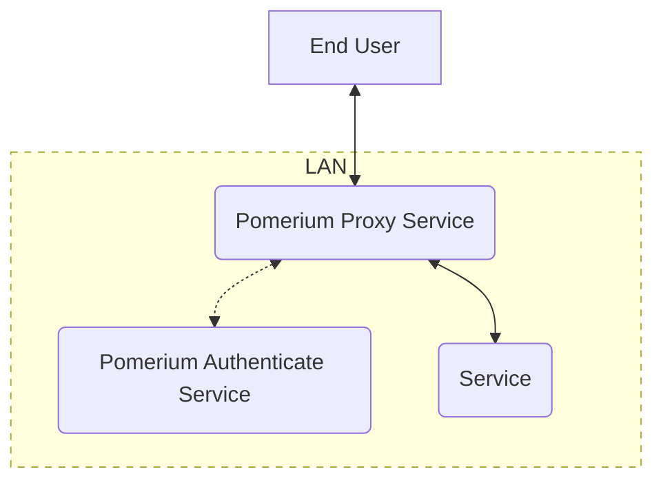
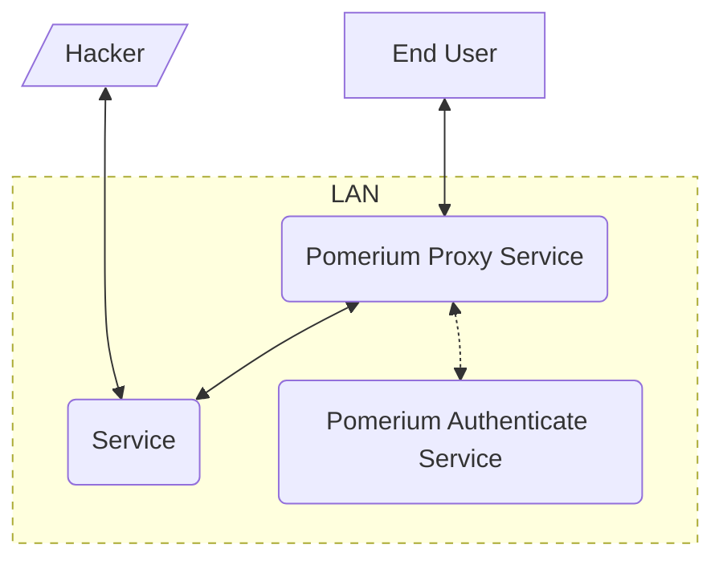
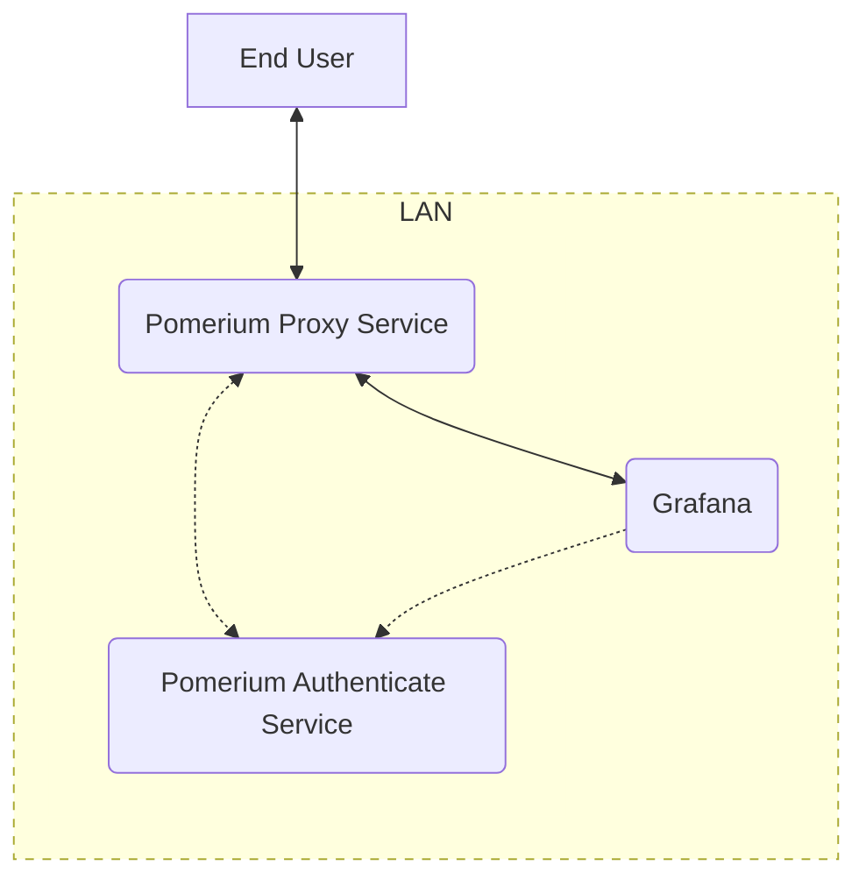
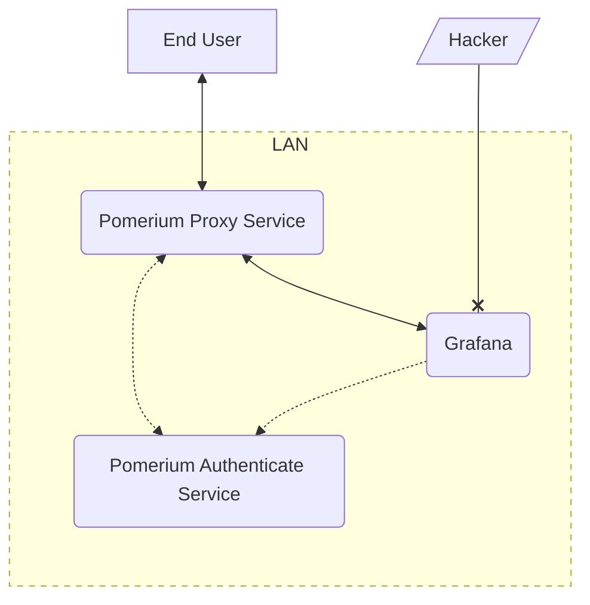
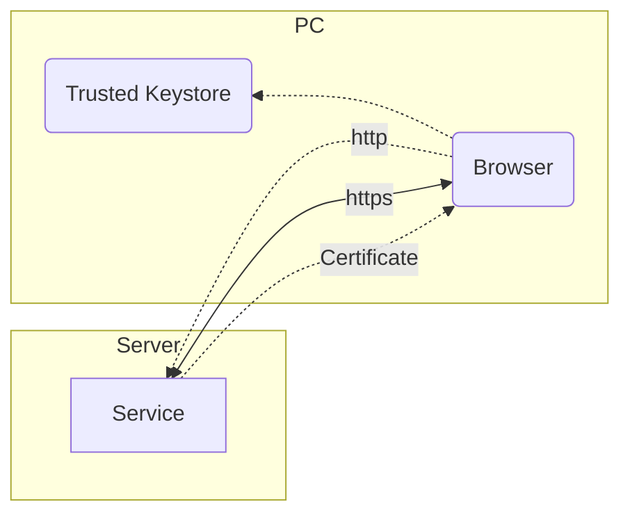
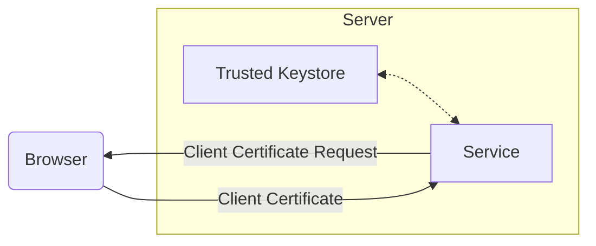
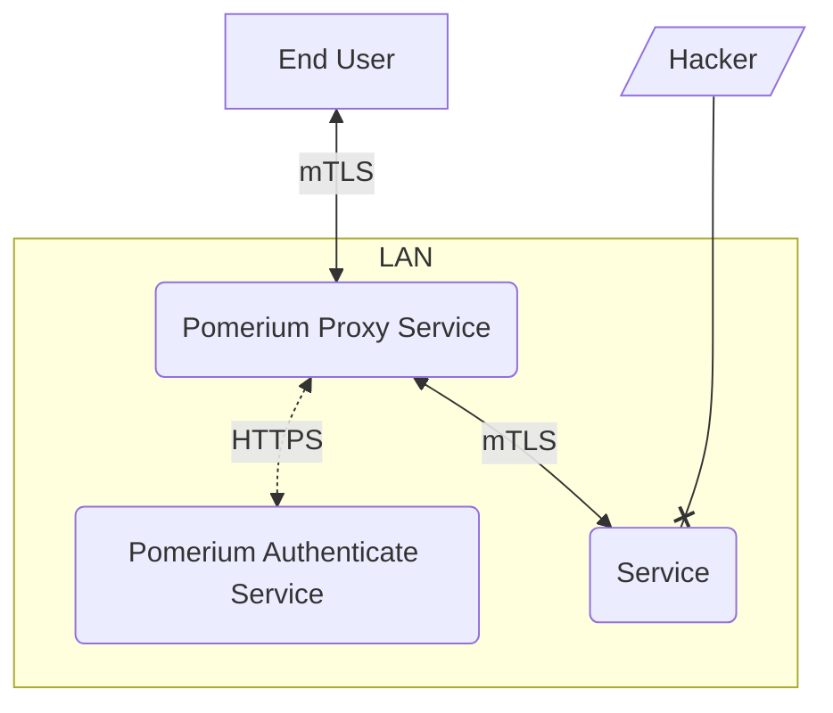
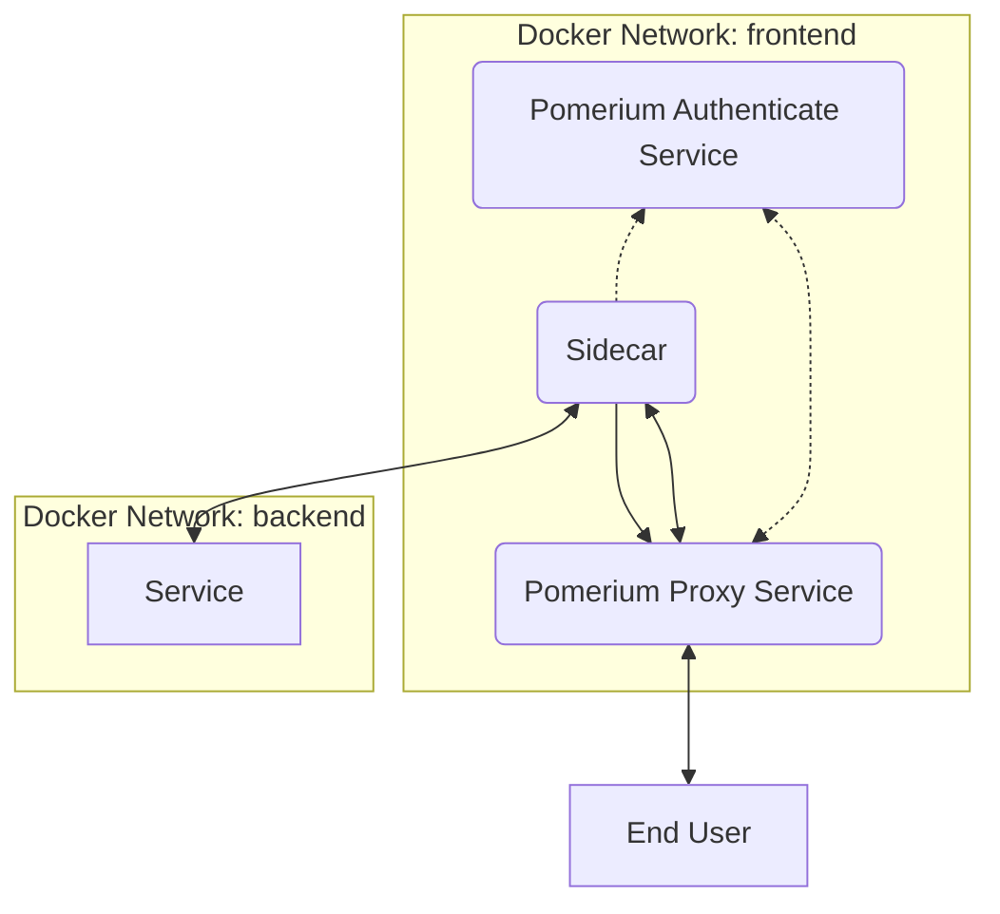
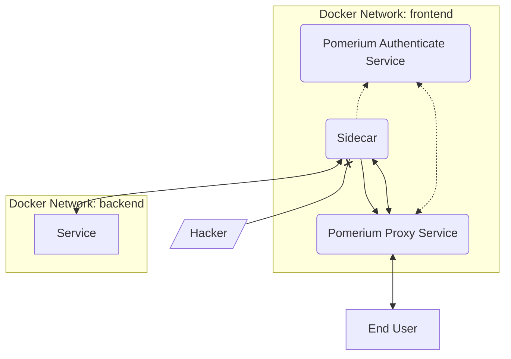

# Mutual Authentication: A Component of Zero-Trust

Pomerium provides a good layer of security out of the box, but it's not (and can't be) configured for complete [zero trust] right out of the box. This page explains several methods of achieving mutual authentication, a big part of the zero-trust model, with practical examples.

This is a long page that dives into several specific security practices that provide mutual authentication. You can use the table of contents below to narrow down to the specific tools you're interested in, or read the entire doc for a deeper understanding of how these tools work together to support strong infrastructure security.

[[toc]]

## What Is Mutual Authentication?

The concept of mutual authentication is deceptively simple. It means that both sides of a connection can validate the identity of the other. The application of this concept however, can be varied and complex. Pomerium provides the features and capability to provide mutual authentication between itself and end users, as well, as between itself and upstream services, but configuring those external endpoints can vary depending on each service's features.

## Pomerium Defaults

> - **Security**: Moderate
> - **Difficulty**: Easy
> - **Encrypted**: Yes (from the end user to Pomerium. It's up to the service to provide a TLS endpoint for Pomerium to use.)
> - **Mutual Authentication**: None

Let's look at a basic installation of Pomerium on a local network, with a single downstream service. This service contains sensitive data that we only want the right people to access.

::: tip Note
This section describes multiple services of Pomerium like Authenticate and Proxy as separate services. If you are running Pomerium in all-in-one mode, these will be a single process/container in your environment.
:::

1. When the user connects to the route `service.example.com` the traffic is received by the Pomerium Proxy service.
1. The proxy redirects to the Authenticate service to validate the user by having them sign in with the identity provider (**IdP**).
1. After authentication succeeds, the proxy verifies that the authenticated (**authn**) user is authorized (**authz**) to access the service, and begins communication with it.

This is a good start, only the users that are supposed to have access to the service get through. But this model is dependent on the security of your network perimeter. If a bad actor gains access to your local area network (**LAN**), they can now communicate with the service directly:

While your network *should* be secured to only allow traffic at specified ports and directed to specified services, this creates a single point of failure. A hacker need only bypass your firewall to get direct access to your service.

## JWT Verification: Internal Mutual Auth

> - **Security**: Strong
> - **Difficulty**: Moderate
> - **Encrypted**: Yes (from the end user to Pomerium. It's up to the service to provide a TLS endpoint for Pomerium to use.)
> - **Mutual Authentication**: Application Layer

Many, but not all, modern web applications support json web tokens (**JWTs**). These tokens are provided by Pomerium (with the [`pass_identity_headers`] key) to the downstream service so that it can independently verify that the traffic it receives is authorized.

Let's look at an example, modeled from our [Grafana] integration guide:

1. When the user connects to the route `grafana.example.com` the traffic is received by the Pomerium Proxy service.
1. The proxy redirects to the Authenticate service to validate the user by having them sign in with the identity provider (**IdP**).
1. After authentication succeeds, the proxy verifies that the authenticated user is authorized to access the service, and sends the connection to Grafana, including the `X-Pomerium-JWT-Assertion` header containing the JWT signed by the key set in the Pomerium Authenticate service.
1. The service (Grafana) reads the signing key from the Authenticate service, and uses it to validate the JWT. Finding it to match, the traffic is allowed.

Our hacker may be able to forge a basic JWT, but they can't sign it with the key secured in the Pomerium configuration, so Grafana rejects their connections:

In this way, we've applied a zero-trust security model to the application layer of our infrastructure's network model'.

## mTLS

> - **Security**: Excellent
> - **Difficulty**: Hard
> - **Encrypted**: Yes
> - **Mutual Authentication**: Protocol Layer

Most tech professionals are familiar with [Transport Layer Security] (**TLS**). The majority of traffic on the web today is sent using TLS. In addition to encrypting data using the server's TLS certificate, the server identity is validated by the certificate and the Certificate Authority (**CA**) that signed it.

1. The browser initiates a connection to `example.com` over the `http` protocol.
1. The server sends its public certificate to the browser.
1. The browser reads the certificate chain to find the CA, and checks against the computers keystore to see if the CA is one that it trusts.
1. After confirming the CA is trusted the browser reconnects to the server, this time using the `https` protocol and encrypting the traffic using the public certificate.

The process above confirms the identity of the *server*, protecting the client. Mutual TLS (**mTLS**) allows the server to confirm the identity of the *client* using a client certificate.

::: tip
The exchange diagrammed here occurs *after* the initial connection and confirmation of the server-side certificate shown above.
:::

1. After the server certificate is trusted and an `HTTPS` connection is established, the server requests a client certificate.
1. The user is prompted to use one of the certificates previously imported into thr browser. This certificate is send to the server
1. The server validates the client certificate signing authority against its trusted keystore or authorized client CA. Once authorized, the server resumes normal encrypted communication with the client.

mTLS can also be configured between Pomerium and an upstream service. This secures the service itself from bad actors in your network by only allowing communication with the Pomerium proxy.

In this way, we've applied a zero-trust security model to the protocol layer of our infrastructure's network model'.

## Mutual Authentication With a Sidecar

If your company depends on software that was not built for mutual authentication, you can still secure those services using a **Sidecar**. This is a piece of software designed to provide a new sole method of accessing a service, and provides the authentication for traffic routed to that service.

We describe the technical steps to test such a configuration using Envoy and Docker containers in our [JWT Verification] guide, but let's describe it conceptually here:

In this example, the service is only network-accessible from the `backend` network. The only other container with access to that network is `sidecar`, which performs the JWT or mTLS authentication before allowing traffic to the service.

Because the `backend` network is inaccessible to any traffic not coming from the sidecar, a bad actor has no way of accessing it:

[`pass_identity_headers`]: /reference/readme.md#pass-identity-headers
[Grafana]: /guides/grafana.md
[JWT Verification]: /guides/jwt-verification.md
[Transport Layer Security]: https://en.wikipedia.org/wiki/Transport_Layer_Security
[zero trust]: https://link-to-something.com