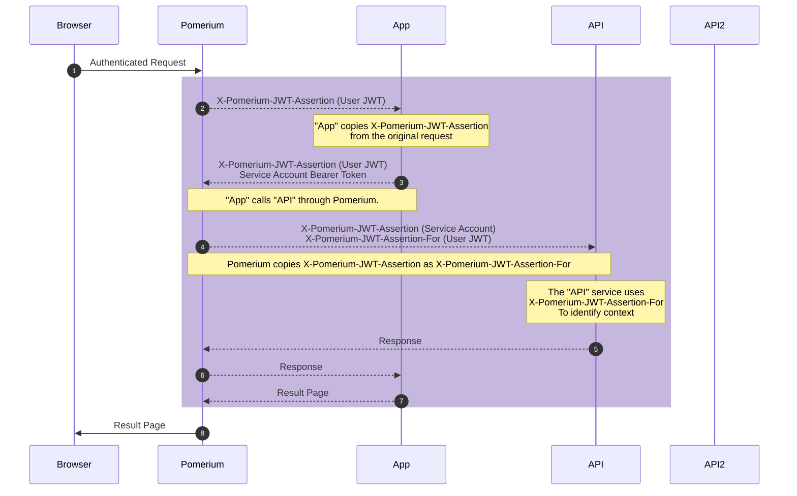
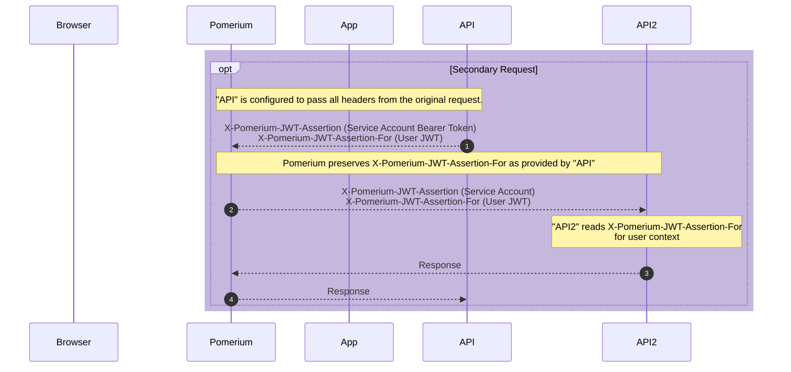

# Original User Context

::: tip
This article describes a use case available to [Pomerium Enterprise](/enterprise/about.md) customers.
:::

In enterprise environments where multiple services protected by Pomerium communicate with each other using a [service account](/enterprise/concepts.md#service-accounts), there are scenarios where the original user context must be preserved. This article describes how this is accomplished with the `X-Pomerium-Jwt-Assertion-For` header.

## Abstract

When a User communicates with a service downstream of Pomerium, the service can identify that user by the `X-Pomerium-JWT-Assertion` header, added by Pomerium, which provides as a value a JSON web token (**JWT**) identifying the user.

Should that service need to communicate with another Pomerium-protected service to construct the response, that connection should be authorized through Pomerium with a [Service Account](/enterprise/concepts.md#service-accounts). Service accounts should be provided to Pomerium from the first service as a bearer token header, i.e. `Authorization: Bearer Pomerium-${service_acount_jwt}`. This header is how the secondary service authenticates the machine-to-machine interaction.

Should that second service need to know the original user context to return the proper response, it would have no way of knowing, as the first service authenticated as the service account and not the original user.

The solution is to have the first service forward the headers, including `X-Pomerium-JWT-Assertion`, in its request to the second service. When Pomerium receives a request that already includes this header, it passes the value to the second service in the `X-Pomerium-JWT-Assertion-For` header. This header can be read by the secondary service to identify the user context.

Should the second service need to communicate with a tertiary service (or more), it can also pass along the original headers it received. When Pomerium receives a request with the `X-Pomerium-JWT-Assertion-For` header, it preserves the value as provided to all additional upstream services.

## Example

Let's look at two example routes, App and API:

```yaml
routes:
  - name: App
    from: https://app.localhost.pomerium.io
    to: https://appserver.local
    pass_identity_headers: true
    policy:
      - allow:
          or:
            - domain:
                is: companydomain.com
  - name: API
    from: https://api.localhost.pomerium.io
    to: https://apiserver.local
    pass_identity_headers: true
    policy:
      - allow:
          or:
            - user:
                is: api-access
```

- **App** is a user-facing application. Users connect to it through Pomerium.
- **API** is also accessed through it's Pomerium Route, but is only accessible by the **App**, using a [service account](/enterprise/reference/configure.md#service-accounts) to authenticate.
- The **API** service needs to know the user making the request to **App** in order to formulate the correct response.

Both Routes include [`pass_identity_headers`](/reference/readme.md#pass-identity-headers), which provides (at minimum) the `X-Pomerium-Jwt-Assertion` header to the downstream application.

When a user makes a request that requires data from the API service, the following happens:



1. The user first authenticates with Pomerium.

1. As the traffic is passed to **App**, Pomerium adds the `X-Pomerium-Jwt-Assertion` header with the JWT for the user as a value.

1. The **App** software has been configured by the software developer to send a request to **API**, using a bearer token to authenticate as the service account, with the original `X-Pomerium-Jwt-Assertion` header forwarded as well.

1. Pomerium, seeing that the incoming request already includes `X-Pomerium-JTW-Assertion` copies the value  to `X-Pomerium-Jwt-Assertion-For` and includes it in the request to **API**. `X-Pomerium-Jwt-Assertion` now contains the service account bearer token

1. Now the **API** can service can read `X-Pomerium-Jwt-Assertion-For` as needed to determine the proper response to send to **App** (through Pomerium), which can then construct the results page for the user.


### Secondary Requests

Suppose the **API** service needed to connect to another machine interface (which we'll call **API2**) for additional information, and this call also needs the original user context.

If **API** is configured to pass along the `X-Pomerium-JWT-Assertion-For` header, Pomerium will recognize and preserve this. All subsequent connections with this header forwarded will perpetuate the original user context.


