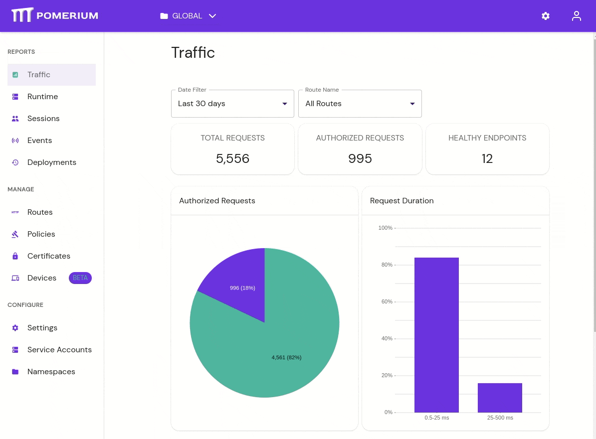
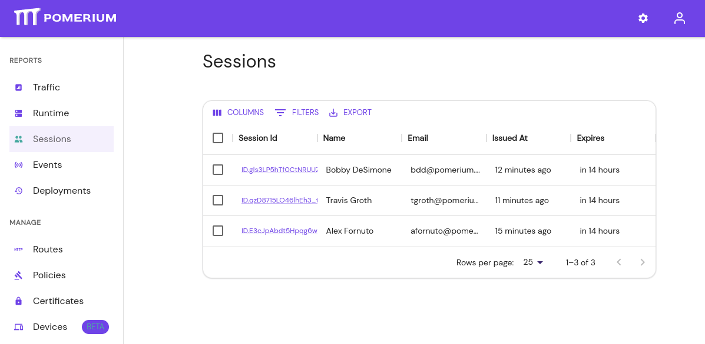

# Pomerium Enterprise

<!-- This paragraph introduces what Pomerium Enterprise is. -->

## Features

In addition to the capabilities provided by open-source Pomerium, Pomerium Enterprise provides:

### Management GUI

The Pomerium Enterprise Console lets you view traffic and logs, define routes and policies, and organize your service access all from an intuitive web interface.

### Programmatic API

<!-- @Travis please add details. -->

### Session management

Quickly view who is logged in your infrastructure, with easy access to revoke sessions.

### Self-Service, and Access Controls

Easily define who can control access to what areas of your infrastructure. Our [Namespaces](/enterprise/concepts.md#namespaces) make it easy to allow teams to self-manage access to the infrastructure they build from or depend on.

[User roles](/enterprise/concepts.md#rbac-for-enterprise-console-users) are granted along Namespace hierarchy, with in inheritance from parents.

Pomerium Enterprise uses teams and groups defined by your IdP, so you can build stable policies that don't need to be adjusted as your company changes.

See [Concepts: Self-Service Capabilities](./concepts.md#self-service-capabilities) for more information.

### Deployment History & Audit Logs

View and export change and access logs from the web UI. Pomerium Enterprise Console gives you a complete view of who's using it and how access is adjusted.

<!-- This is a start, but a weak one. -->

## Sign up

Review our [Pricing](https://www.pomerium.com/pricing/) page, or [Contact Sales](https://www.pomerium.com/contact-sales/) When you're ready to get started.