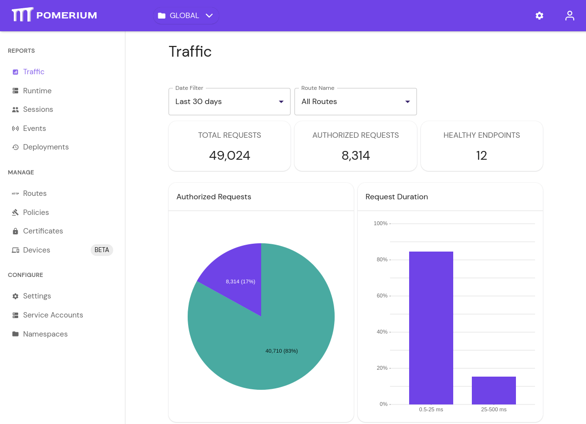

# Prometheus Metrics

The Pomerium Enterprise Console uses Prometheus as a metrics collection back-end. You can configure Pomerium and the Console to talk to an existing Prometheus server, or configure the embedded Prometheus backend.

## Prepare Pomerium

1. In the Pomerium `config.yaml`, define the `metrics_address` key to a network interface and/or port. For example:

   ```yaml
   metrics_address: 0.0.0.0:9999
   ```

   The example above has Pomerium providing metrics at port `9999` on all network interfaces.

## External Prometheus

1. Add the listener to your Prometheus configuration, usually via `prometheus.yml`:

   ```yaml
   - job_name: 'Pomerium'
      scrape_interval: 30s
      scrape_timeout: 5s
      static_configs:
         - targets: ['192.0.2.10:9999']

   ```

1. [Reload](https://prometheus.io/docs/prometheus/latest/configuration/configuration/#configuration) the Prometheus configuration:

   ```bash
   curl -i -XPOST path.to.prometheus:port/-/reload
   ```

1. In the Pomerium Enterprise Console `config.yaml` file, define the `prometheus_url` key to point to your Prometheus instance(s):

   ```yaml
   prometheus_url: http://192.168.122.50:9090
   ```

1. Restart the Pomerium and Pomerium Enterprise Console services. You should now see route traffic data in the Enterprise Console:

   

## Embedded Prometheus

To take advantage of Prometheus embedded in Pomerium Enterprise Console, edit `/etc/pomerium-console/config.yaml`:

```yaml
prometheus_data_dir: /var/lib/pomerium-console/tsdb
```

The directory path can be any location that the `pomerium` system user can write to. The example above matches the location used by the [OS packages](/enterprise/install/quickstart).