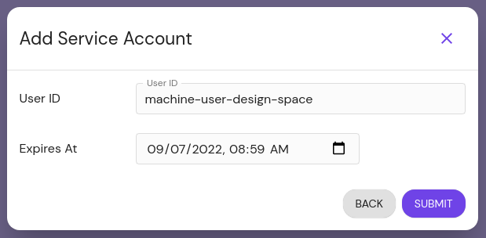
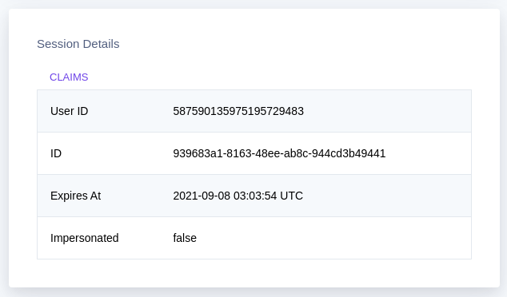
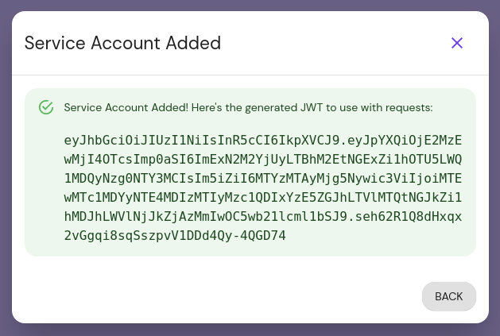
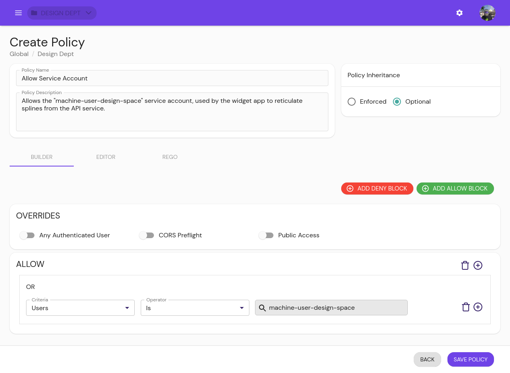

# Configure

## Settings


### Global


#### Debug

::: danger

Enabling the debug flag could result in sensitive information being logged!!!

:::

By default, JSON encoded logs are produced. Debug enables colored, human-readable logs to be streamed to [standard out](https://en.wikipedia.org/wiki/Standard_streams#Standard_output_(stdout)>>>). In production, it is recommended to be set to `false`.

For example, if `true`

```
10:37AM INF cmd/pomerium version=v0.0.1-dirty+ede4124
10:37AM INF proxy: new route from=verify.localhost.pomerium.io to=https://verify.pomerium.com
10:37AM INF proxy: new route from=ssl.localhost.pomerium.io to=http://neverssl.com
10:37AM INF proxy/authenticator: grpc connection OverrideCertificateName= addr=auth.localhost.pomerium.io:443
```

If `false`

```
{"level":"info","version":"v0.0.1-dirty+ede4124","time":"2019-02-18T10:41:03-08:00","message":"cmd/pomerium"}
{"level":"info","from":"verify.localhost.pomerium.io","to":"https://verify.pomerium.com","time":"2019-02-18T10:41:03-08:00","message":"proxy: new route"}
{"level":"info","from":"ssl.localhost.pomerium.io","to":"http://neverssl.com","time":"2019-02-18T10:41:03-08:00","message":"proxy: new route"}
{"level":"info","OverrideCertificateName":"","addr":"auth.localhost.pomerium.io:443","time":"2019-02-18T10:41:03-08:00","message":"proxy/authenticator: grpc connection"}
```

#### HTTP Redirect Address

If set, the HTTP Redirect Address specifies the host and port to redirect http to https traffic on. If unset, no redirect server is started.

#### DNS Lookup Family

The DNS IP address resolution policy. If not specified, the value defaults to `AUTO`.

#### Log Level

Log level sets the global logging level for pomerium. Only logs of the desired level and above will be logged.

#### Proxy Log Level

Proxy log level sets the logging level for the Pomerium Proxy service access logs. Only logs of the desired level and above will be logged.

### Cookies


#### HTTPS Only

If true, instructs browsers to only send user session cookies over HTTPS.

:::warning

Setting this to false may result in session cookies being sent in cleartext.

:::

#### Javascript Security

If true, prevents javascript in browsers from reading user session cookies.

:::warning

Setting this to false enables hostile javascript to steal session cookies and impersonate users.

:::

#### Expires

Sets the lifetime of session cookies. After this interval, users must reauthenticate.

### Timeouts

Timeouts set the global server timeouts. Timeouts can also be set for individual routes.

### GRPC


#### GRPC Server Max Connection Age

Set max connection age for GRPC servers. After this interval, servers ask clients to reconnect and perform any rediscovery for new/updated endpoints from DNS.

See https://godoc.org/google.golang.org/grpc/keepalive#ServerParameters for details


#### GRPC Server Max Connection Age Grace

Additive period with grpc_server_max_connection_age, after which servers will force connections to close.

See https://godoc.org/google.golang.org/grpc/keepalive#ServerParameters (opens new window)for details


### Tracing

Tracing tracks the progression of a single user request as it is handled by Pomerium.

Each unit of work is called a Span in a trace. Spans include metadata about the work, including the time spent in the step (latency), status, time events, attributes, links. You can use tracing to debug errors and latency issues in your applications, including in downstream connections.


#### Tracing Sample Rate

Percentage of requests to sample. Default is .01%.

Unlike the decimal value notion used for the `tracing_sample_rate` [key](/reference/readme.md#shared-tracing-settings) in open-source Pomerium, this value is a percentage, e.g. a value of `1` equates to 1%


### Authenticate


### Proxy


#### Certificate Authority

Certificate Authority is set when behind-the-ingress service communication uses custom or self-signed certificates.

:::warning

Be sure to include the intermediary certificate.

:::

#### Default Upstream Timeout

Default Upstream Timeout is the default timeout applied to a proxied route when no `timeout` key is specified by the policy.

#### JWT Claim Headers

The JWT Claim Headers setting allows you to pass specific user session data down to upstream applications as HTTP request headers. Note, unlike the header `x-pomerium-jwt-assertion` these values are not signed by the authorization service.

Any claim in the pomerium session JWT can be placed into a corresponding header for upstream consumption. This claim information is sourced from your Identity Provider (IdP) and Pomerium's own session metadata. The header will have the following format:

`X-Pomerium-Claim-{Name}` where `{Name}` is the name of the claim requested.

This option also supports a nested object to customize the header name. For example:

```yaml
jwt_claims_headers:
  X-Email: email
```

Will add an `X-Email` header with a value of the `email` claim.

Use this option if you previously relied on `x-pomerium-authenticated-user-{email|user-id|groups}`.

#### X-Forward-For HTTP Header

Do not append proxy IP address to `x-forwarded-for` HTTP header. See [Envoy](https://www.envoyproxy.io/docs/envoy/latest/configuration/http/http_conn_man/headers.html?highlight=skip_xff_append#x-forwarded-for) docs for more detail.

#### Response Headers

Set Response Headers allows you to set static values for the given response headers. These headers will take precedence over the global `set_response_headers`.

## Service Accounts

[Service accounts](/enterprise/concepts.md#service-accounts) offer a protected and standardized method of authenticating machine-to-machine communication between services protected by Pomerium.

::: tip
Before you begin, confirm you are in the correct Namespace. A service account can only be used in the Namespace it was created in, including its children Namespaces.
:::

1. From the main menu, select **Service Accounts** under **CONFIGURE**. Click the **+ ADD SERVICE ACCOUNT** button:

   

1. Service accounts can be unique and exist only for Pomerium, or impersonate directory users from your IdP.

   ::::: tabs
   :::: tab Unique
   Give the user a unique ID. Consider referencing the Namespace you're creating it under, for easier reference later. Optionally set an expiration date:

   

   The user ID set here corresponds to the `User` criteria when editing a policy.
   ::::
   :::: tab Impersonated
   You can find your User ID by going to the special endpoint `/.pomerium`, or selecting **Logout** under your user in the upper right hand corner (this will not immediately log you out):

   

   Copy the User ID and paste it into the **User ID** field in the **Add Service Account** modal. The lookahead search should show you the user name You can also optionally set an expiration date:

   
   ::::
   :::::

1. After you click **Submit**, the modal presents the Json Web Token (**JWT**) for the service account. Temporarily save it somewhere secure, as you will not be able to view it again:

   

   This JWT must be added to your application configuration to enable direct communication.

1. Edit or create policies to give the service account access to the internal service:

   


## Namespaces

A [Namespace][namespace-concept] is a collection of users, groups, routes, and policies that allows system administrators to organize, manage, and delegate permissions across their infrastructure.

- Policies can be optional or enforced on a Namespace.
   - Enforced policies are also enforced on child Namespaces, and optional policies are available to them as well.
- Users or groups can be granted permission to edit access to routes within a Namespace, allowing them self-serve access to the routes critical to their work.

::: tip
When using an IdP without directory sync or when working with non-domain users, they will not show up in the look-ahead search. See [Non-Domain Users](/enterprise/concepts.md#non-domain-users) for more information.
:::


[route-concept]: /enterprise/concepts.md#routes
[route-reference]: /enterprise/reference/manage.md#routes
[namespace-concept]: /enterprise/concepts.md#namespaces
[namespace-reference]: /enterprise/reference/configure.md#namespaces
[service-accounts-concept]: /enterprise/concepts.md#service-accounts
[policy-reference]: /enterprise/reference/manage.md#policies-2
