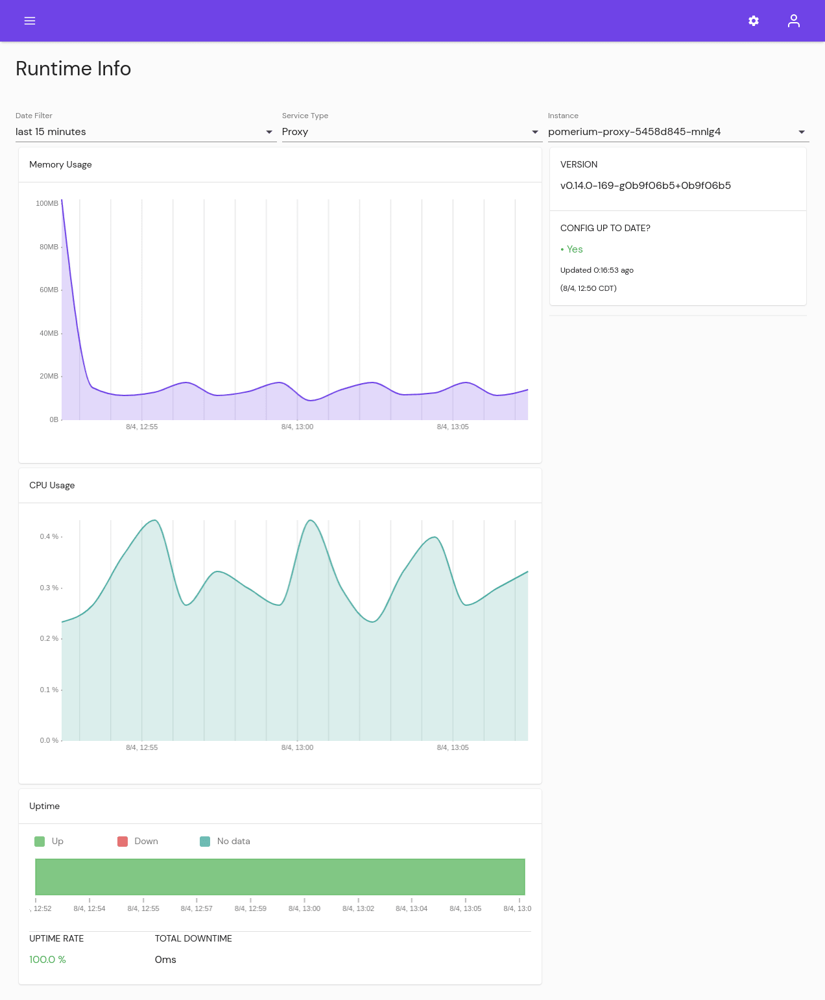

# Reports

## Traffic

View the traffic running through Pomerium. Filter by [Route][route-concept] name, or date range.

## Runtime

Monitor how much system resources Pomerium is consuming. Filter by date range, service, and instance.

## Sessions

View active Sessions. From here you can revoke sessions, filter by session or user information, or revoke one or multiple sessions. You can also export the data.

## Events

The events page displays the log output of Envoy as it process changes from Pomerium and applies updates to the underlying services.

The most common updates are to Pomerium Proxy services, which are updated every time a Route or Policy is created or updated.

The value under **Resource ID** will usually match the resource ID of a [Policy][policy-reference], visible in the Policy under **Change History** or in the URL. A value of "Component reloaded" refers to when services are reloaded, usually due to a system update.

## Deployments

From the **Deployment History** page administrators can review changes made to their Pomerium configuration.

The default view shows all changes made through the Pomerium Enterprise Console. Use the **COMPARE** button next to an entry to filter to only changes that affected that resource. Select two versions of that resource, then **DIFF** to see what changed:

[route-concept]: /enterprise/concepts.md#routes
[route-reference]: /enterprise/reference/manage.md#routes
[namespace-concept]: /enterprise/concepts.md#namespaces
[namespace-reference]: /enterprise/reference/configure.md#namespaces
[service-accounts-concept]: /enterprise/concepts.md#service-accounts
[policy-reference]: /enterprise/reference/manage.md#policies-2
