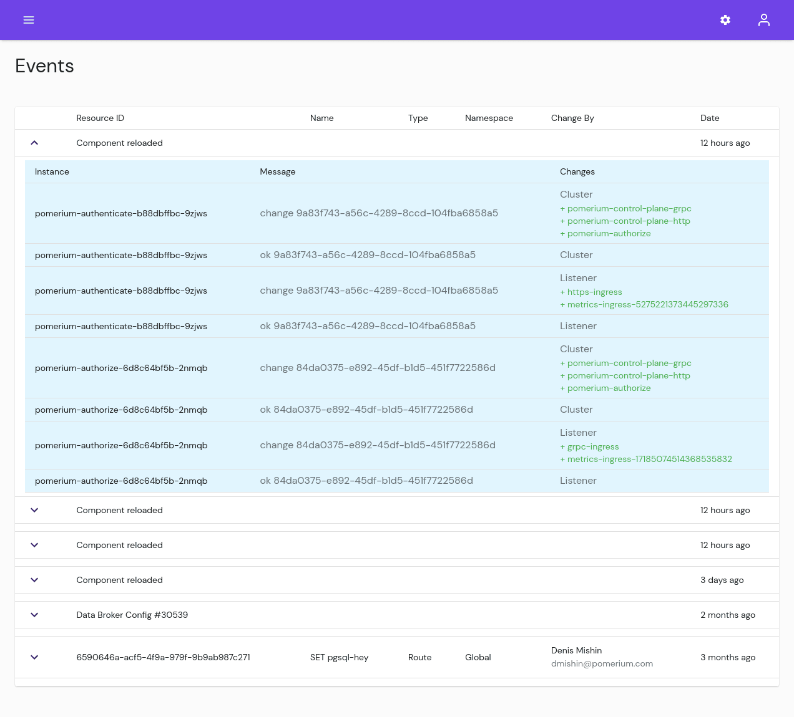

# Reports

## Traffic

View the traffic running through Pomerium. Filter by [Route][route-concept] name, or date range.

## Runtime

Monitor how much system resources Pomerium is consuming. Filter by date range, service, and instance.

## Sessions

View active Sessions. From here you can revoke sessions, filter by session or user information, or revoke one or multiple sessions. You can also export the data.

## Events

## Deployments

[route-concept]: /enterprise/concepts.md#routes
[route-reference]: /enterprise/reference/manage.md#routes
[namespace-concept]: /enterprise/concepts.md#namespaces
[namespace-reference]: /enterprise/reference/configure.md#namespaces
[service-accounts-concept]: /enterprise/concepts.md#service-accounts
