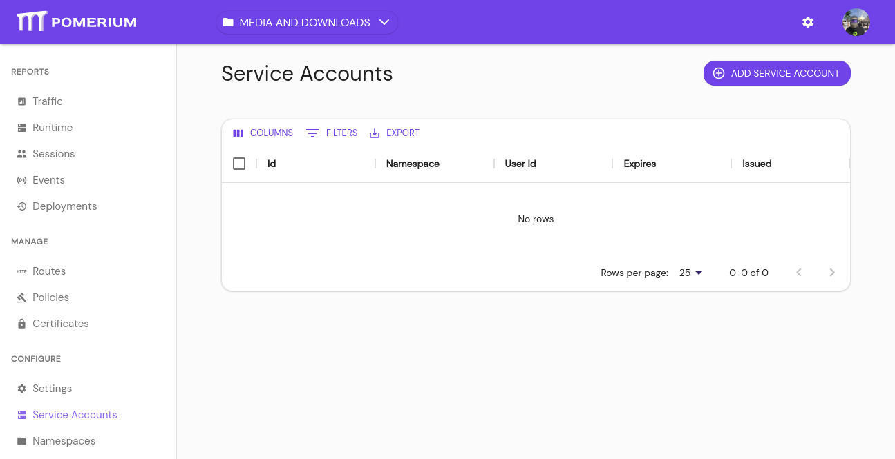
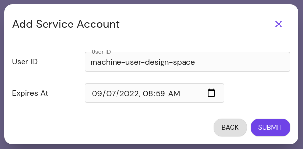
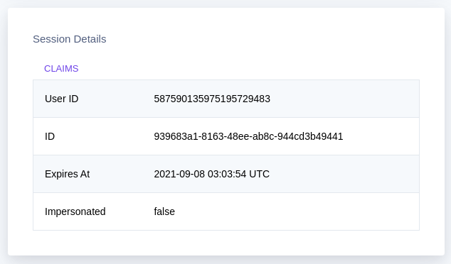
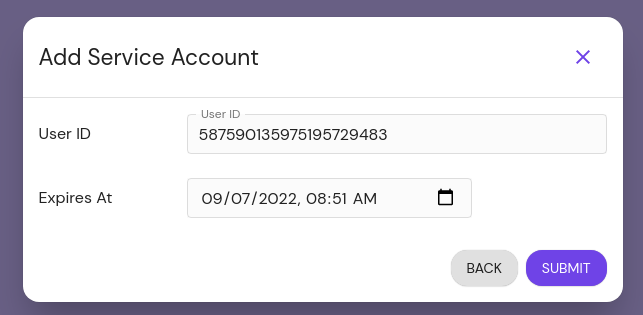
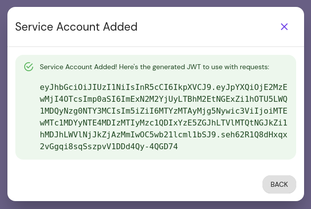
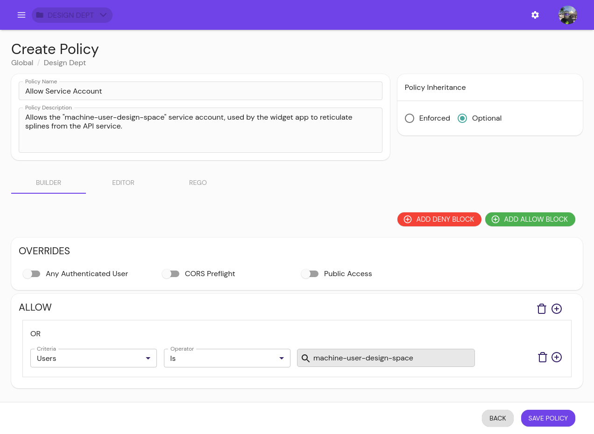

# Service Accounts

Service accounts offer a protected and standardized method of authenticating machine-to-machine communication between services protected by Pomerium.

## Create a Service Account

::: tip
Before you begin, confirm you are in the correct Namespace. A service account can only be used in the Namespace it was created in, including its children Namespaces.
:::

1. From the main menu, select **Service Accounts** under **CONFIGURE**. Click the **+ ADD SERVICE ACCOUNT** button:

   

1. Service accounts can be unique and exist only for Pomerium, or impersonate directory users from your IdP.

   ::::: tabs
   :::: tab Unique
   Give the user a unique ID. Consider referencing the Namespace you're creating it under, for easier reference later. Optionally set an expiration date:

   

   The user ID set here corresponds to the `User` criteria when editing a policy.
   ::::
   :::: tab Impersonated
   You can find your User ID by going to the special endpoint `/.pomerium`, or selecting **Logout** under your user in the upper right hand corner (this will not immediately log you out):

      

   Copy the User ID and paste it into the **User ID** field in the **Add Service Account** modal. The lookahead search should show you the user name You can also optionally set an expiration date:

      
   ::::
   :::::

1. After you click **Submit**, the modal presents the Java Web Token (**JWT**) for the service account. Temporarily save it somewhere secure, as you will not be able to view it again:

   

   This JWT must be added to your application configuration to enable direct communication.

1. Edit or create policies to give the service account access to the internal service:

   