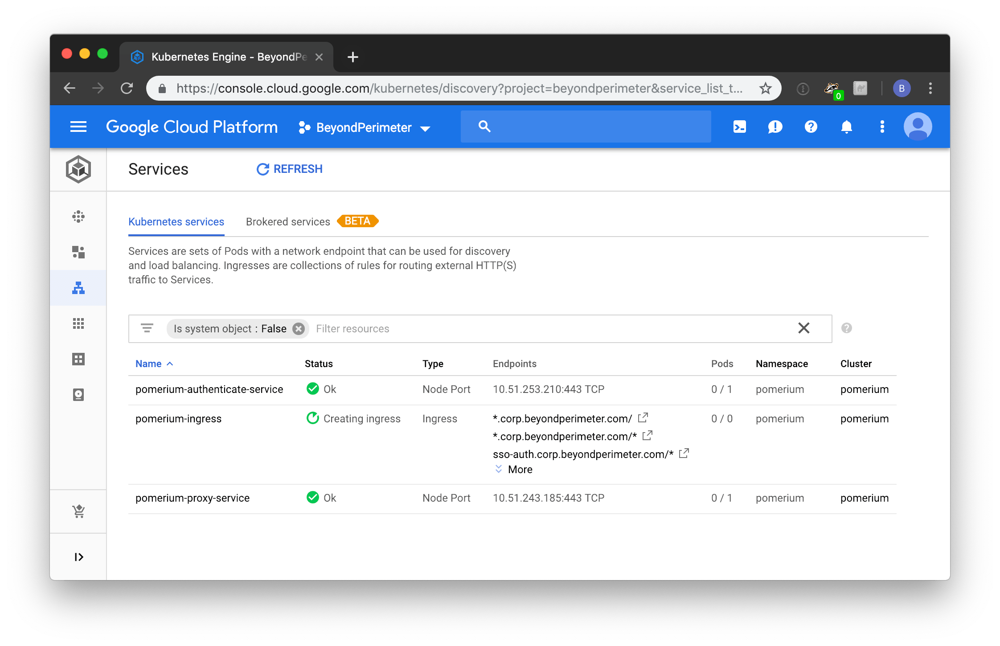

# Helm

This quickstart will show you how to deploy Pomerium with Kubernetes. Though there are [countless ways](https://kubernetes.io/docs/setup/pick-right-solution/) to work with Kubernetes, for the purpose of this guide, we will be using Google's [Kubernetes Engine](https://cloud.google.com/kubernetes-engine/). That said, most of the following steps should be very similar using any other provider with the biggest difference being in the configuration of your ingress. 


## Prerequisites

- A [Google Cloud Account](https://console.cloud.google.com/)
- A configured [identity provider]
- Install [kubectl](https://kubernetes.io/docs/tasks/tools/install-kubectl/)
- Install the [Google Cloud SDK](https://cloud.google.com/kubernetes-engine/docs/quickstart)
- Install [helm](https://helm.sh/docs/using_helm/)
- A [wild-card TLS certificate](../docs/certificates.md)

## Download

Retrieve the latest copy of pomerium's source-code by cloning the repository.

```bash
git clone https://github.com/pomerium/pomerium.git $HOME/pomerium
```

## Configure

Edit the the install command in the [helm_gke.sh script ][./scripts/helm_gke.sh] to match your [identity provider] and access policy settings.


Generate a wild-card TLS certificate. If you don't have one handy, the included [script] generates one from [LetsEncrypt].

## Run

Run [./scripts/helm_gke.sh] which will:

1. Provision a new cluster
2. Create authenticate, authorize, and proxy [deployments](https://cloud.google.com/kubernetes-engine/docs/concepts/deployment).
3. Provision and apply authenticate, authorize, and proxy [services](https://cloud.google.com/kubernetes-engine/docs/concepts/service).
4. Configure an ingress, Google's default load balancer.

```bash
sh ./scripts/helm_gke.sh
```

You should see roughly the following in your terminal. Note, provisioning does take a few minutes.

[]([https://asciinema.org/a/223821](https://asciinema.org/a/YcYC4iZLZi5kCCU5lQIWzFnhV)

And if you check out Google's Kubernetes Engine dashboard you'll see something like:



## Navigate

Open a browser and navigate to `httpbin.corp.example.com`.

You should see something like the following in your browser.


[./scripts/helm_gke.sh]: ../docs/examples.html#google-kubernetes-engine
[example kubernetes files]: ../docs/examples.html#google-kubernetes-engine
[helloworld]: https://hub.docker.com/r/tutum/hello-world
[httpbin]: https://httpbin.org/
[identity provider]: ../docs/identity-providers.md
[letsencrypt]: https://letsencrypt.org/
[script]: https://github.com/pomerium/pomerium/blob/master/scripts/generate_wildcard_cert.sh
