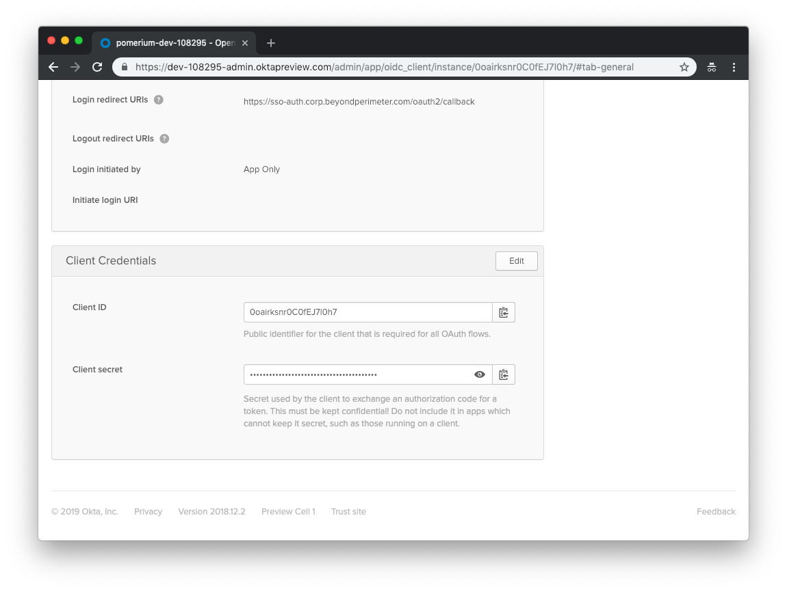

# Identity Provider Configuration

This article describes how to configure pomerium to use a third-party identity service for single-sign-on.

There are a few configuration steps required for identity provider integration. Most providers support [OpenID Connect] which provides a standardized interface for authentication. In this guide we'll cover how to do the following for each identity provider:

1. Establish a **Redirect URL** with the identity provider which is called after authentication.
1. Generate a **Client ID** and **Client Secret**.
1. Configure pomerium to use the **Client ID** and **Client Secret** keys.

## Google

Log in to your Google account and go to the [APIs & services](https://console.developers.google.com/projectselector/apis/credentials). Navigate to **Credentials** using the left-hand menu.


On the **Credentials** page, click **Create credentials** and choose **OAuth Client ID**.


On the **Create Client ID** page, select **Web application**. In the new fields that display, set the following parameters:

| Field                    | Description                               |
| ------------------------ | ----------------------------------------- |
| Name                     | The name of your web app                  |
| Authorized redirect URIs | `https://${redirect-url}/oauth2/callback` |


Click **Create** to proceed.

Your `Client ID` and `Client Secret` will be displayed:


Set `Client ID` and `Client Secret` in Pomerium's settings. Your [environmental variables] should look something like this.

```bash
export REDIRECT_URL="https://sso-auth.corp.beyondperimeter.com/oauth2/callback"
export IDP_PROVIDER="google"
export IDP_PROVIDER_URL="https://accounts.google.com"
export IDP_CLIENT_ID="yyyy.apps.googleusercontent.com"
export IDP_CLIENT_SECRET="xxxxxx"
```

## Okta

[Log in to your Okta account](https://login.okta.com) and head to your Okta dashboard. Select **Applications** on the top menu. On the Applications page, click the **Add Application** button to create a new app.


On the **Create New Application** page, select the **Web** for your application.


Next, provide the following information for your application settings:

| Field                        | Description                                           |
| ---------------------------- | ----------------------------------------------------- |
| Name                         | The name of your application.                         |
| Base URIs (optional)         | The domain(s) of your application.                    |
| Login redirect URIs          | `https://${redirect-url}/oauth2/callback`.            |
| Group assignments (optional) | The user groups that can sign in to this application. |
| Grant type allowed           | **You must enable Refresh Token.**                    |


Click **Done** to proceed. You'll be taken to the **General** page of your app.

Go to the **General** page of your app and scroll down to the **Client Credentials** section. This section contains the **Client ID** and **Client Secret** to be used in the next step.


At this point, you will configure the integration from the Pomerium side. Your [environmental variables] should look something like this.

```bash
export REDIRECT_URL="https://sso-auth.corp.beyondperimeter.com/oauth2/callback"
export IDP_PROVIDER="okta"
export IDP_PROVIDER_URL="https://dev-108295-admin.oktapreview.com/"
export IDP_CLIENT_ID="0oairksnr0C0fEJ7l0h7"
export IDP_CLIENT_SECRET="xxxxxx"
```

## Azure

If you plan on allowing users to log in using a Microsoft Azure Active Directory account, either from your company or from external directories, you must register your application through the Microsoft Azure portal. If you don't have a Microsoft Azure account, you can [signup](https://azure.microsoft.com/en-us/free) for free.

You can access the Azure management portal from your Microsoft service, or visit [https://portal.azure.com](https://portal.azure.com) and sign in to Azure using the global administrator account used to create the Office 365 organization.

::: tip
There is no way to create an application that integrates with Microsoft Azure AD without having **your own** Microsoft Azure AD instance.
:::

If you have an Office 365 account, you can use the account's Azure AD instance instead of creating a new one. To find your Office 365 account's Azure AD instance:

1. [Sign in](https://portal.office.com) to Office 365.
2. Navigate to the [Office 365 Admin Center](https://portal.office.com/adminportal/home#/homepage).
3. Open the **Admin centers** menu drawer located in the left menu.
4. Click on **Azure AD**.

This will bring you to the admin center of the Azure AD instance backing your Office 365 account.

### Create a new application

Login to Microsoft Azure and choose **Azure Active Directory** from the sidebar.


Then under **MANAGE**, select **App registrations**.


Then click on the **+ ADD** button to add a new application.

Enter a name for the application, select **Web app/API** as the **Application Type**, and for **Sign-on URL** enter your application URL.


Next you will need to create a key which will be used as the **Client Secret** in Pomeriunm's configuration settings. Click on **Keys** from the **Settings** menu.

Enter a name for the key and choose the desired duration.

::: tip
If you choose an expiring key, make sure to record the expiration date in your calendar, as you will need to renew the key (get a new one) before that day in order to ensure users don't experience a service interruption.
:::

Click on **Save** and the key will be displayed. **Make sure to copy the value of this key before leaving this screen**, otherwise you may need to create a new key. This value is used as the **Client Secret**.


Next you need to ensure that the Pomerium's Redirect URL is listed in allowed reply URLs for the created application. Navigate to **Azure Active Directory** -> **Apps registrations** and select your app. Then click **Settings** -> **Reply URLs** and add Pomerium's redirect URL. For example,
`https://sso-auth.corp.beyondperimeter.com/oauth2/callback`.


The final, and most unique step to Azure AD provider, is to take note of your specific endpoint. Navigate to **Azure Active Directory** -> **Apps registrations** and select your app.

Click on **Endpoints**


The **OpenID Connect Metadata Document** value will form the basis for Pomerium's **Provider URL** setting. For example, if your **Azure OpenID Connect** is `https://login.microsoftonline.com/0303f438-3c5c-4190-9854-08d3eb31bd9f/v2.0/.well-known/openid-configuration` your **Pomerium Identity Provider URL** would be `https://login.microsoftonline.com/0303f438-3c5c-4190-9854-08d3eb31bd9f/v2.0`.

### Configure Pomerium

At this point, you will configure the integration from the Pomerium side. Your [environmental variables] should look something like:

```bash
# Azure
export REDIRECT_URL="https://sso-auth.corp.beyondperimeter.com/oauth2/callback"
export IDP_PROVIDER="azure"
export IDP_PROVIDER_URL="https://login.microsoftonline.com/{REPLACE-ME-SEE-ABOVE}/v2.0"
export IDP_CLIENT_ID="REPLACE-ME"
export IDP_CLIENT_SECRET="REPLACE-ME"

```

[environmental variables]: https://en.wikipedia.org/wiki/Environment_variable
[oauth2]: https://oauth.net/2/
[openid connect]: https://en.wikipedia.org/wiki/OpenID_Connect
