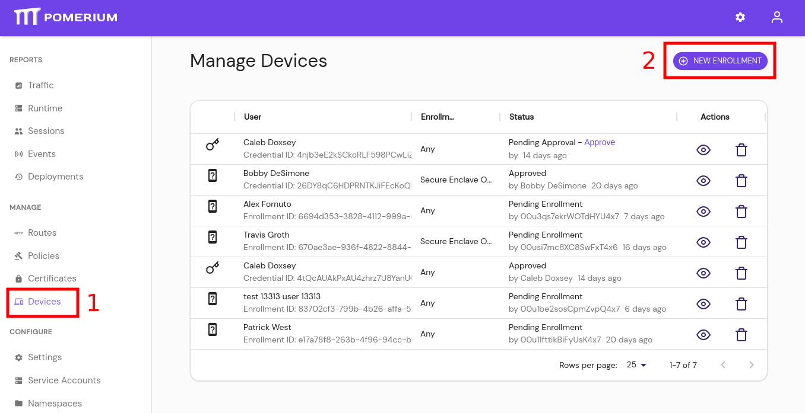
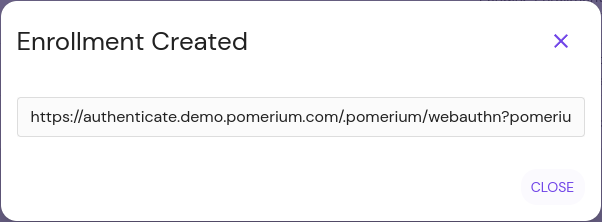

# Pre-Approved Device Enrollment

If a Pomerium route is configured to [require device authentication](/docs/topics/ppl.md#device-matcher), then the user must register a [trusted execution environment](/docs/topics/device-identity.md#authenticated-device-types) (**TEE**) device before accessing the route. In Enterprise environments, policies can require that devices be approved in the Pomerium Enterprise Console.

To make the management of approved devices easier, the Enterprise Console lets administrators create registration links that will allow users to register devices as pre-approved, following the [**TOFU**](https://en.wikipedia.org/wiki/Trust_on_first_use) authentication scheme.

This guide instructs Pomerium Enterprise admins on how to create user-specific enrollment links.

## Before You Begin

- This guide is written for [Pomerium Enterprise](/enterprise/about.md) environments,
- You must have the [Admin](/enterprise/concepts.md#admin) role in the Enterprise Console to perform these steps.

## Create an Enrollment Link

1. From the Pomerium Enterprise Console, select **Devices** from the left-hand menu.

1. Click the **+ NEW ENROLLMENT** button at the top:

   

1. From the **New Enrollment** modal:

    - search for and select the user this URL will be valid for,
    - optionally provide a URL for the user to be redirected to after a successful enrollment,
    - define if the user can enroll any [trusted execution environment](/docs/glossary.md#trusted-execution-environment), or restrict the user to [secure envlaves](/docs/glossary.md#secure-enclave):
    

1. Click **Submit** to get the URL:

    

    Provide the URL to the user.