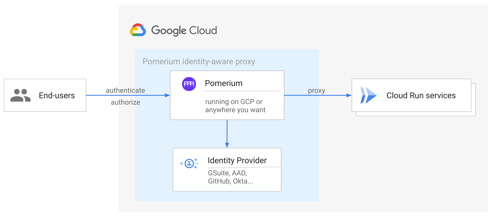
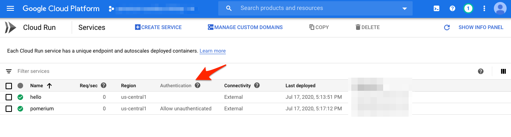

# Securing Cloud Run endpoints

This recipe's sources can be found [on github](https://github.com/pomerium/pomerium/tree/master/examples/cloudrun)

## Background

Services on [Cloud Run](https://cloud.google.com/run) and other Google Cloud serverless products can be restricted to only permit access with a properly signed [bearer token](https://cloud.google.com/run/docs/authenticating/service-to-service). This allows requests from other services running in GCP or elsewhere to be securely authorized despite the endpoints being public.

These bearer tokens are not easily set in a browser session and must be refreshed on a regular basis, preventing them from being useful for end user authorization. Pomerium, however, can generate compatible tokens on behalf of end users and proxy the request to these services.

## How it works



- Add an IAM policy delegating `roles/run.invoker` permissions to a service account
- Run Pomerium with access to a key for the corresponding service account, this can be in any compute infrastructure which provides workload identity, including Cloud Run.
- Publish DNS records for each protected application pointing to Pomerium
- Configure Pomerium with appropriate policy and `enable_google_cloud_serverless_authentication`

The protected application delegates trust to a GCP service account which Pomerium runs as, and Pomerium performs user based authorization on a per route basis. This turns Pomerium into a bridge between a user-centric and service-centric authorization models.

In this guide - we deploy Pomerium to Cloud Run with a single route and target. Because Cloud Run scales to zero and is serverless, it is possible to deploy multiple pomerium instances in a 1:1 configuration with targets. At the end of this guide, we review how to route to multiple proxied services based on path or domain name.
## Pre-requisites

This guide assumes you have Editor access to a Google Cloud project which can be used for isolated testing, and a DNS zone which you are also able to control. DNS configuration is optional and does not need to be inside Google Cloud for the example to work.

Using Google as an example IdP, you should first create an [OAuth Client-id](../docs/identity-providers/google.html) (You don't need to worry for now about the service account for group access). Note the client-id and client-secret values.
### Config

We will use a config.yaml template to contain your IdP credentials and secrets (config.yaml) as well as routing policy:

<<< @/examples/cloudrun/config.template.yaml


Set the client credentials from the previously created Oauth client as environment variables:

```shell
export OAUTH_CLIENT_ID=[client-id]
export OAUTH_CLIENT_SECRET=[client-secret]
```

Ensure you have set a default project:

```shell
glcoud config set default-project MYTESTPROJECT
```
## Deploy

Execute the deploy script:

```shell
bash deploy.sh
```

<<< @/examples/cloudrun/deploy.sh

You will now need to authorize the pomerium service as a valid auth callback for your Oauth app. 

Enter the callback URL output by the deploy script as an "Authorized redirect URI" in the OAuth [credential](https://console.cloud.google.com/apis/credentials
) you created.

## Results

### Overview

We should see two applications deployed. The `hello` app is our protected app, and pomerium is...Pomerium!



Notice that Pomerium allows unauthenticated access, but `hello` does not.

You will use each services automatically created URL available on the detail page for each service.

### Direct Access

Let's verify we cannot access the main application directly by visiting the `hello` service directly. (the URL is in the form of https://hello-xxyyzz-uc.a.run.app)


You should see a 403 error because you do not have the proper credentials.

### Authenticated Access

Now let's access via the pomerium service.

We should get an auth flow through your IdP:


And a hello page:


## Extending to other scenarios

### Using DNS and hostnames

Using custom domains either Cloud Run [mapped domains](https://cloud.google.com/run/docs/mapping-custom-domains) or through [GCLB](https://cloud.google.com/load-balancing/docs/https/setting-up-https-serverless) a single instance of Pomerium can use the hostname to route to different target Cloud Run services. You would route the multiple custom domains all to Pomerium, and then use in the [from](../reference/#from) portion of a policy route.

### Using path based routes
If you are routing to pages that can support path re-writes (requires no use of absolute paths), you can also use path based routing to use a single domain for the Pomerium proxy, with multiple secured applications.
### Non-GCP Applications

If your target application is not running on GCP, you can also perform your own header validation.

See [getting user's identity](../docs/topics/getting-users-identity.md) for more details on using this header.
