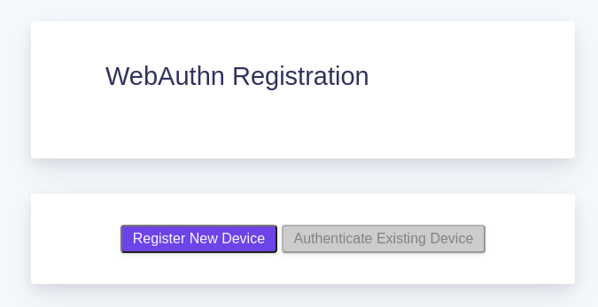
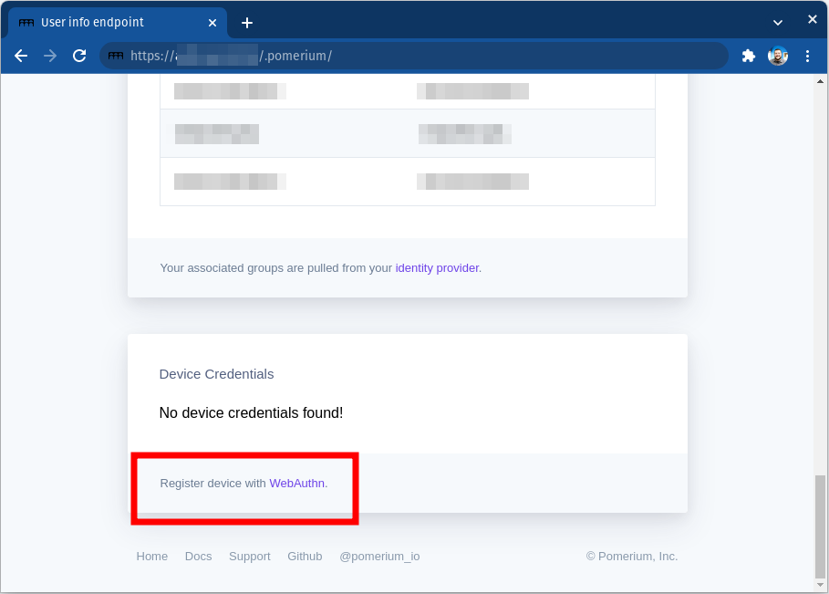
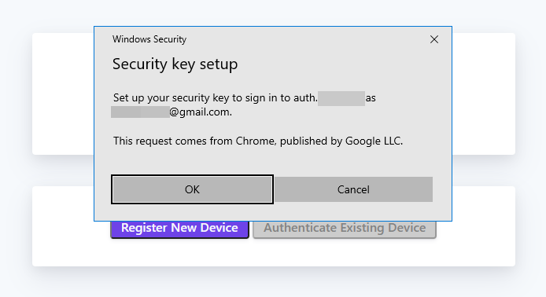
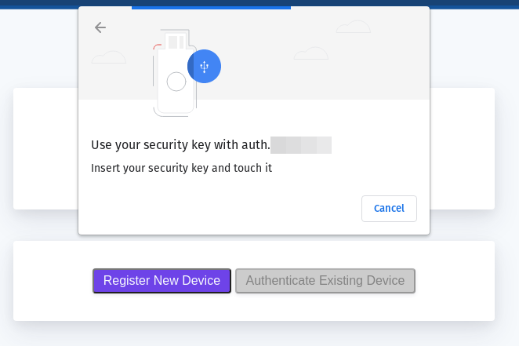
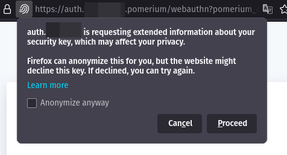
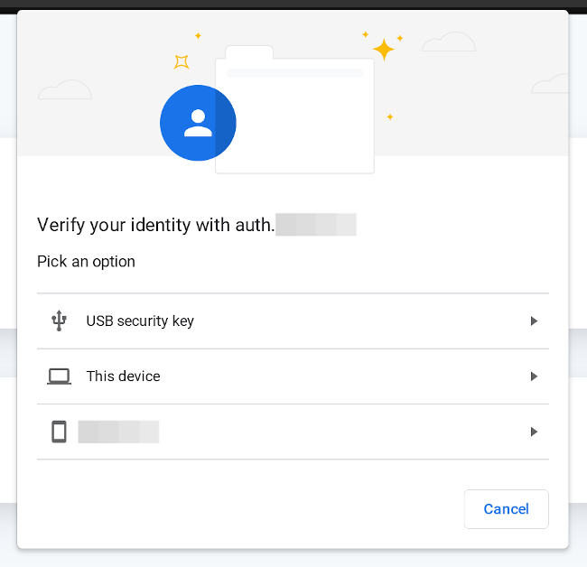
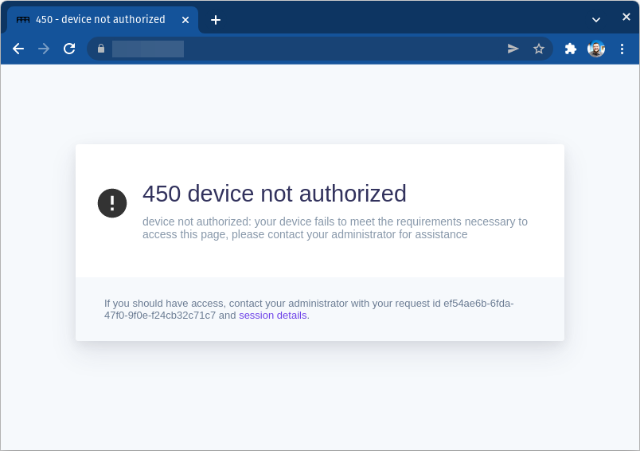
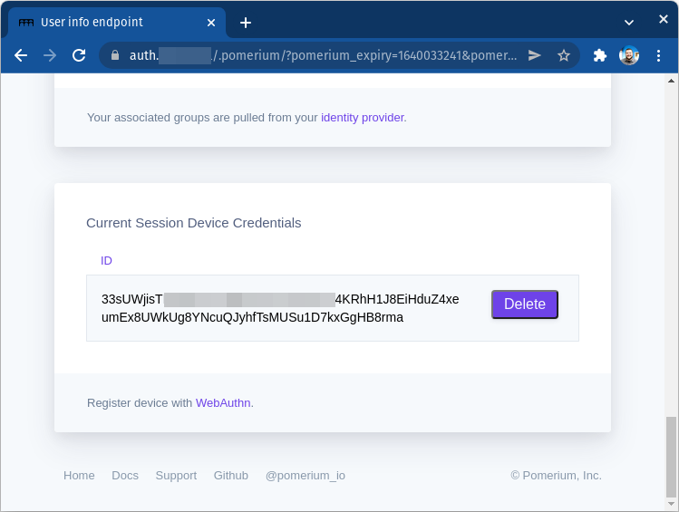

# Enroll a Device

If a Pomerium route is configured to [require device authentication](/docs/topics/ppl.md#device-matcher), then the user must register a [trusted execution environment](/docs/topics/device-identity.md#authenticated-device-types) (**TEE**) device before accessing the route. Registration is easy, but different depending on the device being used to provide ID.

1. Users are prompted to register a new device when accessing a route that requires device authentication:

    

    Users can also get to the registration page from the special `.pomerium` endpoint available on any route, at the bottom of the page:

    

1. Click on **Register New Device**. Your browser will prompt you to provide access to a device. This will look different depending on the browser, operating system, and device type:

    ::::: tabs
    :::: tab Windows
    
    ::::
    :::: tab Chrome
    
    ::::
    :::: tab Firefox
    
    ::::
    :::: tab ChromeOS
    
    ::::

## Find Device ID

If a route's policy is configured to only allow specific device IDs you will see a 450 error even after registering:

From the `.pomerium` endpoint you can copy your device ID to provide to your Pomerium administrator.

From here you can also delete the ID for devices that should no longer be associated with your account.