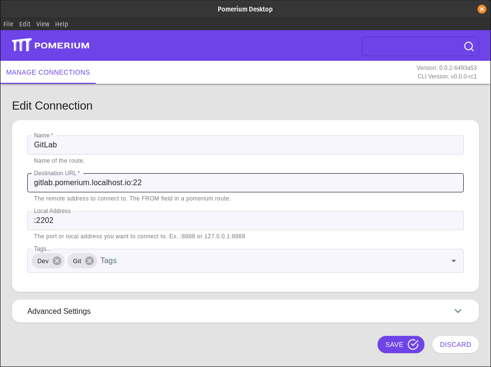

# GitLab

[GitLab] is a highly customizable, highly configurable tool to manage source code, project management, and many other aspects of project development. In addition to the SaaS product, its self-hosted solution and easy free-to-enterprise upgrade path make it a popular choice for those managing sensitive code bases.

This guide demonstrates how to configure a self-hosted GitLab server (a.k.a. gitlab-ee) behind Pomerium for identity-aware access.

## Before You Being

- This guide is written for an environment using [Docker Compose].

- This guide assumes a running instance of Pomerium, already configured with an identity Provider (**IdP**) and running as a docker container on the same host/swarm. See our [Quick-Start] page for more information on installing Pomerium with Docker Compose.

  ::: warning
  While Pomerium can be configured to use self-hosted GitLab [as an IdP][gitlab-idp], we do not recommend doing so while also running it behind Pomerium. In addition to the potential to lock out access to the IdP (breaking access to all routes), we consider it best practice to separate your identity provider and protected services, especially those housing sensitive data like source code.
  :::

- The initial setup documented here uses un-encrypted HTTP traffic between Pomerium and GitLab. The last section covers upgrading the GitLab configuration with a TLS certificate.

## Install GitLab

::: tip
While we do our best to keep our documentation up to date, changes to third-party systems are outside our control. Refer to [GitLab Docker Images] from GitLab's docs as needed, or [let us know](https://github.com/pomerium/pomerium/issues/new?assignees=&labels=&template=bug_report.md) if we need to re-visit this section.
:::

### Prepare The Environment

1.  Create volumes for persistent data. This guide uses the base directory `/srv/gitlab`; adjust this path for your local environment:

    ```bash
    mkdir -p /srv/gitlab #Adjust the path based on your common Docker volume location.
    ```

1.  Create three sub-directories: `config`, `data`, and `logs`:

    ```bash
    mkdir -p /srv/gitlab/{config,data,logs}
    ```

### Install and Configure GitLab

1.  Edit your `docker-compose.yml` file to define a new service for GitLab:

    ```yaml
    services:

    ...

    gitlab:
      container_name: gitlab
      image: gitlab/gitlab-ee:latest
      environment:
        GITLAB_OMNIBUS_CONFIG: |
          external_url 'https://gitlab.pomerium.localhost.io'
          letsencrypt['enable'] = false
          nginx['listen_port'] = 80
          nginx['listen_https'] = false
      volumes:
        - '/srv/gitlab/config:/etc/gitlab'
        - '/srv/gitlab/logs:/var/log/gitlab'
        - '/srv/gitlab/data:/var/opt/gitlab'
      expose:
        - 80
        - 443
        - 22
      restart: always
      shm_size: '256m'
    ```

    - Adjust `external_url` and `registry_external_url` to match the external path, which we will define in Pomerium later in the process.
    - Adjust the paths under `volumes` to match the directories created in [the previous section](#prepare-the-environment).

    ::: tip
    Additional integrations like [Mattermost](https://docs.gitlab.com/ee/integration/mattermost/) and [Pages](https://docs.gitlab.com/ee/user/project/pages/) will require additional configuration (i.e. `mattermost_nginx[*]`).
    :::

1.  Bring up the new Docker Compose configuration:

    ```bash
    docker-compose up -d
    ```

    The container may take several minutes to initialize. Once complete, the status provided to `docker ps` will change from `health:starting` to `healthy`.

    You can also monitor the progress with `docker logs -f gitlab`. Note that even after the process is complete, the log file will continue to output log messages.

## Configure a Pomerium Route

Edit `config.yaml` and add a route for GitLab:

```yaml
  - from: https://gitlab.localhost.pomerium.io
    to: http://gitlab
    preserve_host_header: true
    policy:
      - allow:
          or:
            - domain:
                is: example.com
```

Once the route is applied, you should be able to access GitLab from `https://gitlab.localhost.pomerium.io`. Note that when using Docker, you may need to restart the Pomerium container to apply the changes as file change detection can be finicky on mounted docker volumes.

Use `grep` within the container to find the default root password:

```bash
sudo docker exec -it gitlab grep 'Password:' /etc/gitlab/initial_root_password
```

### Configure TCP Connections

1.  An additional route will provide an encrypted TCP tunnel through which users can securely access code using Git:

    ```yaml
      - from: tcp+https://gitlab.localhost.pomerium.io
        to: tcp://gitlab:22
        policy:
          - allow:
              or:
                - groups:
                    has: devs@example.com
    ```

1.  Once this route is applied, users can create an encrypted connection using [pomerium-cli] or the [Pomerium Desktop] app:

    ::::: tabs
    :::: tab Pomerium-CLI
    ```bash
    pomerium-cli tcp gitlab.pomerium.localhost.io:22 --listen :2202
    ```

    The `--listen` key defines what port the tunnel listens at locally.
    ::::
    :::: tab Pomerium Desktop
    
    ::::
    :::::

1.  Add the tunneled connection as a remote:

    ```bash
    git remote add gitlab-tunneled ssh://git@127.0.0.1:2202/username/project-name
    ```

Now when you first initiate a `pull`, `push`, or `fetch` command your web browser will open to authenticate and authorize the connection.

## Identity Management

While GitLab has a [JWT OmniAuth provider], it only accepts a JSON web token (**JWT**) as a callback url parameter and not as an HTTP header [provided by Pomerium](/reference/readme.md#pass-identity-headers). If your IdP is a [supported OmniAuth provider](https://docs.gitlab.com/ee/integration/omniauth.html#supported-providers), you can integrate it directly to GitLab to re-use your current session, but it will require signing in twice; once with Pomerium and again with GitLab:

<video controls  muted="true" playsinline="" width="100%" control=""><source src="./img/gitlab/gitlab-login.webm" type="video/webm">
Your browser does not support the video tag.
</video>

## Upstream TLS

As part of a complete [zero trust][Background] security model, all connections should be encrypted and [mutually authenticated][mTLS]. An important step in this process is configuring GitLab to serve content to Pomerium using HTTPS.

Because GitLab's internal Nginx server is configured to use the [FQDN] even when behind a proxy service, GitLab itself must use a separate, internal certificate for `gitlab.pomerium.localhost.io`. This is unique from the certificate Pomerium uses to serve the route to end users.

Create this certificate using your infrastructure's preferred internal certificate solution. If you don't have a solution in place, you can use [mkcert] to generate testing certificates:

:::: details mkcert
!!!include(install-mkcert.md)!!!

1.  Create a certificate for the domain that will be used for the GitLab route. For example:

    ```bash
    mkcert "gitlab.pomerium.localhost.io"
    ```

1.  Note the location of the mkcert root certificate files with `mkcert -CAROOT`. You will need to provide this path to your Pomerium configuration to validate the certificate provided by GitLab.
::::

If you have an internal certificate solution, generate a certificate for `gitlab.pomerium.localhost.io` and note the path to the certificate authority (**CA**) root before proceeding.

::: tip
Integrations that use unique subdomains will require their own certificates and Pomerium routes.
:::

1.  Create the directory `/srv/gitlab/config/ssl/` (adjusted for your local Docker volume path), and move the certificate and key files there:

    ```bash
    mkdir /srv/gitlab/config/ssl
    mv gitlab.pomerium.localhost.io.pem gitlab.pomerium.localhost.io-key.pem /srv/gitlab/config/ssl
    ```

    **Note:** You will need elevated permissions (sudo or root access) regardless of the directory location, as GitLab restricts permissions from within the Docker container on the volume mount.

1.  Adjust the `docker-compose.yml` entry for Pomerium to mount the internal certificate authority, and the entry for GitLab to specify the certificate and key files:

    ```yaml
    services:

    ...

      pomerium:
        image: pomerium/pomerium:latest
        container_name: pomerium
        volumes:
          - ./srv/pomerium/config.yaml:/pomerium/config.yaml:ro
          - ~/.local/share/mkcert:/pomerium/ssl:ro # Adjust to the location of your internal certificate authority.
        ports:
          - 443:443
          - 80:80
    ...

    gitlab:
      container_name: gitlab
      image: gitlab/gitlab-ee:latest
      environment:
        GITLAB_OMNIBUS_CONFIG: |
        external_url 'https://gitlab.pomerium.localhost.io'
        letsencrypt['enable'] = false
        nginx['listen_port'] = 443
        nginx['listen_https'] = true
        nginx['ssl_certificate'] = "/etc/gitlab/ssl/gitlab.localhost.pomerium.io.pem"
        nginx['ssl_certificate_key'] = "/etc/gitlab/ssl/gitlab.localhost.pomerium.io-key.pem"
      volumes:
        - '/srv/gitlab/config:/etc/gitlab'
        - '/srv/gitlab/logs:/var/log/gitlab'
        - '/srv/gitlab/data:/var/opt/gitlab'
      expose:
        - 80
        - 443
        - 22
      restart: always
      shm_size: '256m'
      ```

1.  Adjust the route in Pomerium's `config.yaml` to connect to GitLab using HTTPS:

    ```yaml
      - from: https://gitlab.localhost.pomerium.io
        to: https://gitlab-ee
        preserve_host_header: true
        policy:
          - allow:
              or:
                - domain:
                    is: example.com
    ```

1.  Run `docker-compose up -d` to recreate the containers with the adjusted settings.

[Background]: /docs/background.md
[Docker Compose]: https://docs.docker.com/compose/
[FQDN]: https://en.wikipedia.org/wiki/Fully_qualified_domain_name
[GitLab]: https://gitlab.com/
[gitlab-idp]: /docs/identity-providers/gitlab
[GitLab Docker Images]: https://docs.gitlab.com/ee/install/docker.html
[JWT OmniAuth provider]: https://docs.gitlab.com/ee/administration/auth/jwt.html
[mkcert]: https://github.com/FiloSottile/mkcert
[mTLS]: /docs/topics/mutual-auth.md#mtls-protocol-based-mutual-authentication
[pomerium-cli]: /docs/releases.md#pomerium-cli
[Pomerium Desktop]: https://github.com/pomerium/desktop-client/releases
[Quick-Start]: /docs/install/readme.md